<head>
  <title>All-In-One (Windows) - Aparavi Data Suite Documentation</title>
</head>

The All-In-One Install allows you to install Aparavi on a single node. The install will configure each of the nodes automatically. Additionally, the All-In-One installer will install MySQL.

1. Start the install executable.
    1. 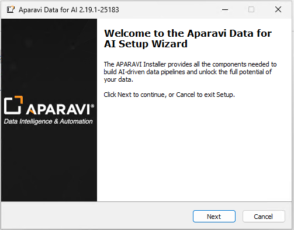
2. Enter a password for the the User "Root". The All-In-One installer will always use Root vs another username.
    1. 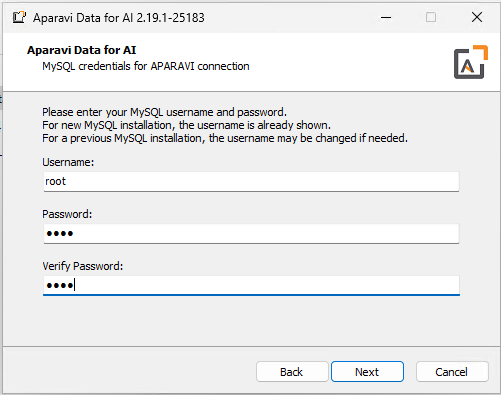
3. The installer will then download and configure MySQL.
    1. 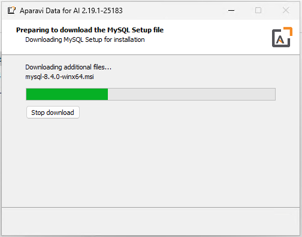
    2. 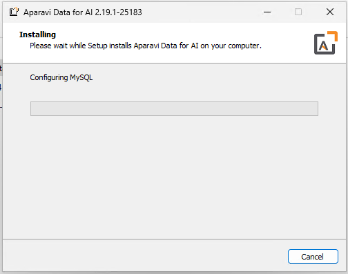
    3. 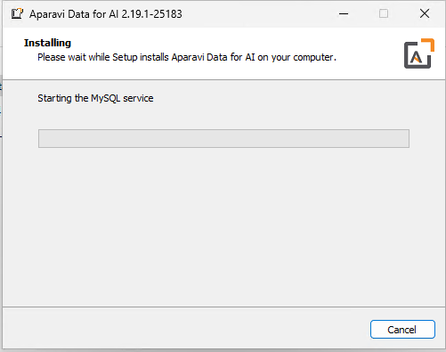
4. Once MySQL is installed, the installer will start installing Aparavi. The All-In-One installer will appear to run multiple times. First it will install the Platform and then it will contine and install the Aggregator-Collector.
    1. 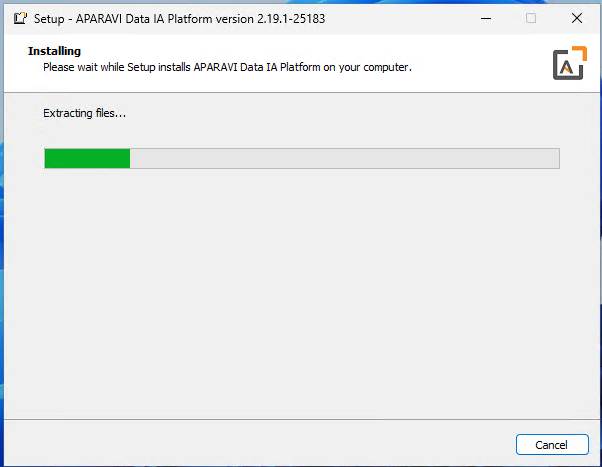
    2. 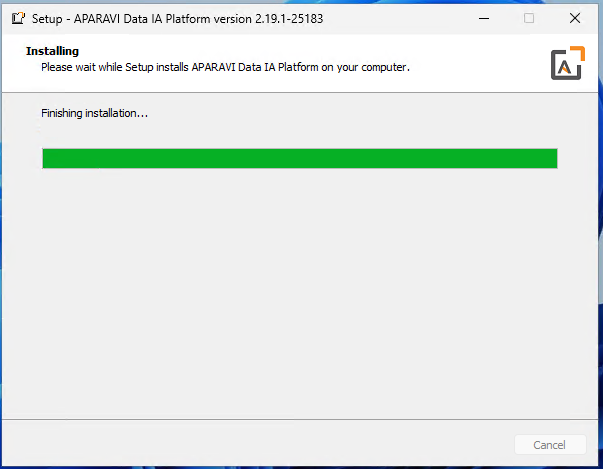
    3. 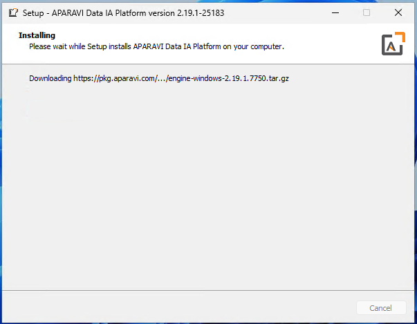
    4. 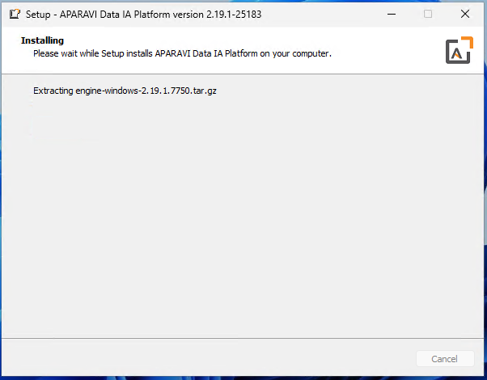
5. Occasionally, the installer will have to wait for the files to finish copying. Once the PROGRAMDATA folder is populated, it will continue.
    1. 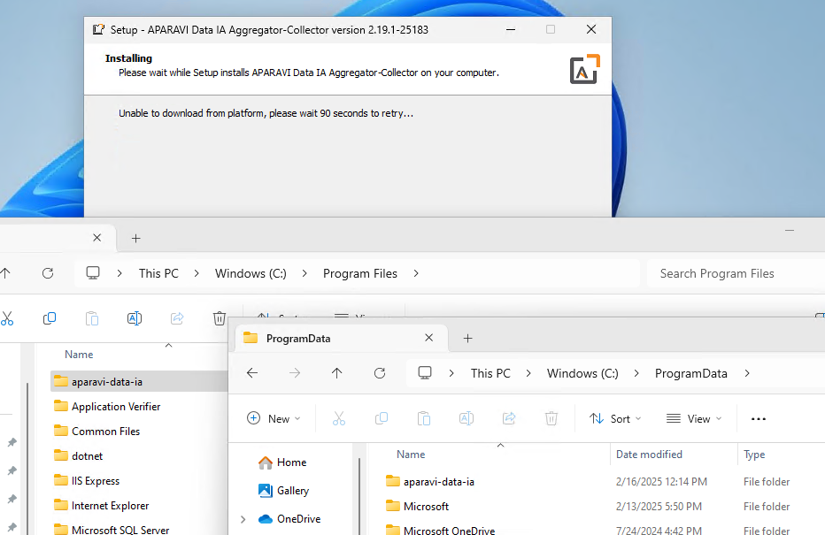
    2. 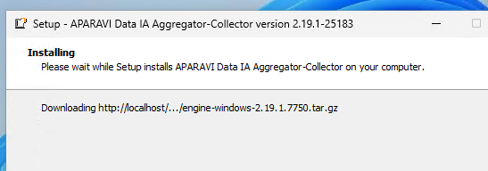
    3. 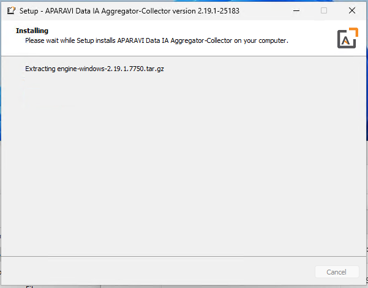
6. Once it completes the install, confirm the Aparavi services are running.
    1. 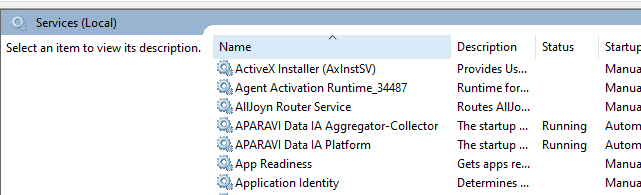
7. Once the services are running, login to Aparavi. You'll need to create an Aparavi Account first.
    1. 
    2. 
8. You can now configure Aparavi.
    1. 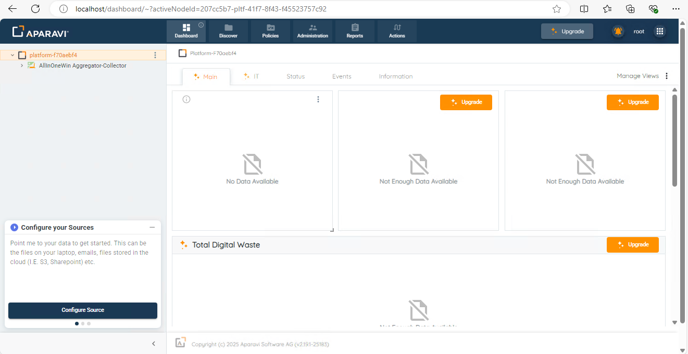
