<head>
  <title>Distributed (Windows) - Aparavi Data Suite Documentation</title>
</head>

The Distributed Install allows you to distribute the aggregator, collector, and platform nodes across multiple systems.

For each node type, the installation process is similar. Where the process or answers differ, a note will be displayed.

The Platform should be installed, then the Aggregator, then the Collector, then the optional Worker. While additional Aggregators can be installed at any time, the order should always be Aggregator, Collector, Worker to support the distributed architecture.

1. After kicking off the install executable, choose what module to install.
    1. 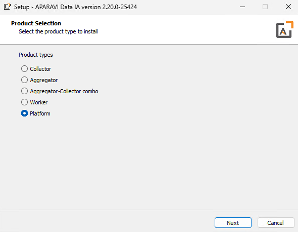
2. For the Platform install, it will ask for initial information
    1. Where is the license found (generally Portal.Aparavi.com)
        1. 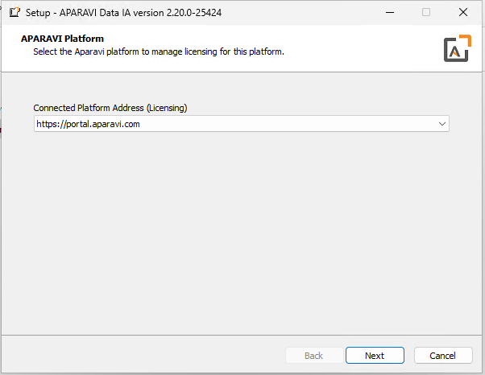
    2. The address and ports for the Platform (generally [localhost](http://localhost) is fine)
        1. 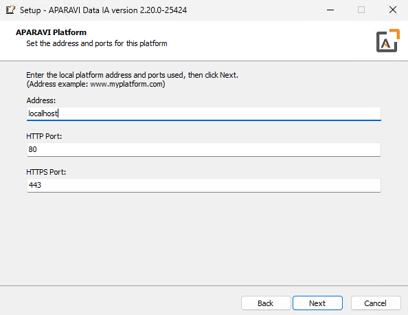
    3. Certificate information to configure HTPPS
        1. 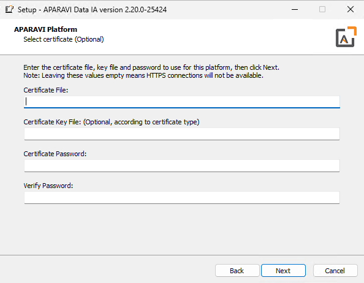
3. For the other modules, it will ask for the Hostname for another connected node, generally the Platform or the Aggregator.
    1. 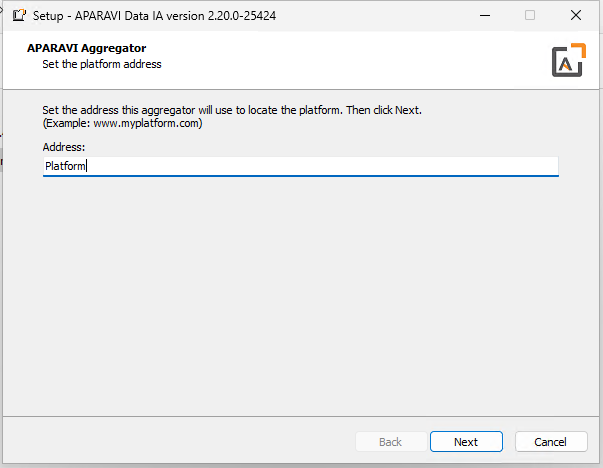
4. It then confirms the application files directory, generally the default path is fine
    1. 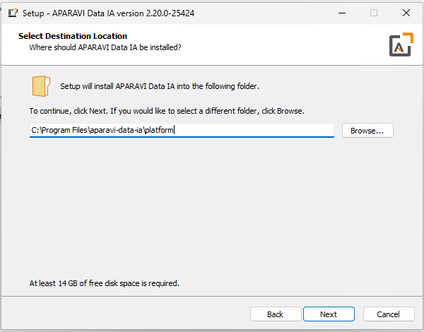
5. And then the location for data and control files, again, the default is generally fine.
    1. 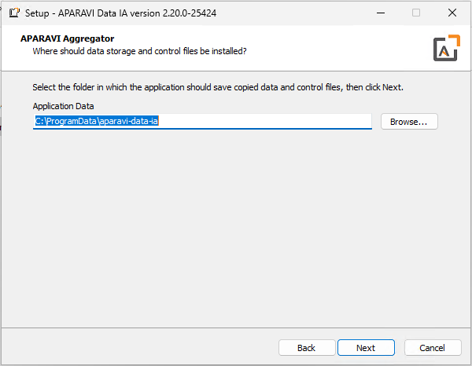
6. Several installs then ask how to connect to the database (currently only MySQL is supported but in future releases, others will be supported)

NOTE: The Collector uses an internal instance of SQLite (in future releases, other Collector databases may be supported).

1. 1. 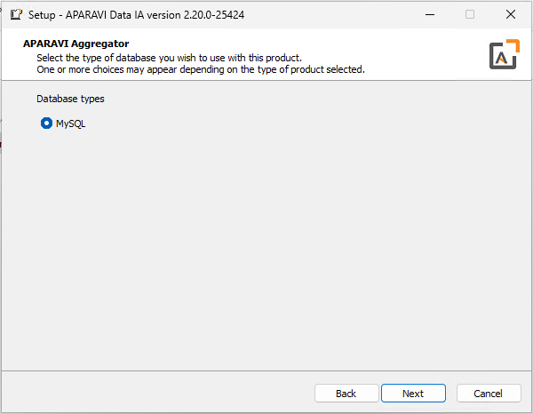
    2. 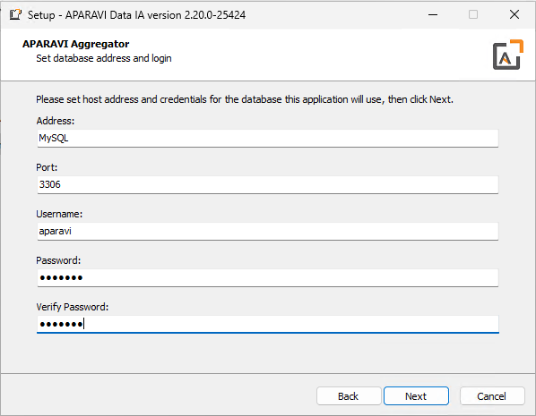
2. Finally it will begin the actual install.
    1. 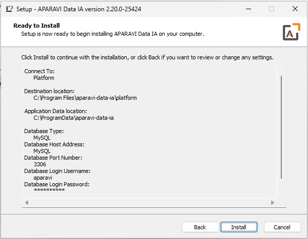
    2. 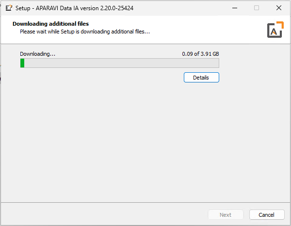
    3. 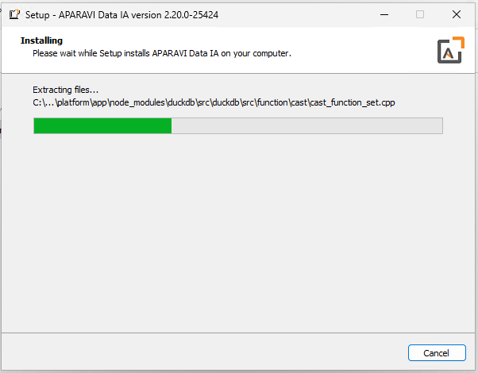
    4. 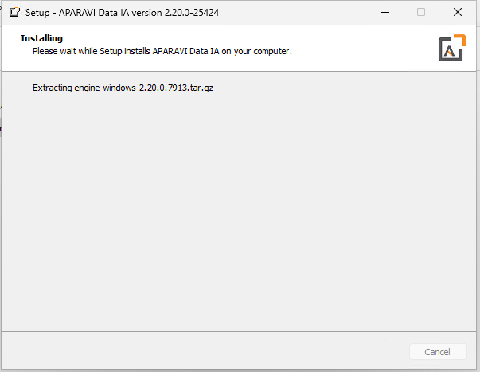

NOTE: The Aggregator-Collector Combo will appear to run the install twice. This is because it first installs the Aggregator, then the Collector.

1. Once the install says it is complete, it will take several minutes to actually complete. There are several indicators that is actually complete.
    1. The ProgramData\\aparavi-data-ia folder exists
        1. 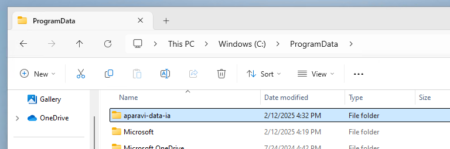
    2. The APARAVI Data IA (module) service is up and running
        1. 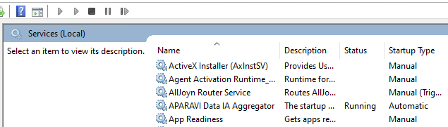
    3. The website is up and running
        1. 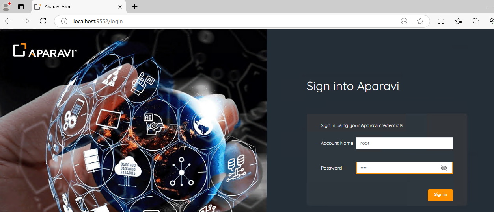
        2. To determine what the port is, use the table below, by default you can visit the website by logging onto localhost:port (ex `http://localhost:9552` )
        3. The login for the Platform page is discussed below. Other pages will use root/root

| Node Type | Port |
| --- | --- |
| Platform | 80/443 (generally not required) |
| Aggregator | 9552 |
| Collector | 9652 |
| Aggregator-Collector Combo aka Hybrid | 9752 |
| Worker |  |

9. The Platform page will require you to CREATE an account and login.
    1. 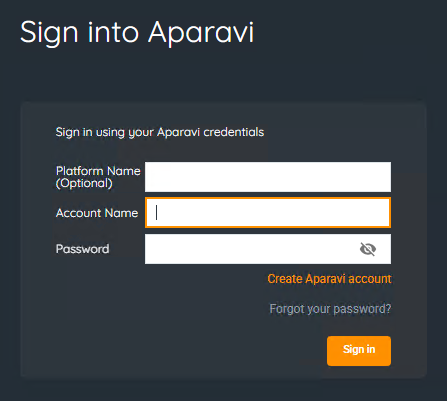
    2. 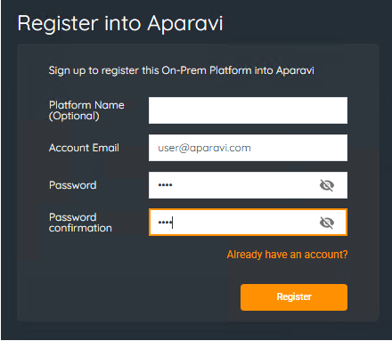
10. Before being granted access you will need to approve the EULAs displayed.
11. Aggregator pages will show an "Activation Code". This code should be copied and pasted into the main application (via the Platform site).
     1. 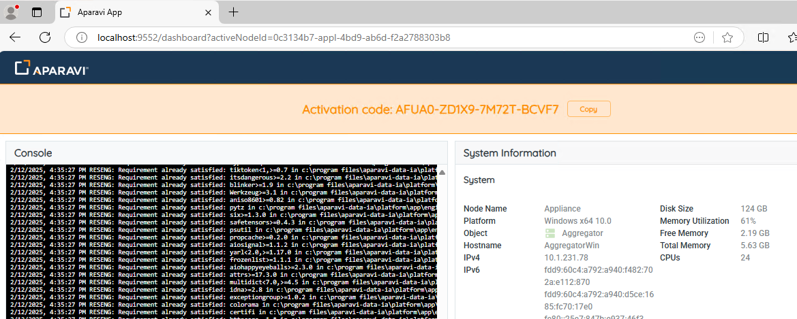
     2. 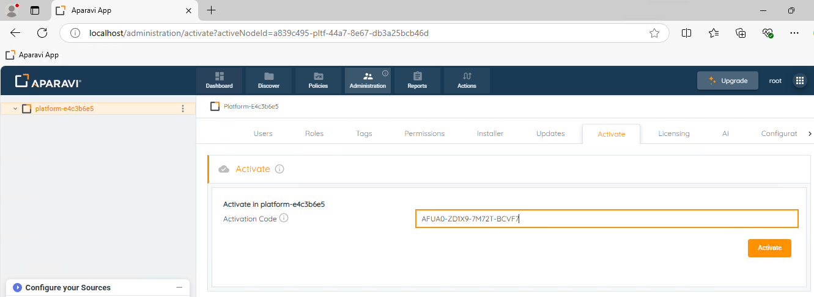
     3. You will then see the node appear on the network tree.
         1. 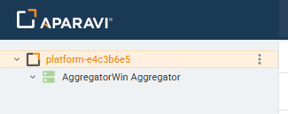
