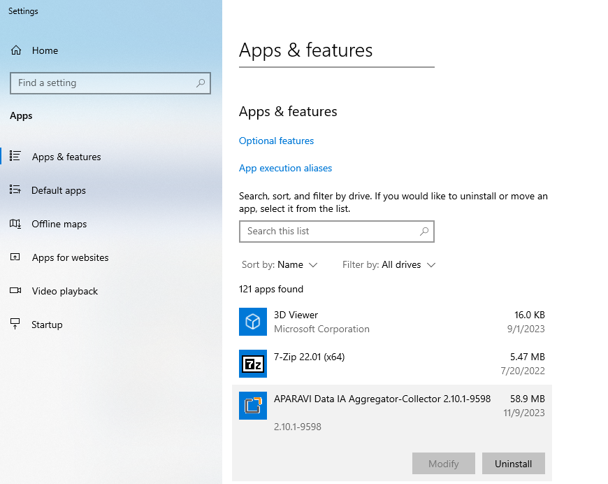
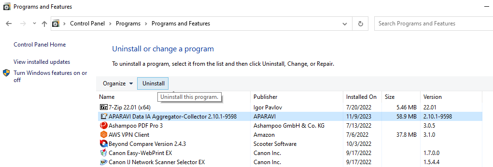
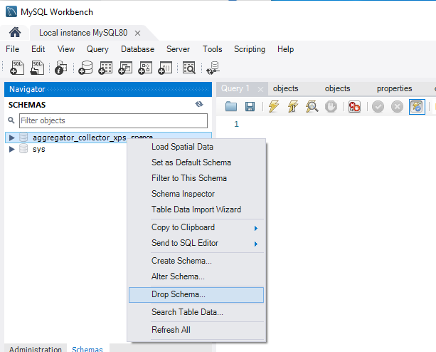
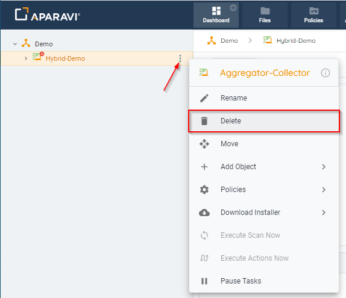

<head>
  <title>Removing Nodes - Aparavi Data Suite Documentation</title>
</head>

# Windows Uninstall

Uninstalling a node from the platform will consist of these steps:

- Uninstall the application
- Remove the node from the object tree in the platform

You will notice after uninstalling the application that the platform will show the node offline. The node must appear offline before it may be removed.

Additionally, for an Aggregator or Aggregator-Collector it is recommended to drop the database schema. If there is no other need to use the database application itself, it may be uninstalled.

### Uninstalling :

Uninstall the application on your computer by accessing the standard Windows "Apps and Features" in the Apps settings. Select the desired app and click the Uninstall button to proceed.

For example:

 

As another way to uninstall, open Control Panel, select "Programs and Features", then click "Uninstall a program". Select the application to uninstall from the list, then click Uninstall from the upper menu.

For example:

 

For cases where you may wish to remove the database, open MySQL workbench.

Access the schemas tab, right-click the uninstalled app's associated schema, and select "Drop Schema." Confirm by clicking "Drop Now" in the ensuing window to finalize the action.

To remove the Node from the object tree log in to your client account in the APARAVI platform.

Locate and right-click on the node, click the three vertical dots to its right to open the menu for that node. Click the “Delete” button, and a new window will appear to confirm the removal of the node.
