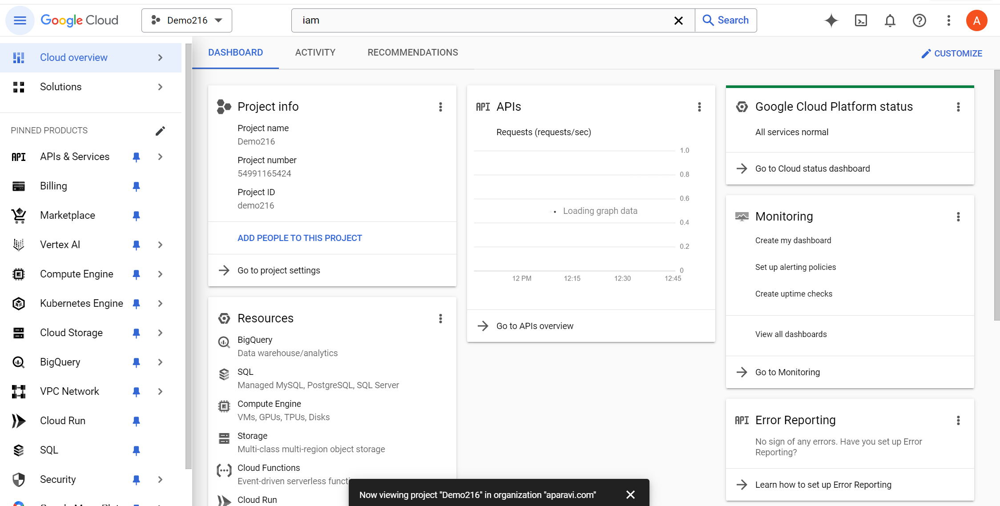

<head>
  <title>Google Workspace Subscription - Aparavi Data Suite Documentation</title>
</head>

Google Workspace subscription and Admin Account

1. In Google Cloud create **Google Cloud project** [Create a Google Cloud project  |  Google Workspace  |  Google for Developers](https://developers.google.com/workspace/guides/create-project)
2. Cloud project manages APIs and Access Control. So, each endpoint setup in Aparavi Platform is likely supposed to have a dedicated pre-configured Google Cloud project.
3. Create **Service Account** in the Google Cloud [Create service accounts  |  IAM Documentation  |  Google Cloud](https://cloud.google.com/iam/docs/service-accounts-create)
    1. Enable **Identity and Access Management (IAM) API** to your project in order to create Service Account (just follow the manual).
    2. After Service Account created, **Service Account Key** file with authentication information will be downloaded. Store this file securely, it will be used for authenticating connections to Google Workspace.
    3. \[ALT\] Create **Service Account Key** and download the file with authentication information. Store this file securely, it will be used for authenticating connections to Google Workspace.
4. Enable **Google Drive API** in Google Cloud [Enable and disable APIs - API Console Help](https://support.google.com/googleapi/answer/6158841?hl=en)
5. Enable **Google Drive API** in Google Workspace [Enable Google Workspace APIs  |  Google for Developers](https://developers.google.com/workspace/guides/enable-apis)
6. Enable **Admin SDK API** in Google Workspace [Enable Google Workspace APIs  |  Google for Developers](https://developers.google.com/workspace/guides/enable-apis)
7. Delegate Admin Account to Service Account [Create access credentials  |  Google Workspace  |  Google for Developers](https://developers.google.com/workspace/guides/create-credentials)

In order to access Google Workspace resources, Google Cloud Service must impersonate as Google Workspace Admin.

1. 1. In Admin Console go to Security/API Controls/Domain-wide Delegation and add to Service Account the follow authorization scopes[https://www.googleapis.com/auth/admin.directory.user.readonly](https://www.googleapis.com/auth/admin.directory.user.readonlyhttps://www.googleapis.com/auth/drive.readonly)
        
        [https://www.googleapis.com/auth/drive](https://www.googleapis.com/auth/admin.directory.user.readonlyhttps://www.googleapis.com/auth/drive.readonly) (or [https://www.googleapis.com/auth/drive.readonly](https://www.googleapis.com/auth/admin.directory.user.readonlyhttps://www.googleapis.com/auth/drive.readonly))

