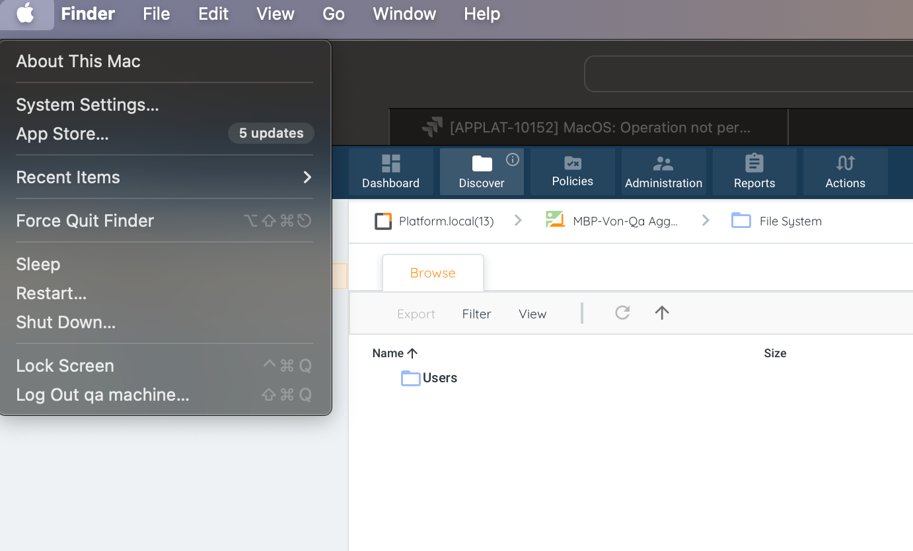
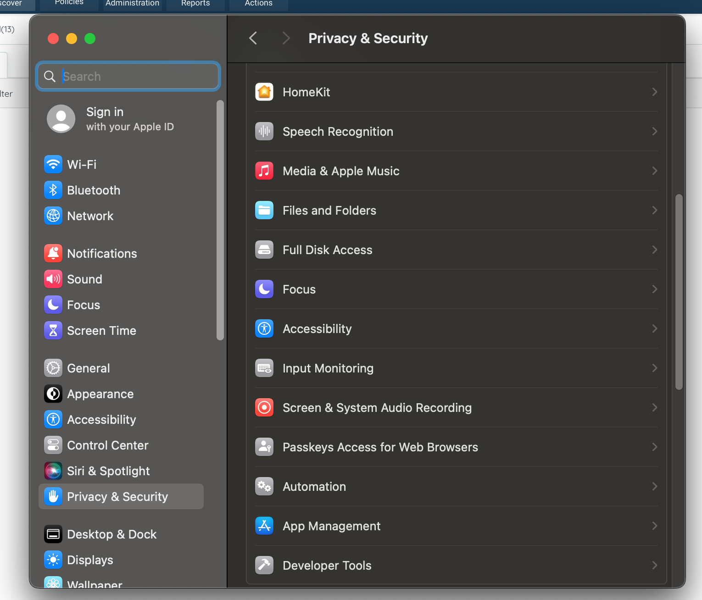
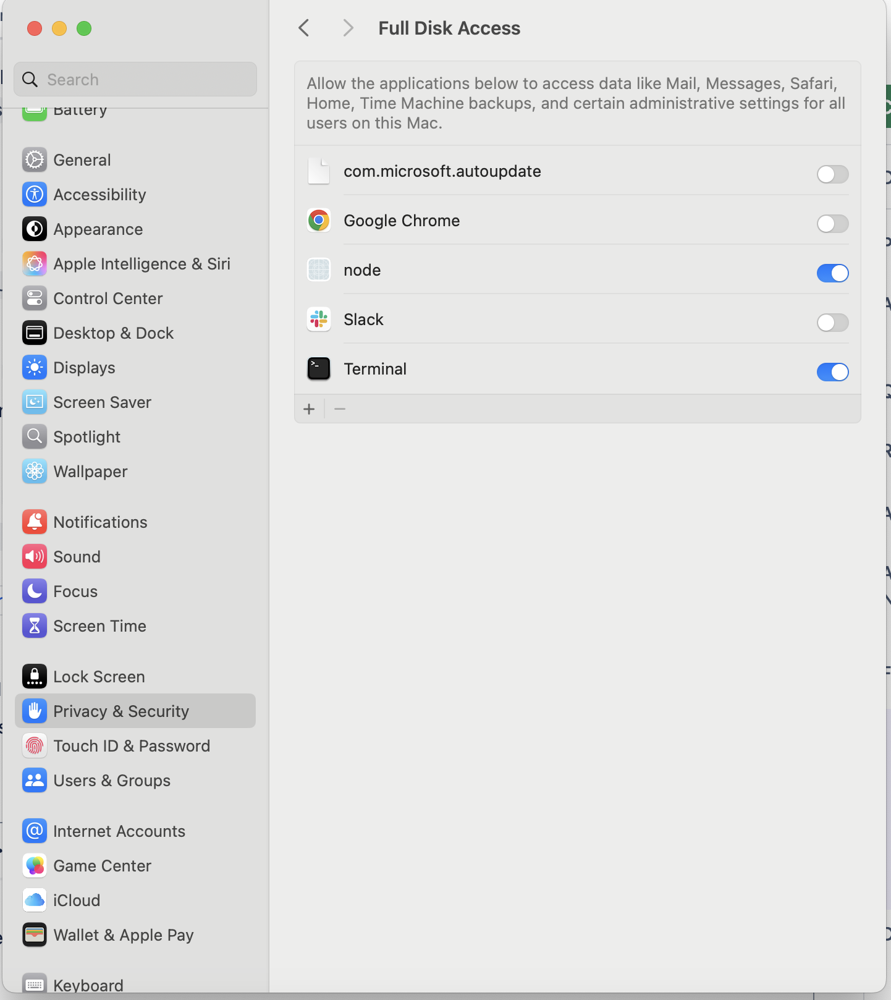

<head>
  <title>macOS Systems - Aparavi Data Suite Documentation</title>
</head>

To run successful scans, users should enable Full Disk Access:

1. Click on the Apple icon in the top left of your menu bar and choose "System Settings...".
2. Click "Security & Privacy". Scroll the sidebar and click "Full Disk Access"
3. Enable “Full Disk Access“ for the Terminal and Node.



4. Stop and Start the application using these commands:

```
sudo /opt/aparavi-data-ia/platform/app/stopapp
sudo /opt/aparavi-data-ia/platform/app/startapp
sudo /opt/aparavi-data-ia/aggregator-collector/app/stopapp
sudo /opt/aparavi-data-ia/aggregator-collector/app/startapp
```
