<head>
  <title>Microsoft Office Connectors - Aparavi Data Suite Documentation</title>
</head>

To add one of the Microsoft applications (OneDrive, SharePoint, Outlook) as a source to the platform, you must first register the application. In this article you will learn how to register a client application in Microsoft Entra ID to access all Microsoft services. This guide is divided into five parts:

- Register an application in Microsoft Entra admin center
- Client Secret Generation
- Add the required permissions
- List of minimum required permissions for different connector types
- How to add a source or target to the platform

## **Register an application in Microsoft Entra admin center**

First, you must have a user in the Microsoft Entra admin center with at least a Cloud Application Administrator role so that they can manage all aspects of the Microsoft Entra ID and Microsoft services that use Microsoft Entra identities. Once you have registered such a user, you can proceed with registering the application.

Follow these steps to create a new application registration:

1. Log in to the **Microsoft Entra admin center** [https://entra.microsoft.com/#home](https://entra.microsoft.com/#home) with the Cloud Application Administrator role or higher.
2. Scroll to **Identity** > **Applications** > **App registrations.**

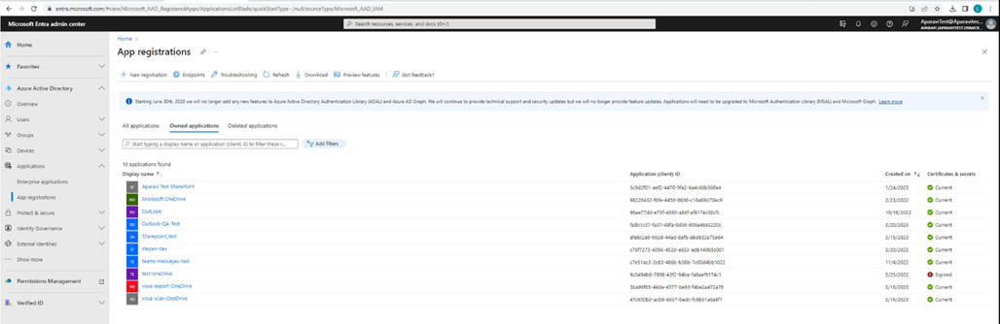

3. Select **New Registration**.
4. Create a display **Name** for the application. Users of your application will see the display name when they use the application, for example when they log in.
5. Specify who can use the application. For example, you can select _Accounts in this organizational directory only._
6. Leave **Redirect URI (optional)** field empty. This field can be configured later if necessary.
7. Select **Register** to complete the initial registration of the application.

- 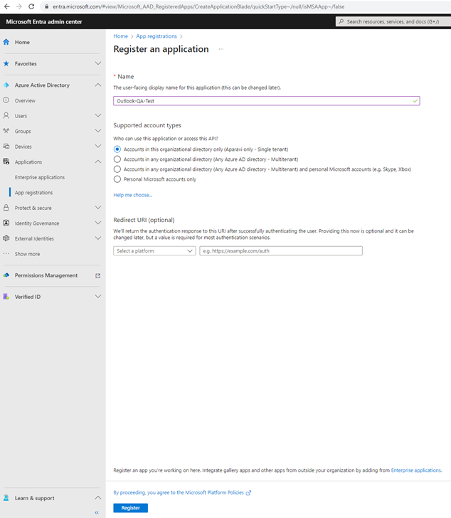
    

8. When registration is complete, the Microsoft Entra admin center will display the app registration's **Overview** pane. Here you will find the **Application (client) ID** or _**client ID**_. This value uniquely identifies your application in the Microsoft identity platform.
9. You can also see the **Directory (tenant) Id** or _**tenant ID**_ here, which is a unique identifier assigned to each organization that uses Microsoft services.

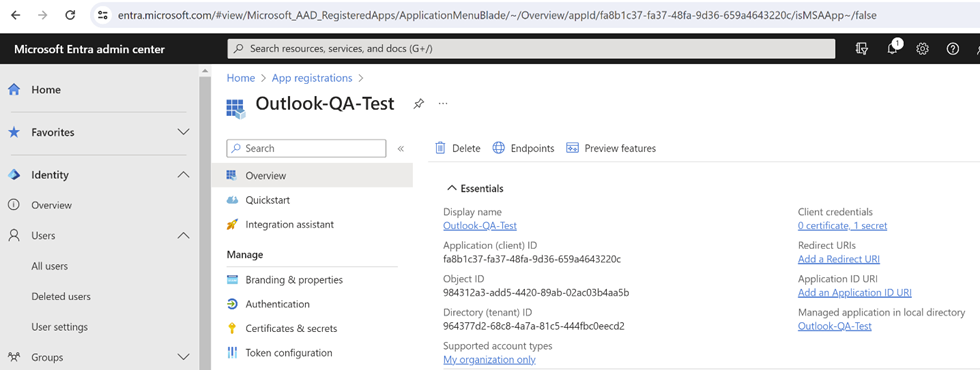

## Client Secret Generation

Credentials are employed by private client applications for web API access, enabling autonomous authentication without user interaction. Certificates, client secrets, or federated identity credentials can be added to confidential client app registrations. This section explores adding a _**client secret**_ (also known as an application password), which is the key that will be used as the secret in the connection to Microsoft Entra.

Follow these steps to create a new client secret:

1. Log in to the **Microsoft Entra admin center**.
2. Choose your application in **App registrations**.
3. Select **Certificates & secrets** > **Client secrets** > **New client secret**.
4. Add a description for your client secret.
5. Select an expiration date for the secret or set a custom expiration date, f.e. 6 months.
6. Select **Add**.
7. **IMPORTANT!** Record **the value of the secret** for use in your client application code. This secret value will **never be displayed again** after you leave this page.

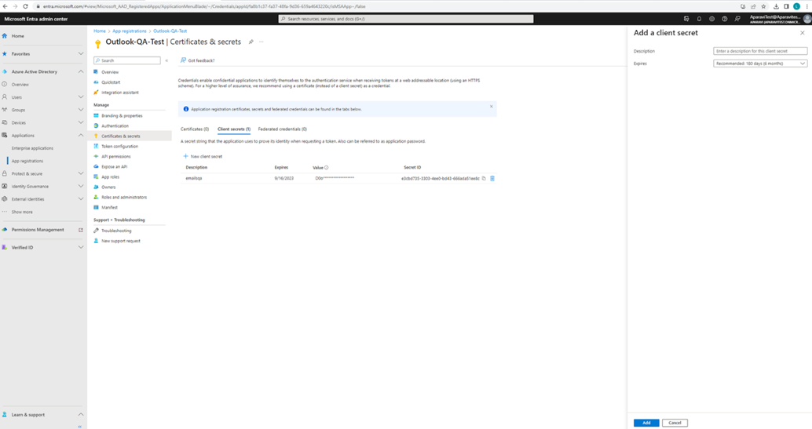

### Add the required permissions

For each application, we need to specify the access method: delegated access (on behalf of a signed-in user) or app-only access (access without a user). Our platform only supports app-only access, ensuring secure interaction with resources.

App-only access, where the application operates independently without a signed-in user, is used for automation, backup and scenarios involving background services or daemons.

As our platform requires the appropriate application permissions from the resource application it is calling to access the requested data, we will see how to set these up.

Follow these steps to add the permissions:

1. Log in to the **Microsoft Entra admin center**.
2. Choose your application in **App registrations**.
3. Select **API permissions** > **Add a permission**.
4. Select **Microsoft Graph** \> **Application permissions**. It is very important to select "Application permissions", otherwise the scan will not work on our platform.
5. Select permissions according to your needs. If you need help, refer to the information in the "List of minimum required permissions for different connector types" section.

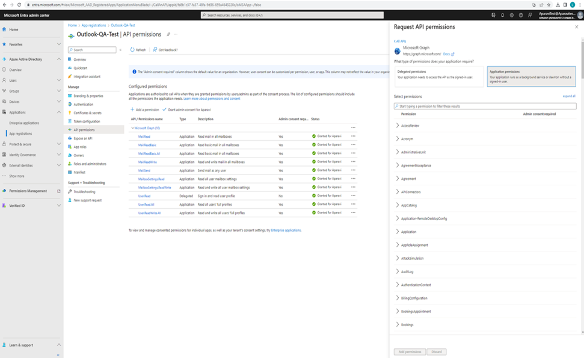

6. After adding the permissions, grant the **Administrator consent** for all of them.

### **List of minimum required permissions for different connector types**

This section lists the minimum permissions required for the main types of actions in the platform: Scan and Data Actions. Scanning a source includes options such as Core Scan, File Signature, Index. Classification is not included here as it is performed exclusively on the platform without file access. Data actions on a source include Copy, Export, Manual Export, Download, Delete.

In general, the logic is as follows:

- All actions on a source, except deleting, require read-only permissions.
- Deleting files requires read-write permission.
- All actions on a target require read-write permission.

**Note:** Deletion action is not implemented for Outlook Connector.

  
| Type of Application | Type of Action | Required Permissions |
| --- | --- | --- |
| OneDrive Source | Scan + Data Actions (except DELETE) | Files.Read.All  User.Read.All |
|  | DELETE action | Files.ReadWrite.All  User.Read.All |
| OneDrive Target | Copy and Export Actions | Files.ReadWrite.All  User.Read.All |
| SharePoint Online Source | Scan + Data Actions (except DELETE) | Sites.Read.All |
|  | DELETE action | Sites.ReadWrite.All |
| SharePoint Online Target | Copy and Export Actions | Sites.ReadWrite.All |
| Outlook Source | Scan + Data Actions | Mail.Read  MailboxSettings.Read  User.Read.All |

### **Source or Target Configuration Parameters for Microsoft connectors.**

The following information is required when adding a source or target:

- **Tenant Id**: It is a unique identifier different to your organization name or domain. Tenant Id can be found in **Microsoft Entra admin center** > **App registrations** > **Overview** page of the application. It is called _Directory (tenant) ID_.
- **Client Id**: It is a unique identifier of your application. It can be found in **Microsoft Entra admin center** > **App registrations** > **Overview** page of the application. It is called _Application (client) ID_.
- **Client Secret**: It is the key that will be used by your application as the secret in the connection to Microsoft Entra. It can be found in **Microsoft Entra admin center** > **App registrations** > **Certificates & secrets** > **Client secrets** > **Value**. It is called _Value_.

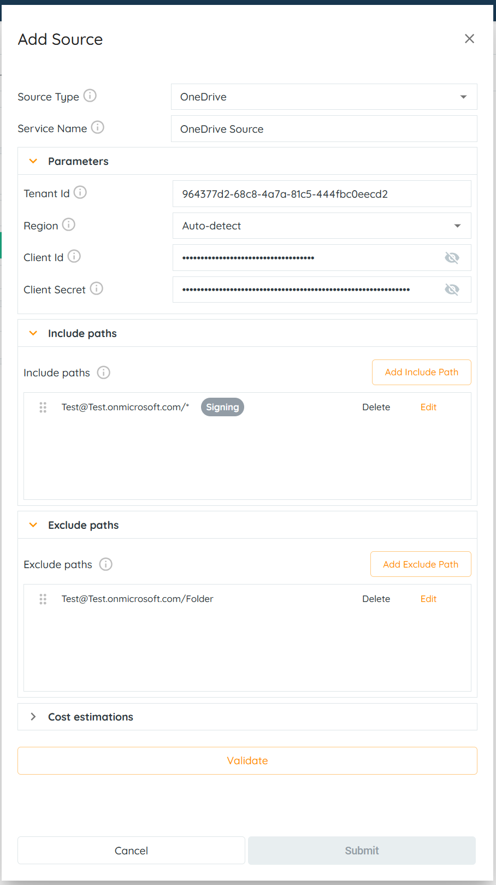
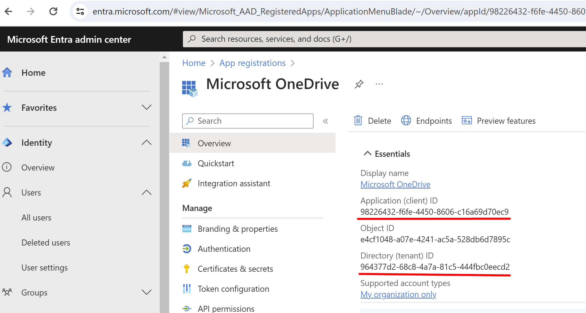
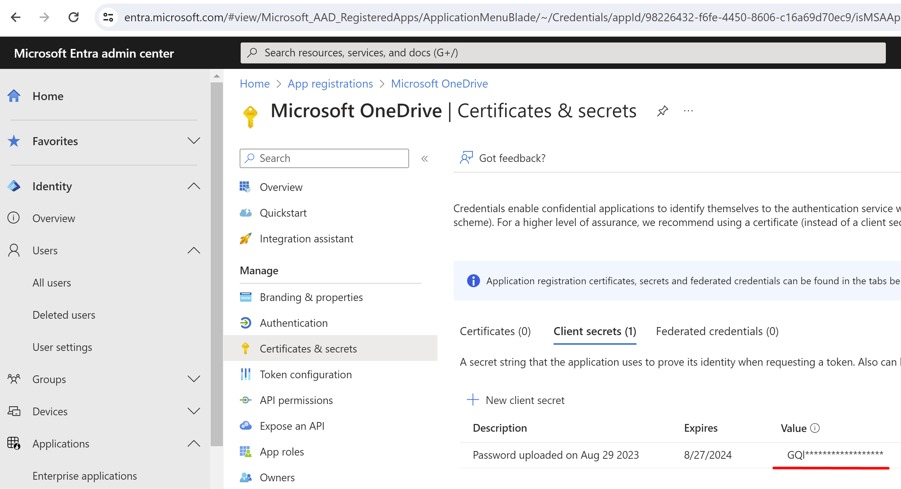

### Adding a OneDrive/Sharepoint/Outlook Source

> The system needs at least one source and one include path to complete a file scan. Multiple include pathscan be customized as well, but the path entries follow an order of precedencethat must be adhered to.

1\. Click on the Policies tab. By default, the system will navigate to the Sources subtab.

2\. Click on the Add Source button, located in the upper right-hand corner of the screen.
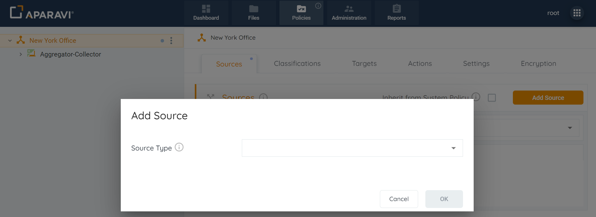
3\. When selected, the Add Source pop-up box will display, offering several sources to choose from. Using the drop-down menu, choose either the OneDrive, Sharepoint, or Outlook option.
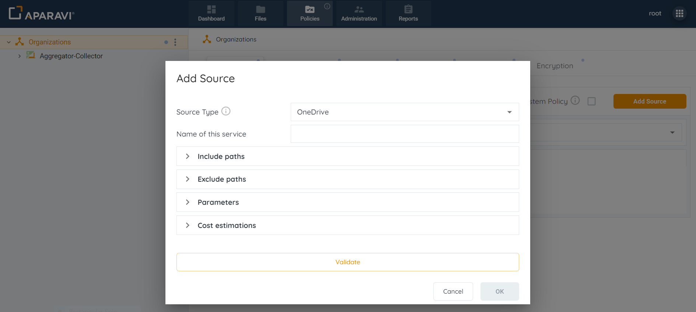
4\. Inside the Add Source pop-up box, enter the fields to configure the OneDrive, Sharepoint, or Outlook source:

- **Source Type:** This field will auto-populate with the selected source. This field cannot be altered.
- **Name of this Service:** Enter any name for the source.
- **Include Paths:** Click on the Include Paths section and include at least one path. Although multiple include paths can be entered, the system has an order of precedence for the paths that must be followed.

> Adding a \* symbol within the include path will scan the entire source.

- **Exclude Paths:** In addition to configuring include paths, an optional step is to enter an exclude path within the section below. When entered, the system will skip the path and not scan the folders and files within it.
- **Configure Parameters:**
    - **Tenant Id**:
    - **Region:**
    - **Client Id:**
    - **Client Secret:**
- **Configure the Estimations Section**:
    - **Access Rate:** Time required to recall a file in MB per second.
    - **Access Delay:** Elapsed time before access to a file starts.
    - **Access Cost:** The egress cost per MB to recall a file.
    - **Storage Cost:** The cost per MB to store a file per month.

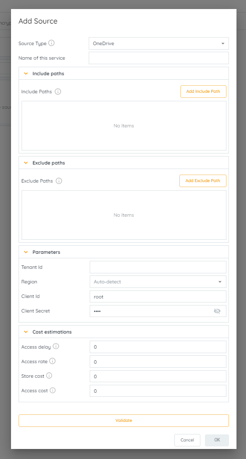
5\. After completing all sections within the Add source pop-up box, select the Validate button. If the validation was successful, the Ok button inside the pop-up box will become active. If the OK button does not activate, this indicates that the credentials are throwing an error and need to be revised before the configuration can progress.

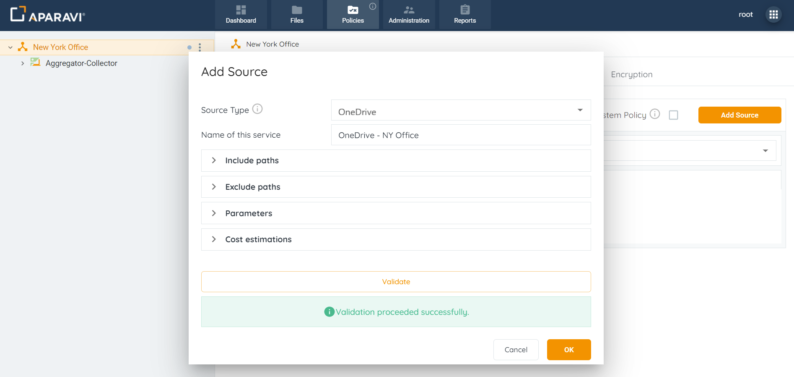

6\. Once the source settings have been validated, click on the OK button to save the changes. Once selected, the Add Source pop-up box will close.

7\. Click on the Save All Changes button, located in the bottom right-hand corner. Once clicked, a pop-up box will appear requesting to confirm all changes.
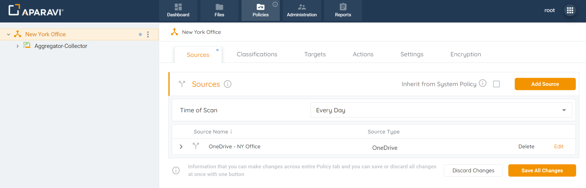
8\. Click the OK button to confirm the configuration.

Once the source has been configured, the system will display an alert message and begin scanning from the source.
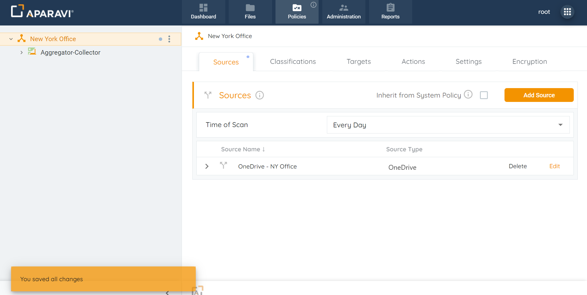

### Editing Microsoft Sources

1\. Click on the Policies tab. By default, the system will navigate to the Sources subtab.

2\. Click on the Edit button to the right of the configured source.

3\. Inside the Edit Source pop-up box, edit the previously configured fields.
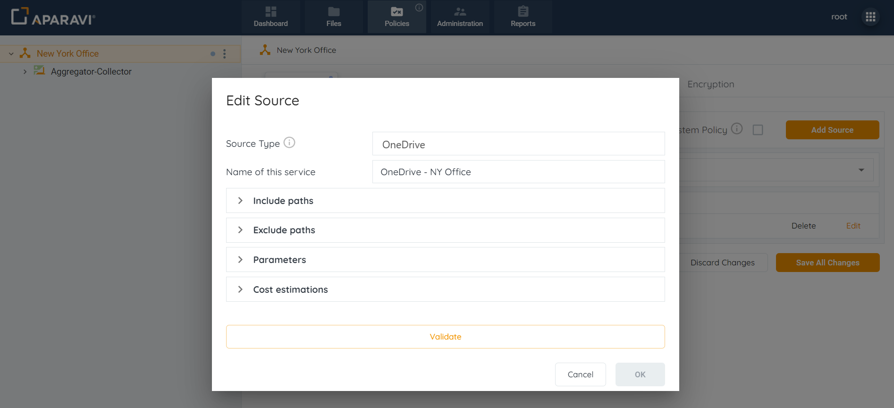
4\. After completing all sections within the Edit source pop-up box, select the Validate button. If the validation was successful, the Ok button inside the pop-up box will become active. If the OK button does not activate, this indicates that the credentials are throwing an error and need to be revised before the altered configuration can be finalized.

5\. Click on the OK button to save the changes.

6\. Click on the Save All Changes button, in the bottom right-hand corner. Once clicked, a pop-up box will appear requesting to confirm all changes.

7\. Click the OK button to confirm the updated settings.

Once the source has been updated, the system will display an alert message and begin scanning using the updated settings.

