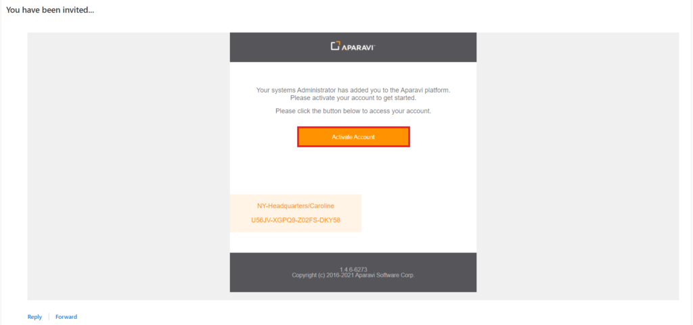
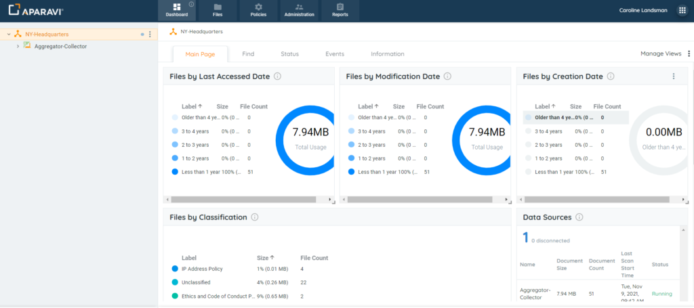

<head>
  <title>SSO Login - Microsoft - Aparavi Data Suite Documentation</title>
</head>

Signing into the platform can be achieved in several ways. The system offers a Microsoft single sign-on option, that when configured will allow for signing in without having to input the credentials each time.

1. To configure this option, a user with administrative permissions must create the new account using the matching Microsoft account that will be set up by the user to authenticate successfully.
    - To create a new user, use the following [instructions](/data-suite/administration/users/users-manage-users)
    - To create a new client, use the following [instructions](/data-suite/technical-documentation/configuration/clients)
2. Log into the Microsoft account. This Microsoft account must be the email used during the new user/client creation to authenticate successfully.
3. Once the administrative user has configured the new user/client, the Microsoft user will receive an activation email from the Aparavi platform.
4. Click on the Activate Account button, located in the middle of the email that was received by the Microsoft account.

5. Once clicked, a new browser window will open, displaying the Aparavi login webpage.
6. Without changing any other fields on the webpage, click the "Sign in with Microsoft" button.

7. At this point, the "Master SaaS Agreement" and "End User Licence Agreement" must be accepted. Once both have been accepted, the user will have access to their account.

