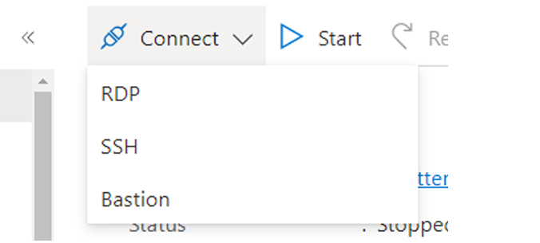
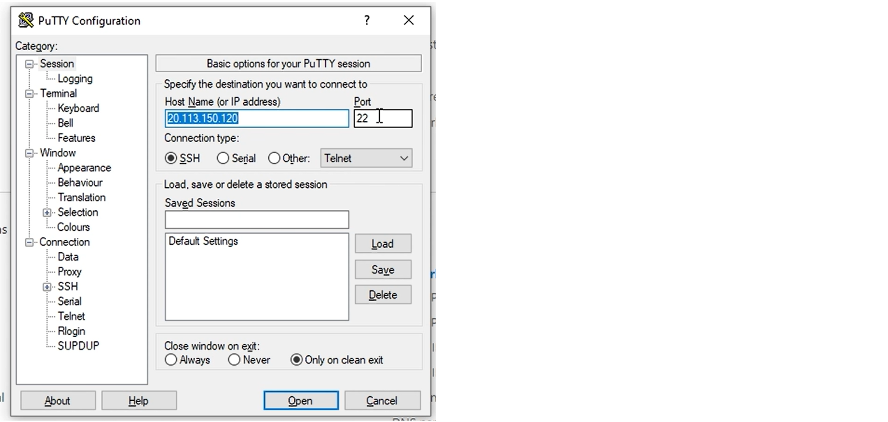
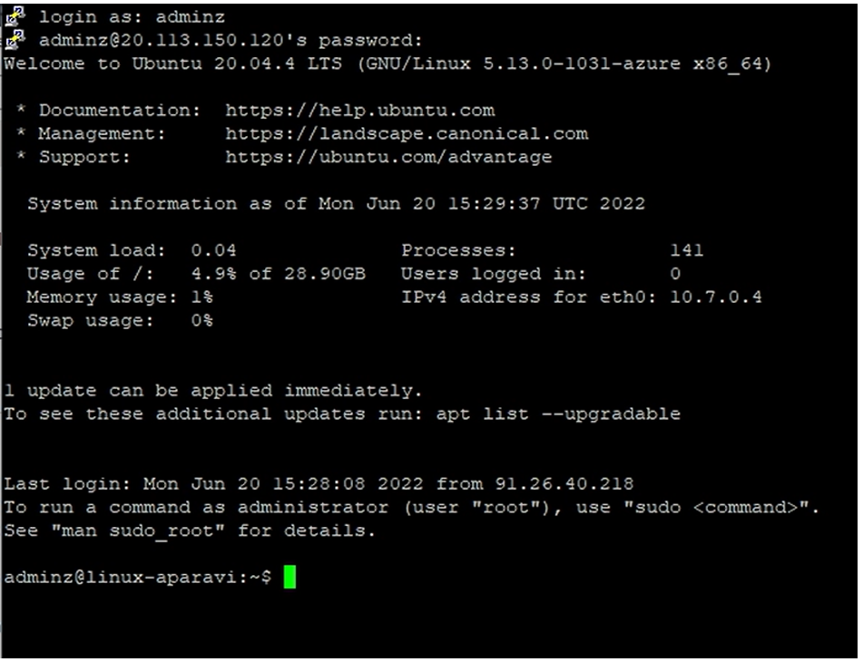

<head>
  <title>Azure VM - Linux - Aparavi Data Suite Documentation</title>
</head>

# **Overview**

This document outlines the basics of a VM and system requirements for the APARAVI software in the Azure environment.

## **Defining a VM in Azure**

Login to your Microsoft Azure account and locate the “**Create**” button to start the process of making the VM.

From within the create a virtual machine window, a new window will appear with the Information that would need to be filled in to initiate the download.

- **Subscription**  – Name of the Azure subscription
- **Resource group** – Collection of resources that share the same lifecycle, permissions, and policies.
- **Virtual machine name** – Name of the VM within the resource group
- **Region** – Selection of regions of the VM location
- **Availability options** – managing the resiliency for the application
- **Security type**– Selection types refer to the different security features
- **Image** – Selection of base Operating system
- **Size** – Selection of VM performance
- **Username** – The administrator username for the VM
- **Password** – The Administrator password for the VM
- **Confirm password** – Confirm your administrator password

When wanting to connect to the VM you have options of RDP, SSH, and Bastion.

To connect to the Windows VM you would make use of RDP (Remote desktop protocol) and for Linux, you would use SSH (secure socket layer)

## **Connecting to the VM**

When needing to connect to a VM you will have alternative methods depending on the operating system. (Windows RDP, for Linux SSH).

To connect to a Linux Distro from a Windows system you would need an application to establish the connection. Putty can be used for this purpose.

Input the IP/DNS name of the VM you want to connect to and input port 22 ( SSH port ) and click “ **Open** ”

A terminal window will open where you will need to input your username and password that was configured in the creation of the VM. When done you would have successfully connected to the Linux Distro to start your APARAVI software installation.

