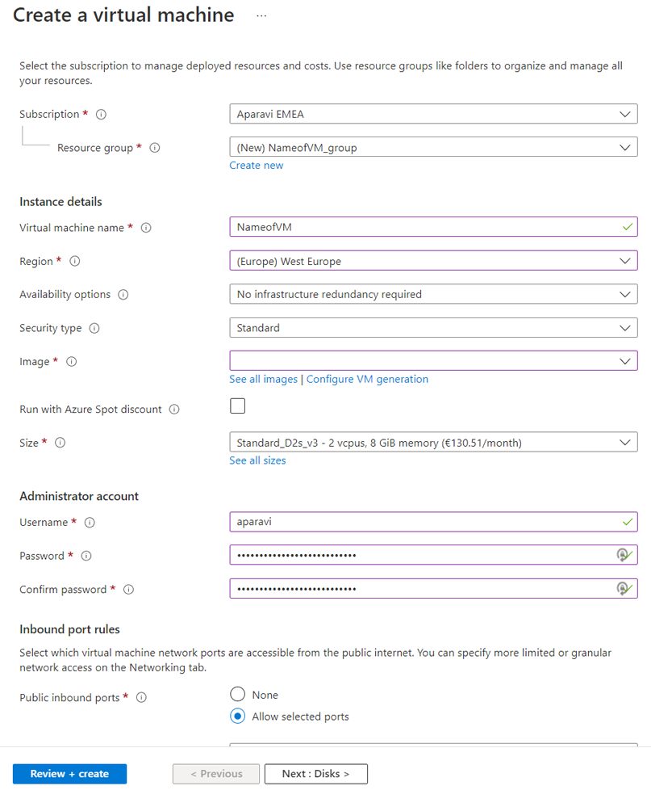
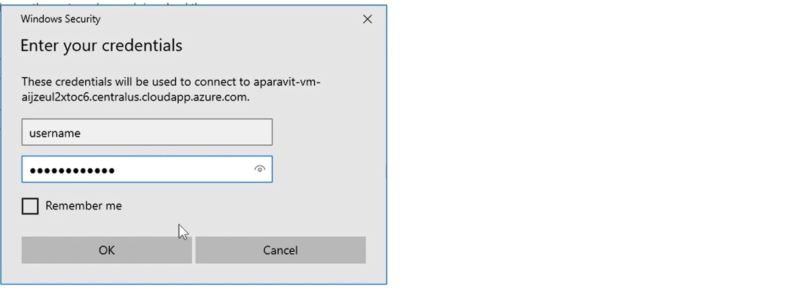
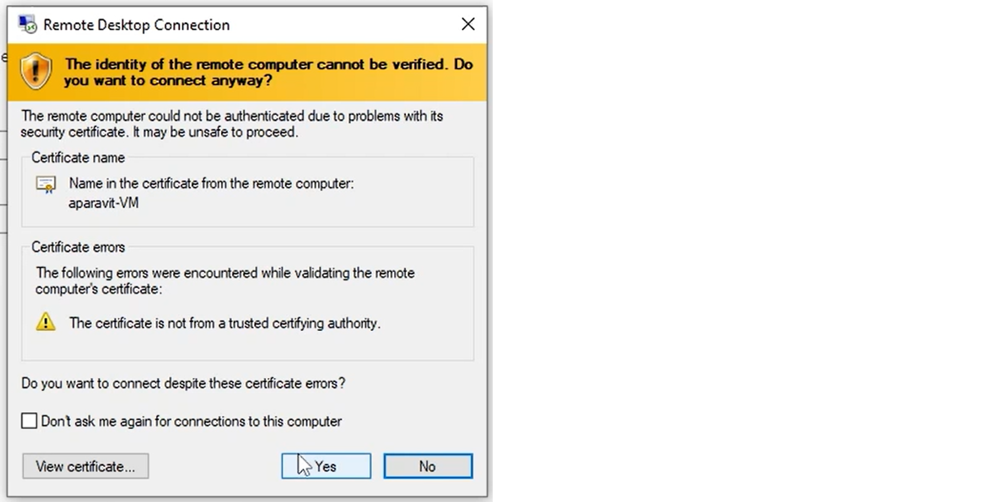

<head>
  <title>Azure VM - Windows - Aparavi Data Suite Documentation</title>
</head>

# **Overview**

This document outlines the basics of a VM and system requirements for the APARAVI software in the Azure environment.

## **Defining a VM in Azure**

Login to your Microsoft Azure account and locate the “**Create**” button to start the process of making the VM.

From within the create a virtual machine window, a new window will appear with the Information that would need to be filled in to initiate the download.

 

- **Subscription**  – Name of the Azure subscription
- **Resource group** – Collection of resources that share the same lifecycle, permissions, and policies.
- **Virtual machine name** – Name of the VM within the resource group
- **Region** – Selection of regions of the VM location
- **Availability options** – managing the resiliency for the application
- **Security type**– Selection types refer to the different security features
- **Image** – Selection of base Operating system
- **Size** – Selection of VM performance
- **Username** – The administrator username for the VM
- **Password** – The Administrator password for the VM
- **Confirm password** – Confirm your administrator password

 

When wanting to connect to the VM you have options of RDP, SSH, and Bastion.

To connect to the Windows VM you would make use of RDP (Remote desktop protocol) and for Linux, you would use SSH (secure socket layer)

1. Download the RDP file from the Microsoft Azure portal.([portal.azure.com](https://portal.azure.com/)).
2. Run the RDP executable and a window will appear to establish the connection click on “ **Connect** “

3. Enter the credentials require to connect to the Virtual Machine.
4. Click **OK**

5. When done, a new security window will appear to accept the connection certificate.
6. You have the option to view the certificate and click on “ **Yes** “ if you agree.

7. When the firewall rules allow an RDP connection you will now be able to login into the Windows environment to start your APARAVI software installation.
