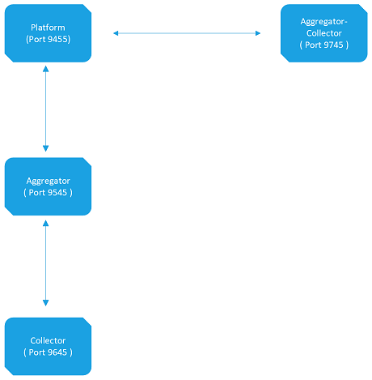

<head>
  <title>Firewall Rules - Aparavi Data Suite Documentation</title>
</head>

### What are the inbound and outbound rules?

Correct inbound and outbound rules are essential for APARAVI nodes to communicate with the APARAVI platform. Use this article for configuring them.

### What rules need to be allowed?

The network rules must contain the following ports:

- HTTPS (443)
- Aparavi (9455)

Both using the TCP protocol over TLS 1.3.

Data ports used by Aparavi are setup using two mutual TSL/SSL TCP/IP communication paths. These communications are two way. For example, if a user searches for something, the platform will forward the search request to all related aggregators. When the user initiates “Scan now” for any collector, the platform will forward that request to the parent owner aggregator which in turn will initiate a task request to the collector. All of this happens using data port. These values are also stored in `config.json` for each module. If someone wants to change these values, they can do it manually by stopping the service, editing the `config.json` file, then starting the service. Here are data ports for all module types:

| Component | Port |
| --- | --- |
| Platform | 9455 |
| Collector | 9645 |
| Aggregator | 9545 |
| Aggregator-Collector | 9745 |

The following table illustrates inbound and outbound direction as well as app to app flow of communication:

Browser access is generally only needed for the platform. In certain cases it may also be desired to access one of the other module types through the browser, which can be done generally using localhost followed by a colon and the port number as shown. The platform will not need a port number as it will automatically choose the correct value.

| Connection | Port |
| --- | --- |
| Platform (HTTP/HTTPS) | 80/443 |
| Collector | 9652 |
| Aggregator | 9552 |
| Aggregator-Collector | 9752 |
