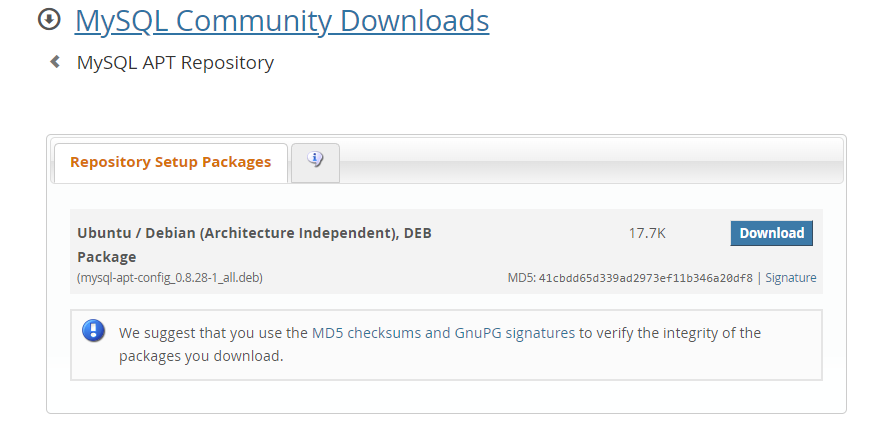
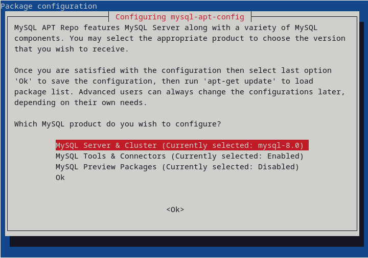
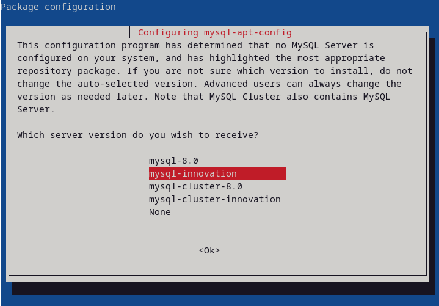
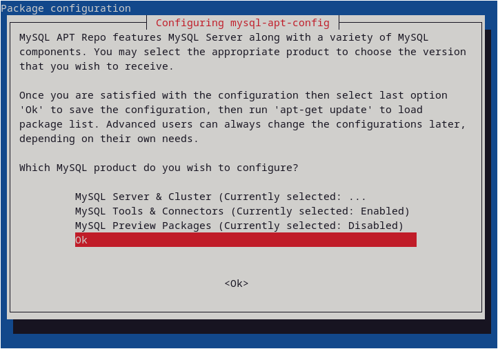

<head>
  <title>MySQL Server - Linux - Aparavi Data Suite Documentation</title>
</head>

- - video 18.30, error 45.13

MySQL database 8.0.28 or higher is a pre-requisite for deploying an Aggregator or Aggregator-Collector. This database houses all of the indexed data collected from your environment.

MySQL 8.2 is the latest available version, referred to as MySQL 8.2.0 Innovation. This document will describe the steps to download and setup the version 8.2 installation, however you may be able to use the default version available with your Linux distribution.

**Checking the default version**

Using the method to install packages on your Linux version, enter the command to install **mysql-server** without allowing the installation to proceed when prompted. If the version shows 8.0.28 or higher you may proceed. If the version is lower, decline the installation then install the latest version shown in the next section.

**Installing MySQL 8.2**

The first step is to update your repository configuration so that the MySQL installation package can be found for your distribution. For the Debian family using the apt package install method, the information is available [here](https://dev.mysql.com/doc/mysql-apt-repo-quick-guide/en). Other package install types are available in the left menu.

The remainder of this guide will describe the apt package installation method, but once the package installation is compete the steps to configure should be the same for any package installation and distribution used.

**Installation Process**

Begin by downloading the repository setup package [here](https://dev.mysql.com/downloads/repo/apt/).

In the following screen, click 'No thanks, just start my download' to begin the download.

The default download location will be the Downloads directory, so open a terminal screen, change to that directory and run the package setup. For example:

sudo dpkg -i mysql-apt-config\_0_.8.28-1_\_all.deb

 

This will cause the first configuration screen to appear:

Press Enter with the selection shown. It is expected to show 8.0 to begin with.

This will cause the next screen to appear:

Select mysql-innovation to select the latest MySQL version, then press Enter.

This will cause the next screen to appear:

This will cause the next screen to appear:

Scroll down to the "Ok" selection in the list, then press Enter.

This completes the product selection from the repository, and you will see the command prompt return. Next make the new configuration effective by running this command:

**sudo apt update**

After a couple seconds, the command prompt will appear. Next enter the command to install the MySQL package with this command:

**sudo apt install mysql-server**

Press Y when prompted to confirm to continue.

This will cause the following prompts to appear:

**Enter root password:**

Provide a root password, making sure to write down for future use. Press Enter to continue.

**Re-enter root password:**

Type the same as provided, to be sure there was no mistake. Press Enter to continue.

**Informational authentication screen**

Press Enter to continue

**Select default authentication plugin**

Select "Use Legacy Authentication Method". Press Enter to continue.

 

This completes the installation and you are ready to use the APARAVI product where the application types require the MySQL database, where you may specify user as root and the password as provided during installation
