<head>
  <title>MySQL Server - Windows - Aparavi Data Suite Documentation</title>
</head>

## Versions

Aparavi requires MySQL 8.x (the current 9.x has not been tested). The current 8.x LTS version is 8.4 and has been tested.

## Installation Notes

### Logging

When installing, choose the Advanced Logging options. Set _General Log_, _Slow Query Log_, and _Binary Log_ off (unchecked). All three tend to create large logs when used with Aparavi.

### Location

Make sure that the MySQL database drive and directory are located on a drive that can be extended or expanded. Aparavi's database can be large as the metadata becomes more complex and the size of the data analyzed increases.

# Detailed Installation

For a detailed example of the installation, see below for click-by-click pictures

1. 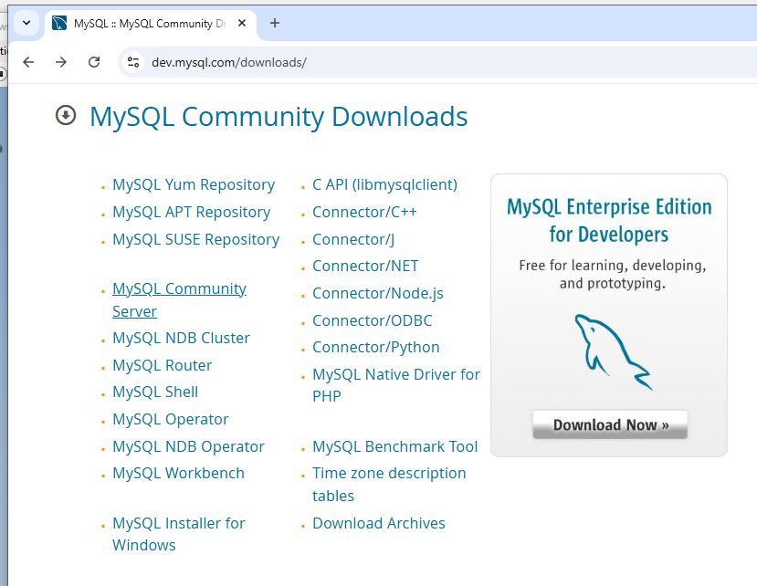
2. 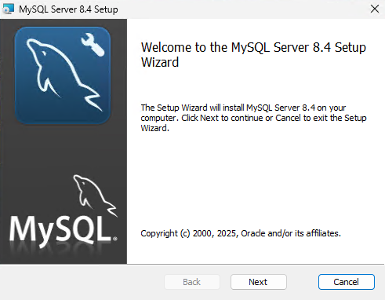
3. 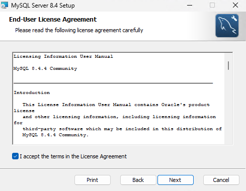
4. 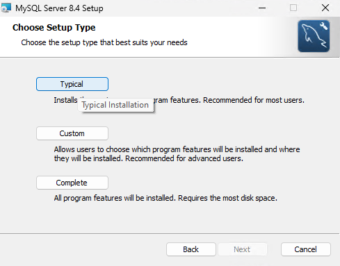
5. 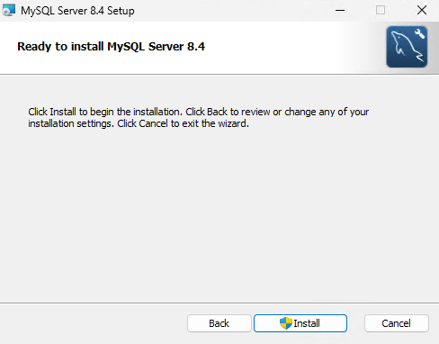
6. 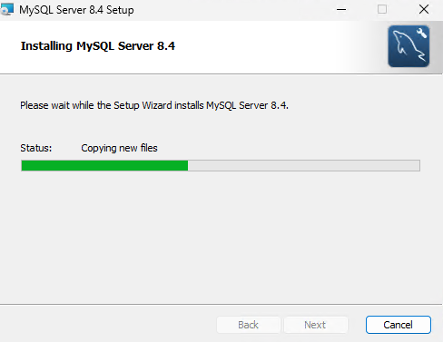
7. 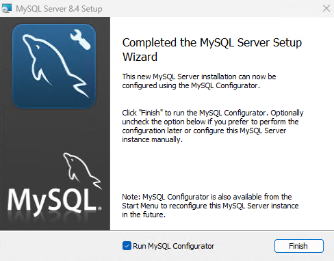
8. 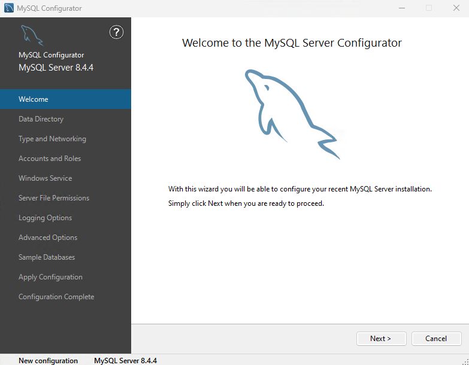
9. 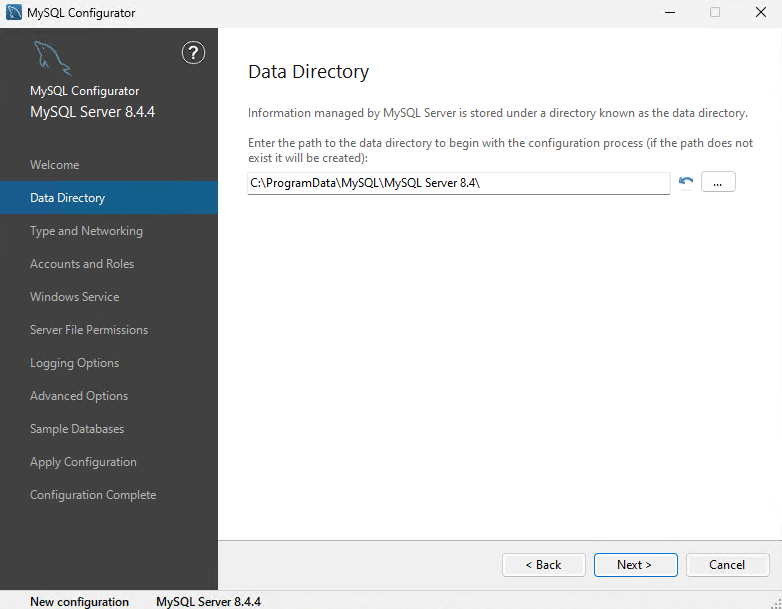
10. 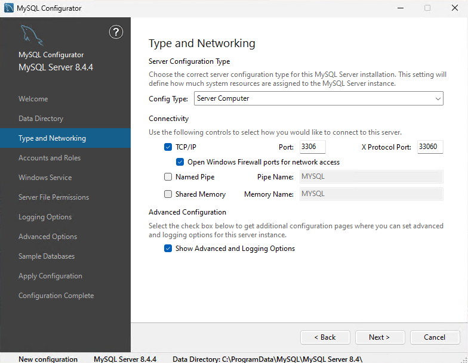
11. 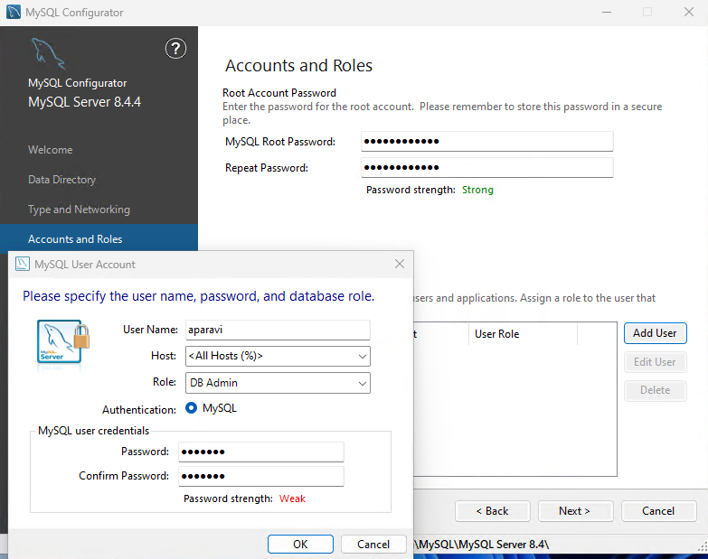
12. 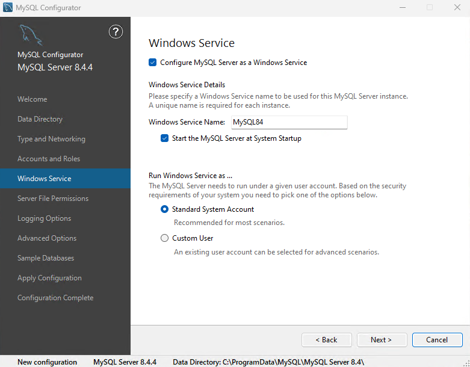
13. 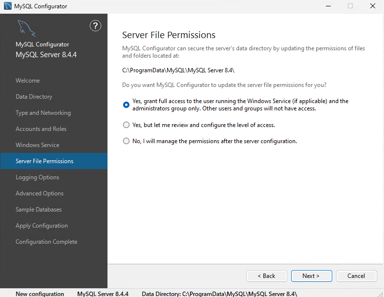
14. 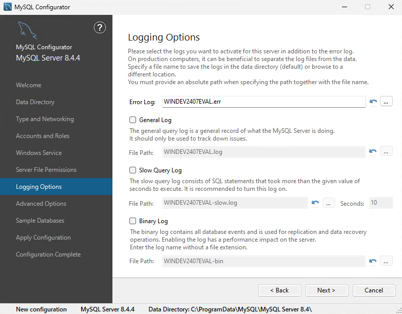
15. 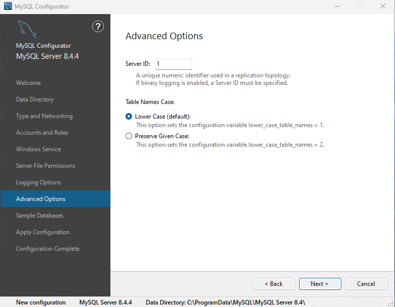
16. 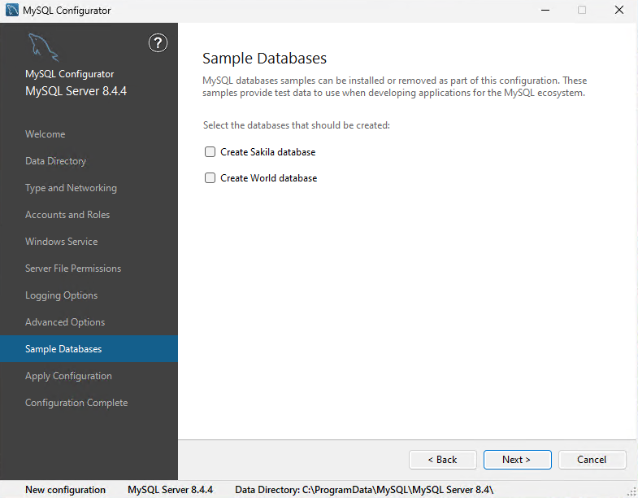
17. 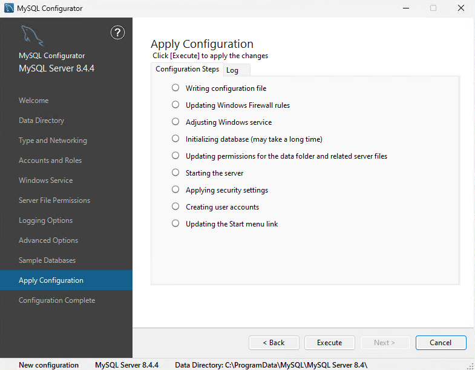
18. 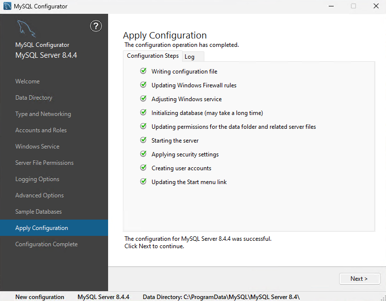
19. 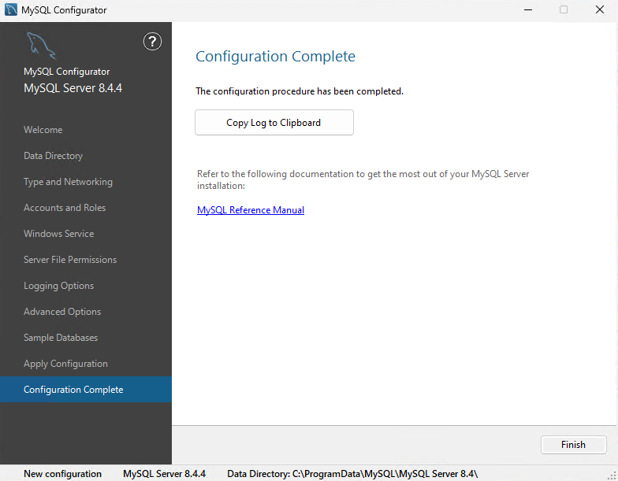
