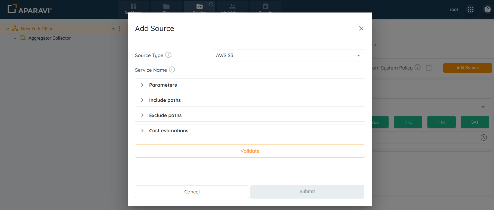
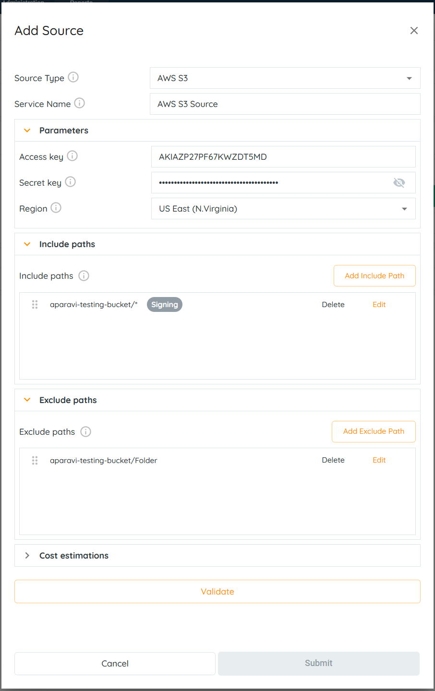
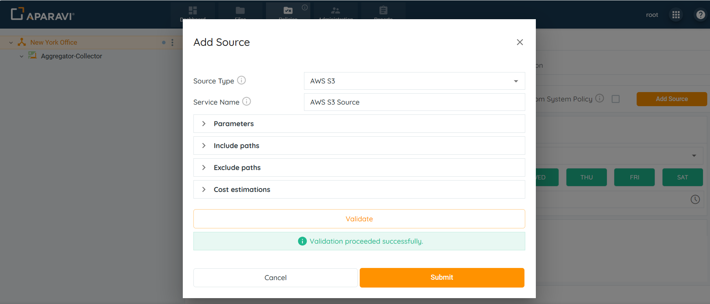
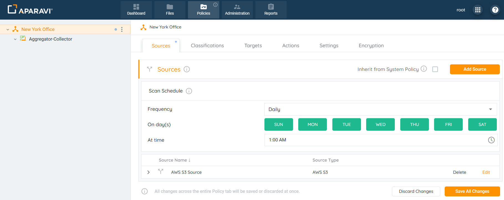
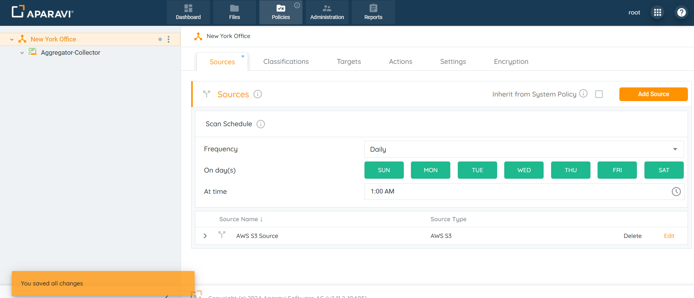

<head>
  <title>AWS S3 - Aparavi Data Suite Documentation</title>
</head>

## Overview

Aparavi allows business users to automate data actions by linking AWS S3 sources and targets, no code or command line necessary.

> The system needs at least one source and one include path to complete a file scan. Multiple include path scan be customized as well, but the path entries follow an order of precedence that must be adhered to.

1. Click on the Policies tab. By default, the system will navigate to the Sources subtab.

2. Click on the Add Source button, located in the upper right-hand corner of the screen.

3. Select AWS S3 from the drop-down.

4. Provide the necessary information in the fields to set up and configure the AWS S3 source:

- **Source Type:** This field defines the kind of source to connect to. It will auto-populate with the selected AWS S3 source. This field cannot be altered.
- **Service Name:** Enter any name for the AWS S3 source.
- **Include Paths:** Click on the Include Paths section and include at least one path. Although multiple include paths can be entered, the system has an order of precedence for the paths that must be followed. The Include path should start with bucket name: **B****ucketName/FolderName/\***.

Examples:

- - **\*** - scanning of all buckets on an account.
    - **aparavi-testing-bucket/\*** - scanning a specific bucket.
    - **aparavi-testing-bucket/Folder/\*** - scanning a particular folder.
    - **aparavi-testing-bucket/Folder/Test\*** - scanning using wild cards in the file path. This will include all emails and folders starting with the word _Test_ (f.e aparavi-testing-bucket/Folder/Test1, aparavi-testing-bucket/Folder/Test123.pdf).
- **Exclude Paths:** In addition to configuring include paths, an optional step is to enter an exclude path within the section below. When entered, the system will skip the path and not scan the folders and files within it.

Examples:

- - **aparavi-testing-bucket** - excluding a specific user from a scan.
    - **aparavi-testing-bucket/Folder** - excluding a particular folder.
    - **aparavi-testing-bucket/Folder/Test\*** - excluding using wild cards in the file path. This will exclude all files and folders starting with the word _Test_ (f.e aparavi-testing-bucket/Folder/Test1, aparavi-testing-bucket/Folder/Test123.txt).
    - **aparavi-testing-bucket/Folder/doc.txt** - excluding a particular file _doc.txt_.
- **Configure Parameters:**
    - **Access key**: This is a key which gives access to your AWS resources. It is provided by the service provider. It is used to sign the requests you send to Amazon S3.
    - **Secret key:** This is a key which gives access to your AWS resources. It is provided by the service provider. It is used to sign the requests you send to Amazon S3.
    - **Region:** This is defined and provided by the service provider.
- **Configure the Cost estimations**:
    - **Access Rate:** Time required to recall a file in MB per second.
    - **Access Delay:** Elapsed time before access to a file starts.
    - **Access Cost:** The egress cost per MB to recall a file.
    - **Storage Cost:** The cost per MB to store a file per month.

5. After completing all sections within the Add source pop-up box, select the Validate button. If the validation was successful, click OK. If the OK button does not activate, this indicates that the credentials are throwing an error and need to be revised before the configuration can progress.
6. Once the AWS S3 settings have been validated, click OK.

7. Click on the Save All Changes button.

8. Click OK.

9. Once the source has been configured, the system will display an alert message and begin scanning from the AWS S3 source.

