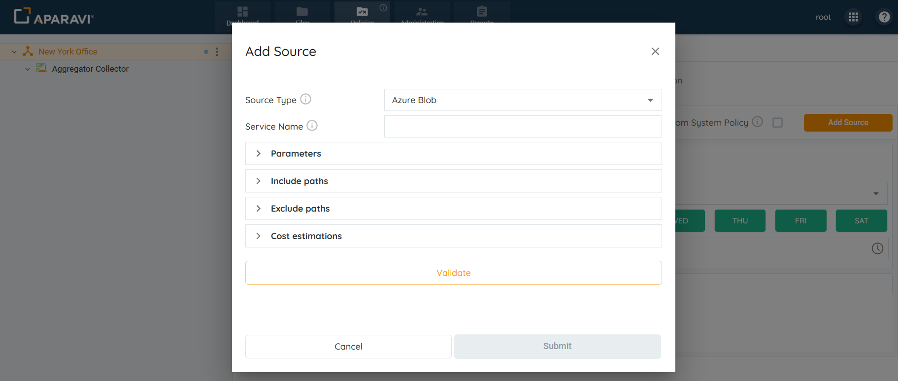
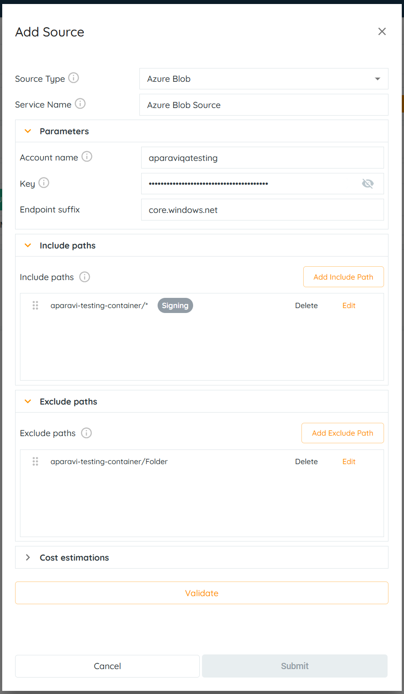
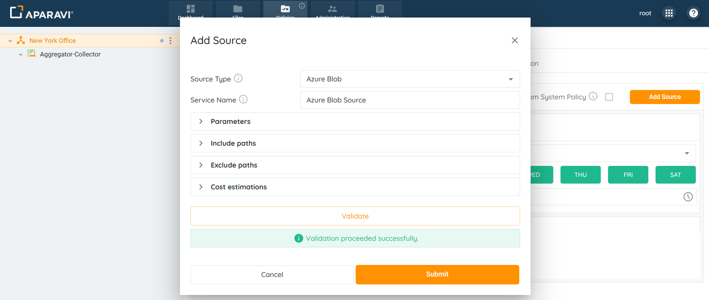
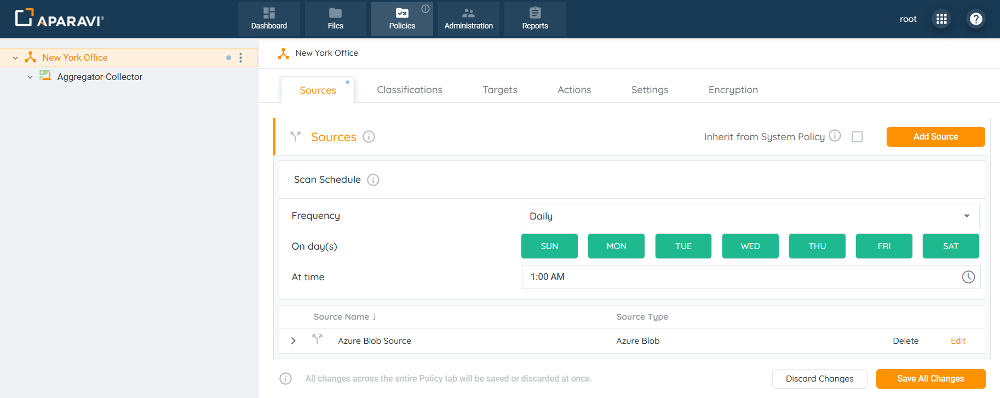
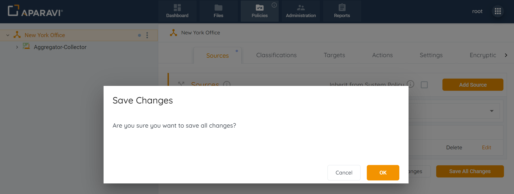
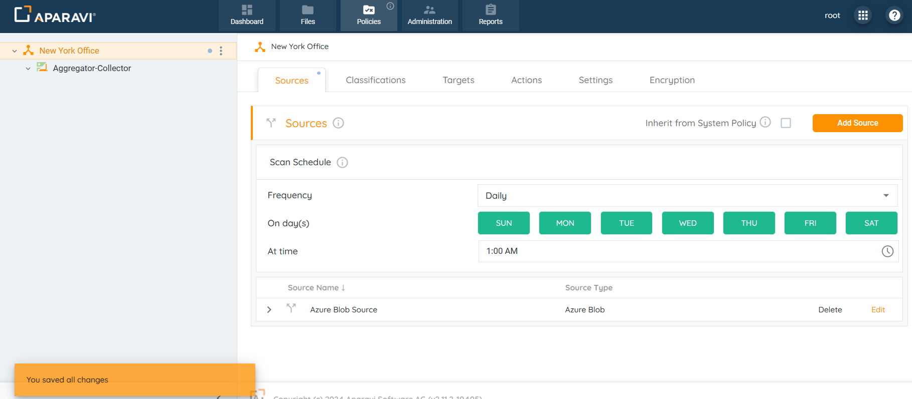

<head>
  <title>Azure Blobs - Aparavi Data Suite Documentation</title>
</head>

## Overview

Aparavi allows business users to automate data actions by linking Azure Blob sources and targets, no code or command line necessary.

> The system needs at least one source and one include path to complete a file scan. Multiple include path scan be customized as well, but the path entries follow an order of precedence that must be adhered to.

1. Click on the Policies tab. By default, the system will navigate to the Sources subtab

2. Click on the Add Source button, located in the upper right-hand corner of the screen.

3. Select Azure Blob from the drop-down.

4. Provide the necessary information in the fields to set up and configure the Azure Blob source:

- **Source Type:** This field defines the kind of source to connect to. It will auto-populate with the selected Azure Blob source. This field cannot be altered.
- **Service Name:** Enter any name for the Azure Blob source.
- **Include Paths:** Click on the Include Paths section and include at least one path. Although multiple include paths can be entered, the system has an order of precedence for the paths that must be followed. The Include path should start with container name: **BlobContainer/FolderName/\***.

Examples:

- - **\*** - scanning of all containers on an account.
    - **aparavi-testing-container/\*** - scanning a specific container.
    - **aparavi-testing-container/Folder/\*** - scanning a particular folder.
    - **aparavi-testing-container/Folder/Test\*** - scanning using wild cards in the file path. This will include all emails and folders starting with the word _Test_ (f.e aparavi-testing-container/Folder/Test1, aparavi-testing-container/Folder/Test123.pdf).
- **Exclude Paths:** In addition to configuring include paths, an optional step is to enter an exclude path within the section below. When entered, the system will skip the path and not scan the folders and files within it.

Examples:

- - **aparavi-testing-container** - excluding a specific container from a scan.
    - **aparavi-testing-container/Folder** - excluding a particular folder.
    - **aparavi-testing-container/Folder/Test\*** - excluding using wild cards in the file path. This will exclude all files and folders starting with the word _Test_ (f.e Taparavi-testing-container/Test1, aparavi-testing-container/Test123.pdf).
    - **aparavi-testing-****container****/doc.txt** - excluding a particular file _doc.txt_.
- **Configure Parameters:**
    - **Account name:** This defines the unique namespace in Azure for your data. This is available inside the Azure Portal.
    - **Key:** This defines the Azure account key needed to access the blob storage. This is available inside the Azure Portal.
    - **Endpoint suffix:** Specifies the endpoint suffix to use for establishing the connection. The default value is _core.windows.net_.
- **Configure the Estimations Section**:
    - **Access Rate:** Time required to recall a file in MB per second.
    - **Access Delay:** Elapsed time before access to a file starts.
    - **Access Cost:** The egress cost per MB to recall a file.
    - **Storage Cost:** The cost per MB to store a file per month.

 

5. After completing all sections within the Add source pop-up box, select the Validate button. If the validation was successful, click OK. If the OK button does not activate, this indicates that the credentials are throwing an error and need to be revised before the configuration can progress.
6. Once the Azure Blob settings have been validated, click OK.

7\. Click on the Save All Changes button.

8\. Click OK.

9. Once the source has been configured, the system will display an alert message and begin scanning from the Azure Blob source.

