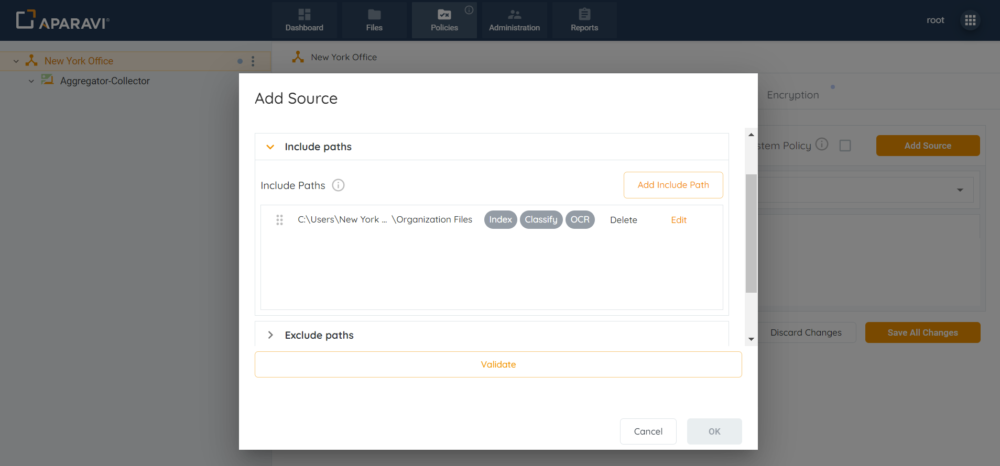
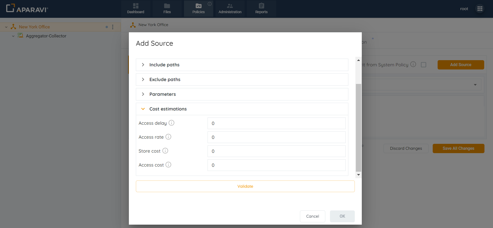
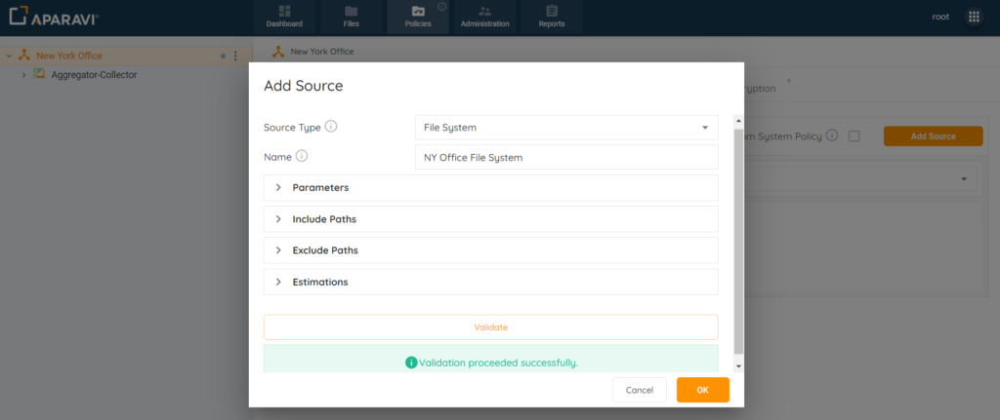
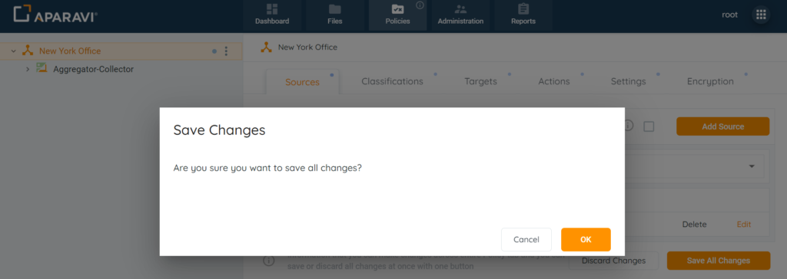
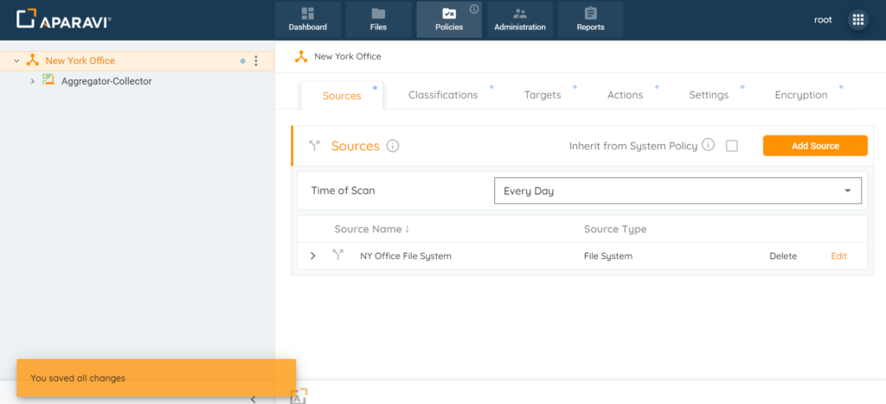

<head>
  <title>File System - Aparavi Data Suite Documentation</title>
</head>

- Log in and navigate down to your collector level in the APARAVI platform.
- Navigate to the “**Policies**” menu and select the “**Sources**” tab. While on this tab click on “**Add Source**“ (Note: the filesystem to be scanned must be running the Aparavi Collector Service)
- A new window will appear with a dropdown list. Select “**File System**” from the dropdown menu.
- Click on the Include Paths section and include at least one path. Although multiple include paths can be entered, the system has an order of precedence for the paths that must be followed.

See: Order of Precedence:

- [Sources - Order of Precedence for Folder Paths](../order-of-precedence-for-folder-paths/order-of-precedence-for-folder-paths.md)
- In addition to configuring include paths, an optional step is to enter the exclude path within the section below. When entered, the system will skip the path and not scan the folders and files within it.

- Parameters**:** This section allows for configuring the settings for the External Drives, and Exclude path typical File System features. These toggles customize boundaries to specify what the platform should scan.
- Click on the Estimations Section and enter the File System data.
    - **Access Rate:** Time required to recall a file in MB per second.
    - **Access Delay:** The elapsed time before access to a file starts.
    - **Access Cost:** The egress cost per MB to recall a file.
    - **Storage Cost:** The cost per MB to store a file per month.

- After completing all sections within the Add source pop-up box, select the Validate button. Ensure the validation is successful.
- Click **OK**

5\. Click on the Save All Changes button. Once clicked a pop-up box will appear requesting to confirm all changes.

6\. Click OK.

7. Once the Source has been configured, the system will display an alert message and begin scanning from the source.

### Source Inheritance Settings

Click on the checkbox next to the label “Inherit from \[XYZ Organization\]” to select it. Once selected, the checkbox will appear in an orange background to indicate that it is selected.

Now, this node will apply the same settings from the Sources subtab as the Client/node above it.
