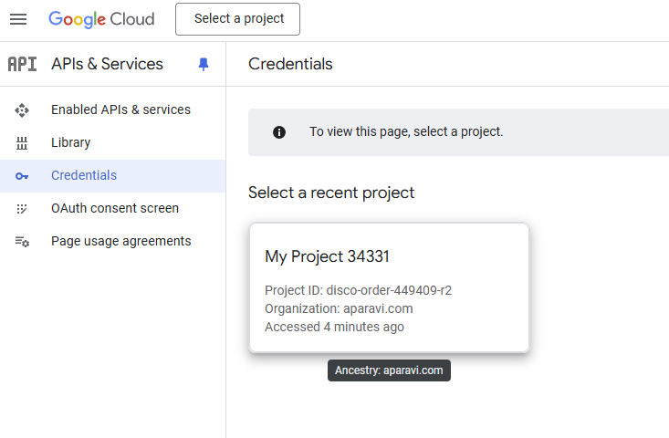
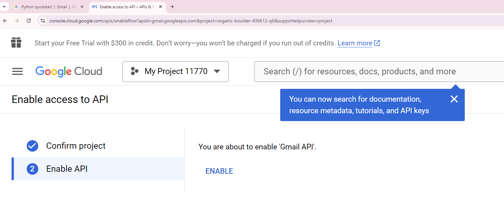
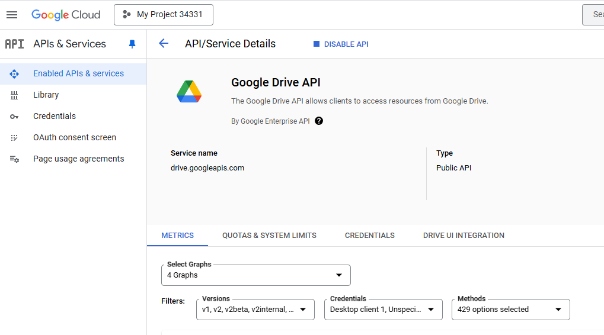
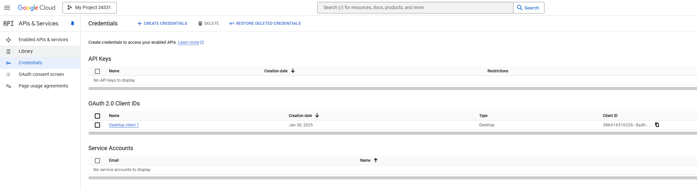

<head>
  <title>Google Personal Account - Aparavi Data Suite Documentation</title>
</head>

APARAVI adds value quickly by allowing you to add your personal Google accounts as the source and run scans to find the data insights from all the unstructured data within Google accounts like Gmail or Google Drive. Here is a quick guide on how to set up a Google Personal account for Data Toolchain for AI

- Login to your Google account (user@gmail.com)

### Create a Google Cloud Project

- Go to: [https://developers.google.com/workspace/guides/create-project](https://developers.google.com/workspace/guides/create-project)
    
    

### Enable the APIs

Before using Google APIs, you need to turn them on in a Google Cloud project. You can turn on one or more APIs in a single Google Cloud project.

- In the Google Cloud console, enable the Gmail API: [https://console.cloud.google.com/flows/enableapi?apiid=gmail.googleapis.com](https://console.cloud.google.com/flows/enableapi?apiid=gmail.googleapis.com)

- Enable the Google Drive API: [https://console.developers.google.com/apis/api/drive.googleapis.com](https://console.cloud.google.com/apis/api/drive.googleapis.com)

### Configure the OAuth consent screen

If you're using a new Google Cloud project to complete this quickstart, configure the OAuth consent screen and add yourself as a test user.

- In the Google Cloud console, go to Menu menu > **APIs & Services** > **OAuth consent screen**
- Open [https://console.cloud.google.com/apis/credentials](https://console.cloud.google.com/apis/credentials) and in the tab on the left find the “OAuth content screen”.
- Click the “OAuth content screen” and create your application.
- Pay attention to these fields when you create the application:
    - For **User type** select **External**, then click **Create**.
    - Set Publishing Status = Testing
    - Test users = \[Add your Google account as a test user\].

### Authorize credentials for a desktop application

To authenticate end users and access user data in your app, you need to create one or more OAuth 2.0 Client IDs. A client ID is used to identify a single app to Google's OAuth servers. If your app runs on multiple platforms, you must create a separate client ID for each platform.

- In the Google Cloud console, go to Menu menu > **APIs & Services** > **Credentials**
- Select “Credentials”: [https://console.cloud.google.com/apis/credentials](https://console.cloud.google.com/apis/credentials)

2. - Click **Create Credentials** > **OAuth client ID**.
    - Click **Application type** > **Desktop app**.
    - In the **Name** field, type a name for the credential. This name is only shown in the Google Cloud console.
    - Click **Create**. The OAuth client-created screen appears, showing your new Client ID and Client secret.
    - Click **OK**. The newly created credential appears under **OAuth 2.0 Client IDs.**
    - Download and save the JSON file, and move it to your working directory. (The file is not downloaded automatically)

- This JSON file has to be uploaded to the APARAVI Data Toolchain to connect to your Google Account.
