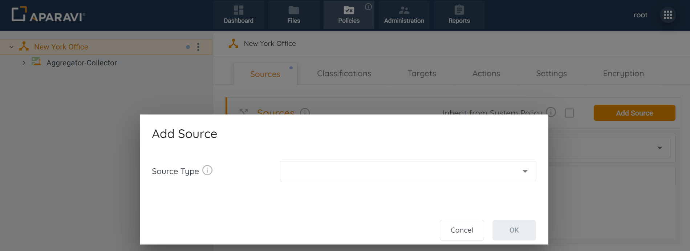
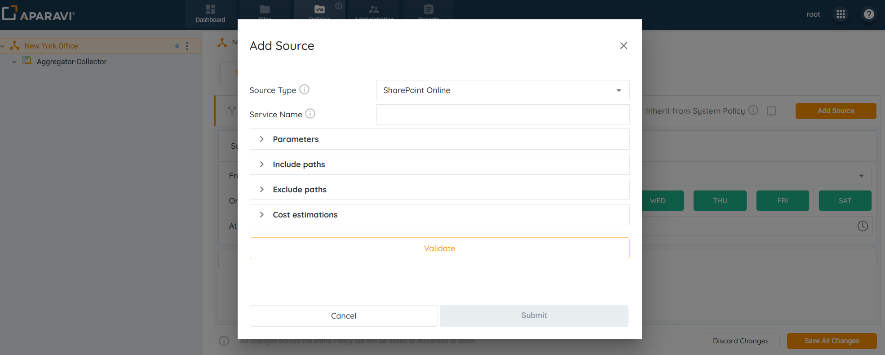
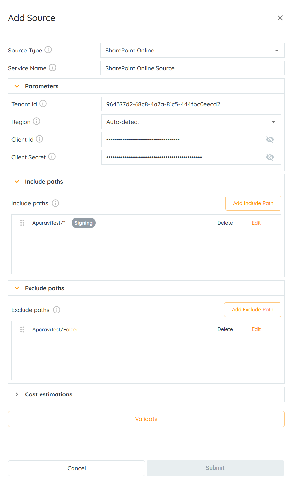
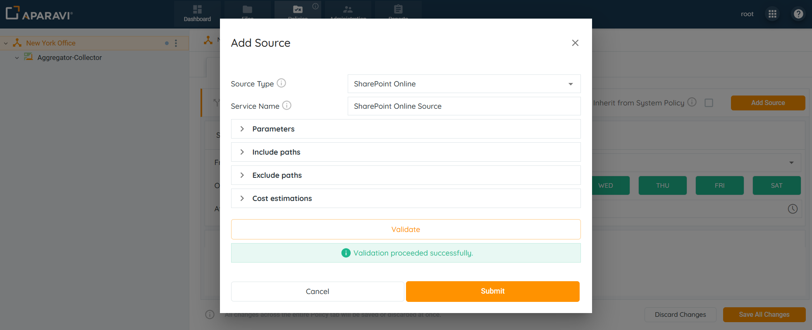
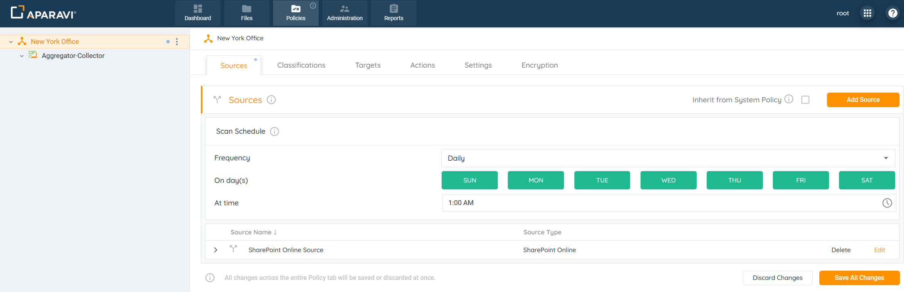
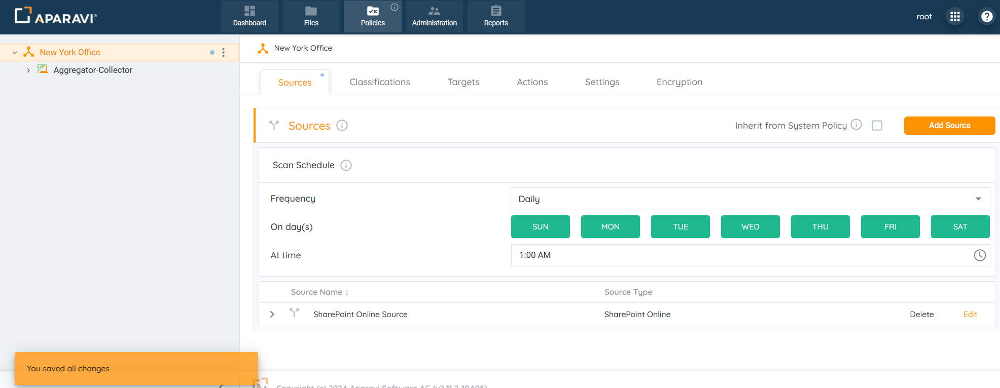

<head>
  <title>Microsoft SharePoint - Aparavi Data Suite Documentation</title>
</head>

## Overview

Aparavi allows business users to automate data actions by linking SharePoint Online sources and targets, no code or command line necessary. Before you start working with SharePoint Online, you will need to add and configure the application in the Microsoft Entra admin center. You can find instructions on how to do this here

- [Integrations - Microsoft Office Connectors](../../integrations/microsoft-office-connectors/microsoft-office-connectors.md)

**_Please Note:_** _The system needs at least one source and one include path to complete a file scan. Multiple include path scan be customized as well, but the path entries follow an order of precedence that must be adhered to._

1\. Click on the Policies tab. By default, the system will navigate to the Sources subtab.

<figure>

<figcaption>

Sources Subtab

</figcaption>

</figure>

2\. Click on the Add Source button, located in the upper right-hand corner of the screen.

<figure>

<figcaption>

Add Source Button

</figcaption>

</figure>

3\. Select SharePoint Online from the drop-down.

<figure>

<figcaption>

Add SharePoint Online Source

</figcaption>

</figure>

4\. Provide the necessary information in the fields to set up and configure the SharePoint Online source:

- **Source Type:** This field will auto-populate with the selected SharePoint Online source. This field cannot be altered.
- **Service Name:** Enter any name for the SharePoint Online source.
- **Include Paths:** Click on the Include Paths section and include at least one path. Although multiple include paths can be entered, the system has an order of precedence for the paths that must be followed.

The path consists from 3 elemens:

- site name indicates what site to scan;
- drive name indicates what drive inside corresponding site to scan, by default all drives are scanned for the corresponding site;
- folder name indicates what folders should be scanned inside corresponding drive, by default all folders are scanned for the corresponding drive. The default drive is "Documents".

The Include path should be in the following format: **siteName/driveName/FolderName**.

Examples:

- - **\*** - scanning of all sites on an account.
    - **AparaviTest/\*** - scanning a specific site.
    - **AparaviTest/Documents/Folder/\*** - scanning a particular folder in the "Documents" library. The "Documents" library is a mandatory part of the site and we must always include it in the path.
    - **AparaviTest/Documents/Test\*** - scanning using wild cards in the file path. This will include all files and folders starting with the word _Test_ (f.e AparaviTest/Documents/Test1, AparaviTest/Documents/Testimony, AparaviTest/Documents/Test123.pdf).
- **Exclude Paths:** In addition to configuring include paths, an optional step is to enter an exclude path within the section below. When entered, the system will skip the path and not scan the folders and files within it.

Examples:

- - **AparaviTest** - excluding a specific site from a scan.
    - **AparaviTest/Documents/Folder** - excluding a particular folder in the "Documents" library. The "Documents" library is a mandatory part of the site and we must always include it in the path.
    - **AparaviTest/Documents/Test\*** - excluding using wild cards in the file path. This will exclude all files and folders starting with the word _Test_ (f.e TestSite/Documents/Test1, estSite/Documents/Testimony, ).
    - **AparaviTest/Documents/doc.txt** - excluding a particular file _doc.txt_.
- **Configure Parameters:**
    - **Tenant Id**: It is a unique identifier different to your organization name or domain (configuration in Microsoft Entra).
    - **Region:** This specifies the data center regions for the SharePoint Online account.
    - **Client Id:** The Client Id created for your application (configuration in Microsoft Entra).
    - **Client Secret:** The Client Secret for your application (configuration in Microsoft Entra).
- **Configure the Estimations Section**:
    - **Access Rate:** Time required to recall a file in MB per second.
    - **Access Delay:** Elapsed time before access to a file starts.
    - **Access Cost:** The egress cost per MB to recall a file.
    - **Storage Cost:** The cost per MB to store a file per month.

<figure>

<figcaption>

Add SharePoint Online Source

</figcaption>

</figure>

5\. After completing all sections within the Add source pop-up box, select the Validate button. If the validation was successful, click OK. If the OK button does not activate, this indicates that the credentials are throwing an error and need to be revised before the configuration can progress.

6\. Once the SharePoint Online settings have been validated, click OK.

<figure>

<figcaption>

Submit Button

</figcaption>

</figure>

7\. Click on the Save All Changes button.

<figure>

<figcaption>

Save All Changes

</figcaption>

</figure>

8\. Click OK.

<figure>

<figcaption>

Confirmation

</figcaption>

</figure>

9. Once the source has been configured, the system will display an alert message and begin scanning from the SharePoint Online source.

<figure>

<figcaption>

SharePoint Online Source Configured

</figcaption>

</figure>

**_Please note:_** _If you are experiencing errors during the scan, they may be caused by incorrect application permissions settings. Check the list of minimum required rights on this page "__How to configure an application in the Microsoft Entra admin center configuration for Cloud Connectors"__._

 

_**Please note:**_ _SharePoint_ _connector does not support ACCESS DATE file property, so it will be empty in our system. SharePoint does not support the PERMISSIONS and DATA OWNERS file properties._
