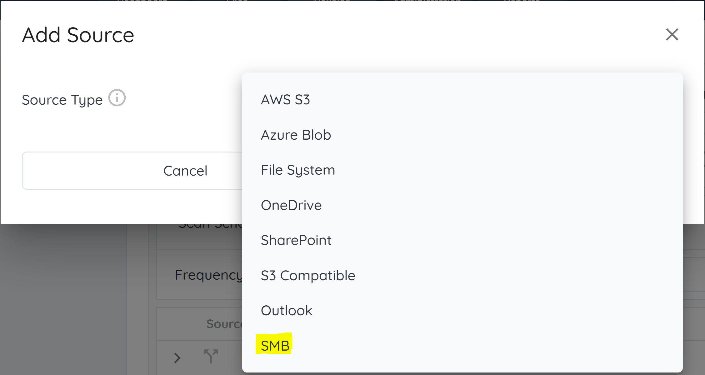
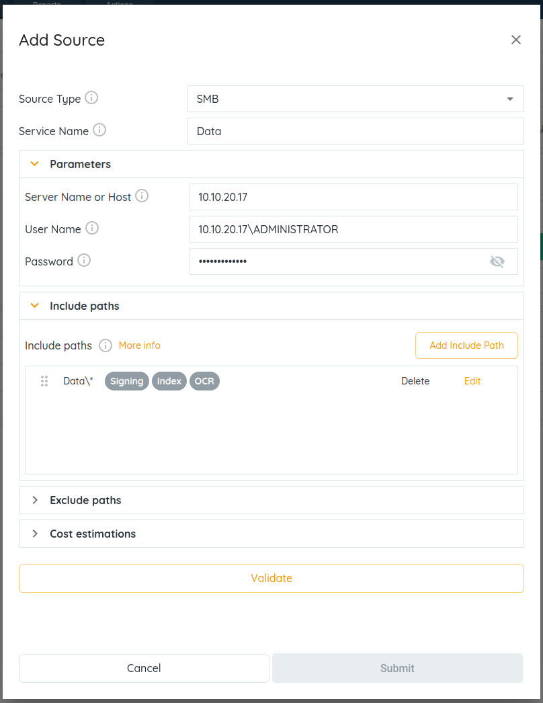

<head>
  <title>Samba (SMB) - Aparavi Data Suite Documentation</title>
</head>

- Login on your client level in the APARAVI platform.
- Navigate to the “**Policies**” menu and select the “**Sources**” tab. When on this tab click on “**Add Source**“
- A new window will appear with a dropdown selection. Select “**SMB**” from the dropdown menu and click **“OK”**



**Source type**  - Defines the kind of source connecting to.

**Service Name** - Provide a unique name to the SMB source.

**Parameters:** This section allows defining the parameters required to connect to an SMB file share.

- Server Name or Host - Defines the server name: hostname or with IP address.
- Username - Username needed to connect to the file share. The format is domainname\\username.
- Password - Password needed to connect to the file share.

**Include paths** – Click on the Include Paths section and include at least one path. This path defines the paths included for Scan, Signing, Index, Classify, and OCR.

- - SMB Format for Windows: Sharename\\\*
    - SMB Format for Linux: Sharename/ \*

**Exclude paths** - The system will skip the path and not scan the folders and files within these defined paths. The format to define exclude paths are similar to defining an include path.

Click on “**Validate**” and click “**Submit**” to save the settings.

## Mac Notes

To connect an **SMB data source** on a Mac machine, users need the **Samba library.** Here's the command to install Samba via **Homebrew**, a package manager commonly used on macOS:

### Intel-based machines:

```
brew install samba

```

ARM-based machines (M-series):

1. arch -x86\_64 /bin/bash -c "$(curl -fsSL https://raw.githubusercontent.com/Homebrew/install/master/install.sh)"
2. arch -x86\_64 /usr/local/bin/brew install samba
