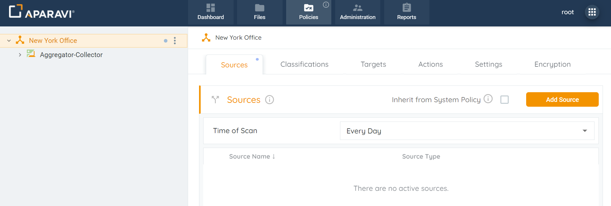
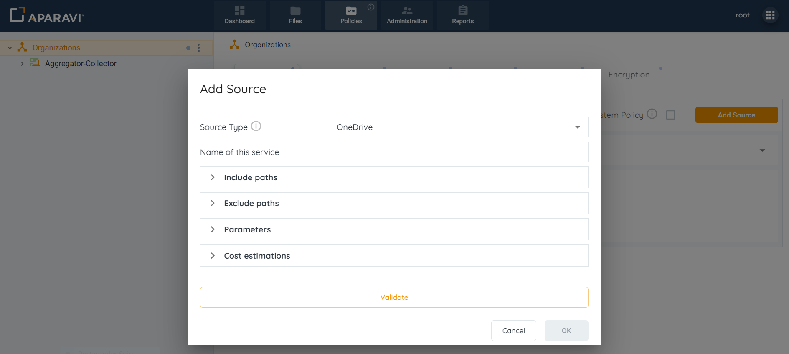
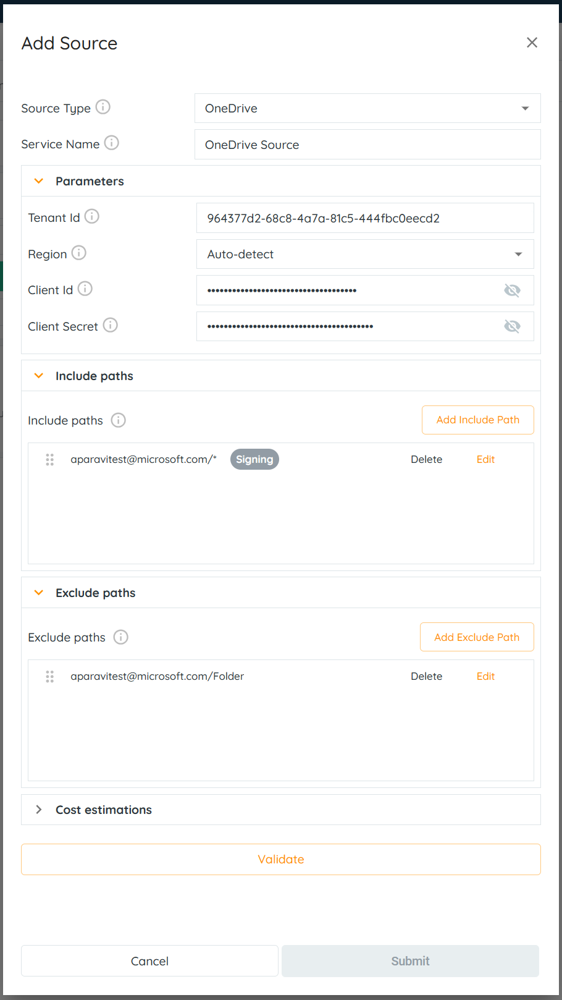
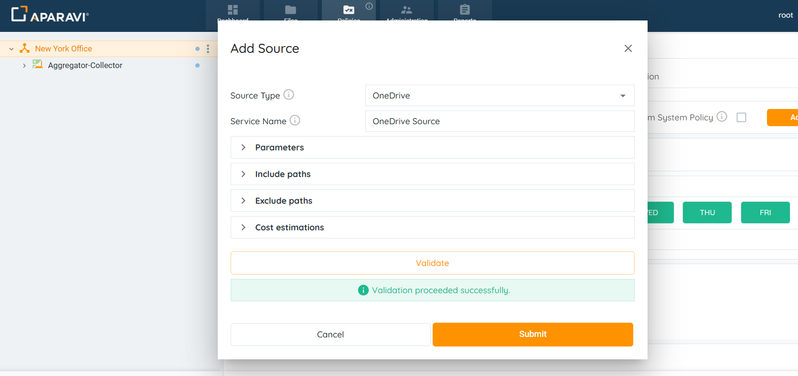
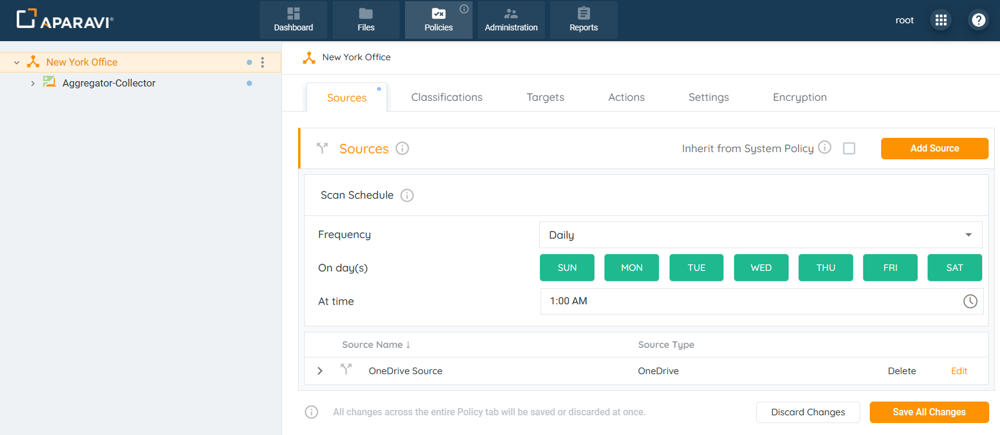
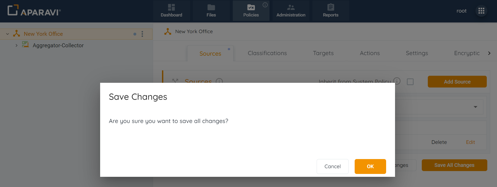
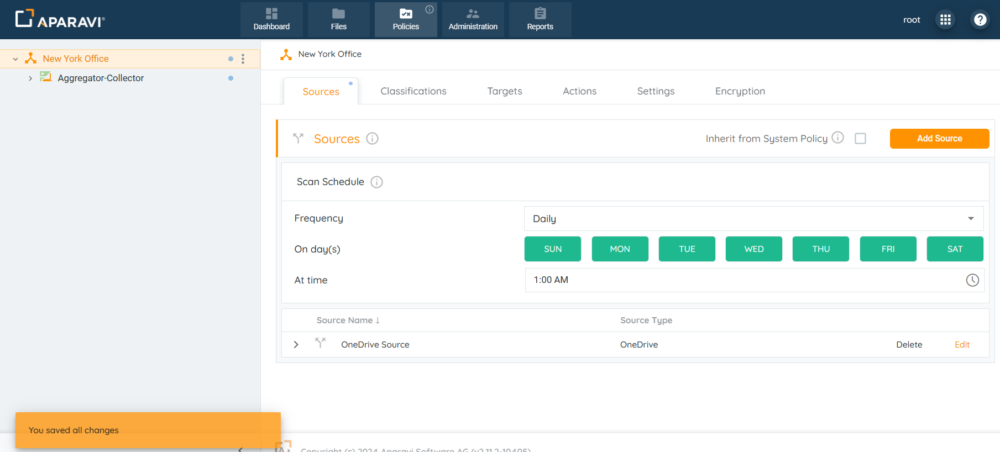
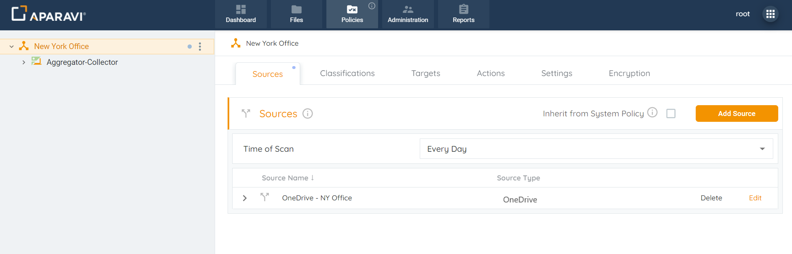
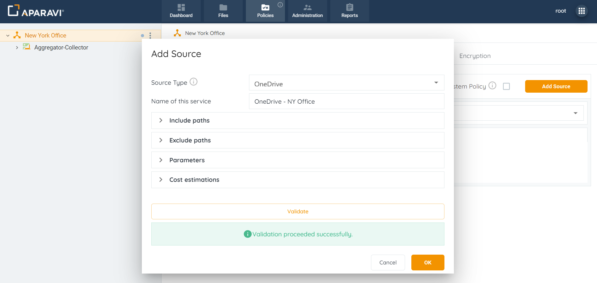
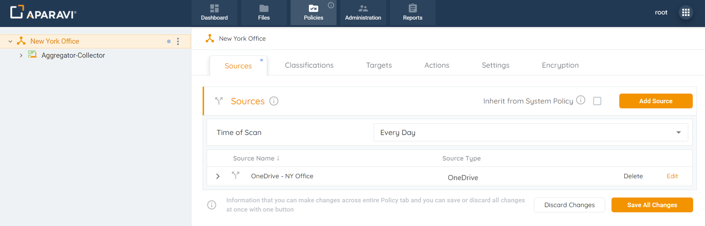

<head>
  <title>Microsoft OneDrive - Aparavi Data Suite Documentation</title>
</head>

## Overview

Aparavi allows business users to automate data actions by linking OneDrive sources and targets, no code or command line necessary. Before you start working with OneDrive, you will need to add and configure the application in the Microsoft Entra admin center. You can find instructions on how to do this here

- [Integrations - Microsoft Office Connectors](../../integrations/microsoft-office-connectors/microsoft-office-connectors.md)

> The system needs at least one source and one include path to complete a file scan. Multiple include path scan be customized as well, but the path entries follow an order of precedence that must be adhered to.

1. Click on the Policies tab. By default, the system will navigate to the Sources subtab.

2. Click on the Add Source button, located in the upper right-hand corner of the screen.

3. Select OneDrive from the drop-down.

4. Provide the necessary information in the fields to set up and configure the OneDrive source:

- **Source Type:** This field will auto-populate with the selected OneDrive source. This field cannot be altered.
- **Service Name:** Enter any name for the OneDrive source.
- **Include Paths:** Click on the Include Paths section and include at least one path. Although multiple include paths can be entered, the system has an order of precedence for the paths that must be followed. The Include path should be in the following format: **user ID****/FolderName/\***.

Examples:

- - **\*** - scanning of all users on an account.
    - **aparavitest@microsoft.com/\*** - scanning a specific user.
    - **aparavitest@microsoft.com/Folder/\*** \- scanning a particular folder.
    - **aparavitest@microsoft.com/Test\*** - scanning using wild cards in the file path. This will include all files and folders starting with the word _Test_ (f.e aparavitest@microsoft.com/Test1, aparavitest@microsoft.com/Testimony, aparavitest@microsoft.com/Folder/Test123.pdf).
- **Exclude Paths:** In addition to configuring include paths, an optional step is to enter an exclude path within the section below. When entered, the system will skip the path and not scan the folders and files within it. The Exclude path should start with user ID: **user ID****/FolderName/\***.

Examples:

- - **aparavitest@microsoft.com** - excluding a specific user from a scan.
    - **aparavitest@microsoft.com/Folder** \- excluding a particular folder.
    - **aparavitest@microsoft.com/Test\*** - excluding using wild cards in the file path. This will exclude all files and folders starting with the word _Test_ (f.e Test@Test.onmicrosoft.com/Test1, Test@Test.onmicrosoft.com/Testimony).
    - **aparavitest@microsoft.com/Folder/doc.txt** - excluding a particular file _doc.txt_.
        
        ### **Configure Parameters:**
        
    - **Tenant Id**: It is a unique identifier different to your organization name or domain (configuration in Microsoft Entra).
    - **Region:** This specifies the data center regions for the OneDrive account.
    - **Client Id:** The Client Id created for your application (configuration in Microsoft Entra).
    - **Client Secret:** The Client Secret for your application (configuration in Microsoft Entra).
        
        ### **Configure the Estimations Section**:
        
    - **Access Rate:** Time required to recall a file in MB per second.
    - **Access Delay:** Elapsed time before access to a file starts.
    - **Access Cost:** The egress cost per MB to recall a file.
    - **Storage Cost:** The cost per MB to store a file per month.

5\. After completing all sections within the Add source pop-up box, select the Validate button. If the validation was successful, click OK. If the OK button does not activate, this indicates that the credentials are throwing an error and need to be revised before the configuration can progress.

6\. Once the OneDrive settings have been validated, click OK.

7\. Click on the Save All Changes button.

8\. Click OK.

9. Once the source has been configured, the system will display an alert message and begin scanning from the OneDrive source.

> If you are experiencing errors during the scan, they may be caused by incorrect application permissions settings. Check the list of minimum required rights on this page "How to configure an application in the Microsoft Entra admin center configuration for Cloud Connectors".

> OneDrive connector does not support ACCESS DATE file property, so it will be empty in our system. OneDrive does not support the PERMISSIONS and DATA OWNERS file properties.

1\. Click on the Policies tab. By default, the system will navigate to the Sources subtab.

2\. Click on the Edit button to the right of the configured source.

3\. Inside the Edit Source pop-up box, edit the previously configured fields.

4\. After completing all sections within the Edit source pop-up box, Click the Validate button. If the validation was successful, Click OK. If the OK button does not activate, this indicates that the credentials are throwing an error and need to be revised before the altered configuration can be finalized.

5\. Click OK to save changes.

6\. Click on the Save All Changes button, in the bottom right-hand corner. Once clicked, a pop-up box will appear requesting to confirm all changes.

7\. Click the OK button to confirm the updated settings.

8. Once the source has been updated, the system will display an alert message and begin scanning using the updated OneDrive settings.

