<head>
  <title>AWS S3 - Aparavi Data Suite Documentation</title>
</head>

Aparavi allows business users to automate data actions by linking sources and targets, no code or command line necessary.

Creating targets allows the system to direct data into pre-configured data services. This enables businesses to build custom workflows for data hygiene, compliance, and retention use cases.

Once the target service has been set up, export actions can also be configured to run in the background and copy the files from the source to the target service.

> FAT32 file systems, removable and mounted drives cannot be configured as a target service at this time.

## Configuring an AWS S3 Target Service

The platform allows for all nodes to inherit identical settings for the Targets subtab. If the various nodes should have their own set of specifications instead, disabling this feature is also available.

1. Click on the Policies tab, located in the top navigation menu.

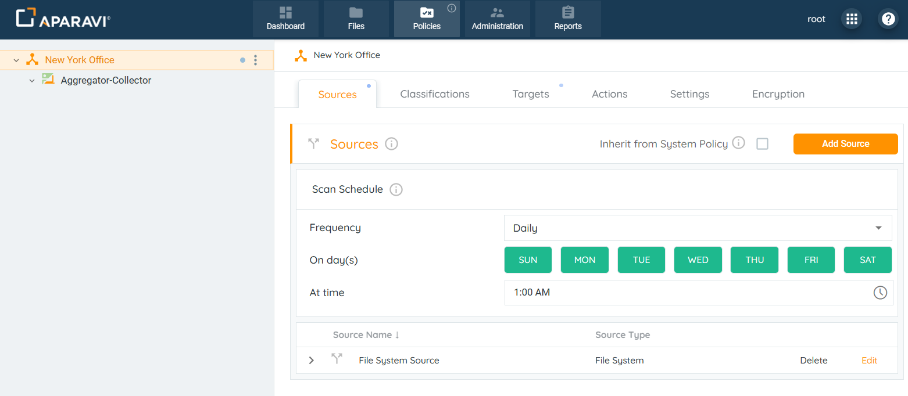

2. Click on the Targets subtab.
3. Click on the Add Target button, located in the upper right-hand corner of the screen. Once this button is clicked, the Add Target pop-up box will appear.

4. Inside of the Add Target pop-up box, select the AWS S3 option listed from the drop-down menu that appears under the Target Type field.

### Target Service Options for use with AWS S3 Bucket

This section describes all required fields to complete in order to implement the Target Service for the AWS S3 bucket.

1. Select "AWS S3” as the Target Type.
2. Inside the Add Target pop-up box, enter the fields to configure the AWS S3 target:
    - **Target Type:** This field defines the kind of target to connect to.
    - **Service Name:** Enter any name for the AWS S3 target.
    - **Configure Parameters:**
        - **Store path:** This path defines the exact specific folder in the filesystem. Format for AWS S3: **bucketname/foldername**. For example: aparavi-testing-general/targetFolder.
        - **Access key:** This is a key which gives access to your AWS resources. It is provided by the service provider. It is used to sign the requests you send to Amazon S3.
        - **Secret key:** This is a key used to access the AWS services.
        - **Region:** This is defined and provided by the service provider.
        - **Encryption:** Encryption enables you to encrypt your metadata and data so others cannot easily read your data without the proper access key. The data is encrypted before it ever is transmitted across the network and stored on the aggregator or sent to the cloud for retention purposes.
        - **Compression:** Compression can greatly reduce the amount of data sent and stored. Certain file types are more compressible than others. The algorithm used is LZ4, which is highly efficient and very fast. An average of 30% to 50% data size reduction is typical depending on your data set. This has the benefit of reducing the total amount of data that needs to be stored, but also decreases the time required to send that data across the network.
            
            ### **Configure Cost estimations:**
            
        - **Access delay:** Elapsed time before access to a file starts. (For example: S3 could be 0 second delay, while Glacier could be hours.
        - **Access rate:** Time required to recall a file in MB per second.
        - **Store cost:** The cost per MB to store a file per month.
        - **Access cost:** The egress cost per MB to recall a file.

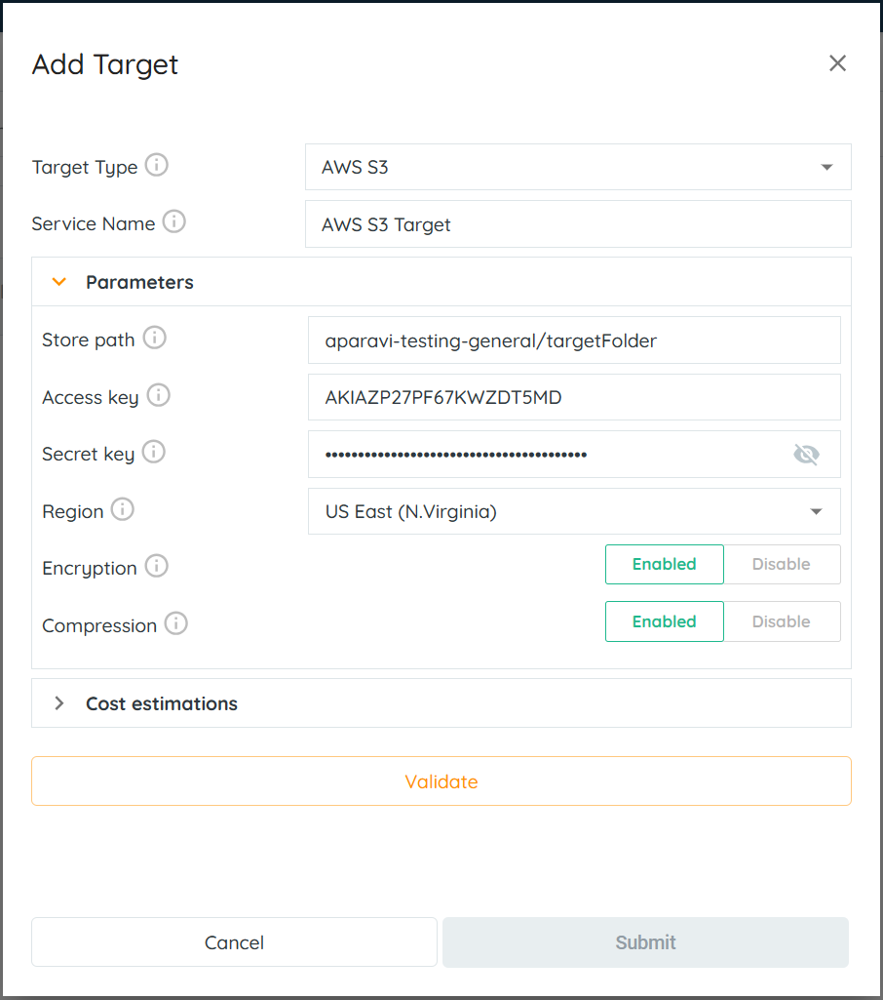

> You can find your "Access Key" information in your AWS Management Console. Follow the steps to find the information.

- Log in to the AWS Management Console as a root user or a user with administrative permissions.
- Click on your username in the top right corner and select “Security credentials”.

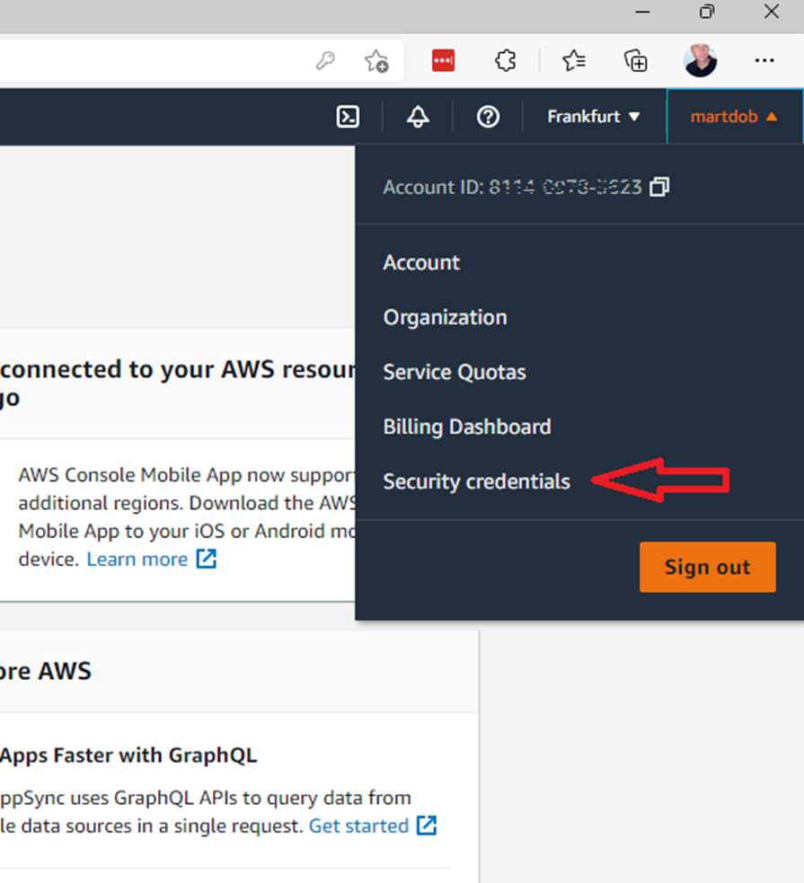

- Choose “Access keys (access key ID and secret access key)”.

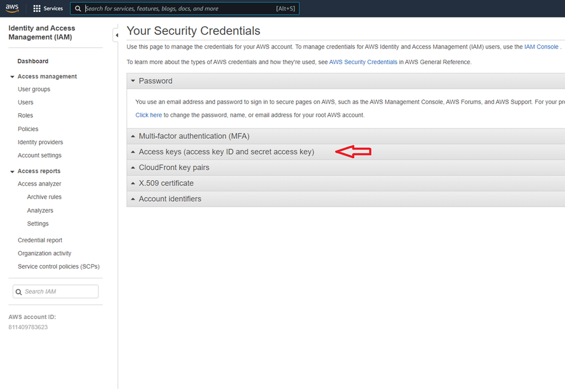

- Click "Create New Access Key" button.

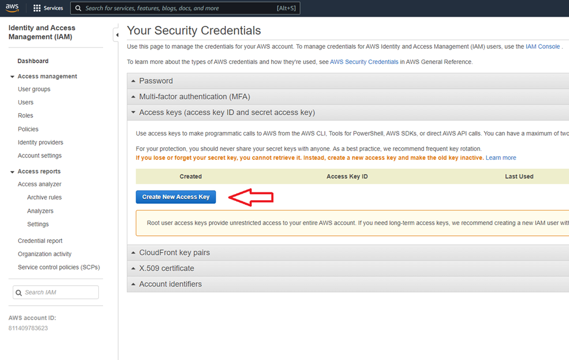

- Download your Access and Security Keys and use them as required to configure the S3 Target service.

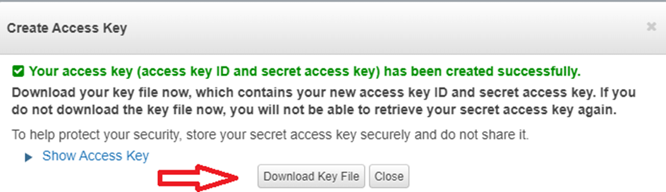

- Create a new bucket in your S3 environment.

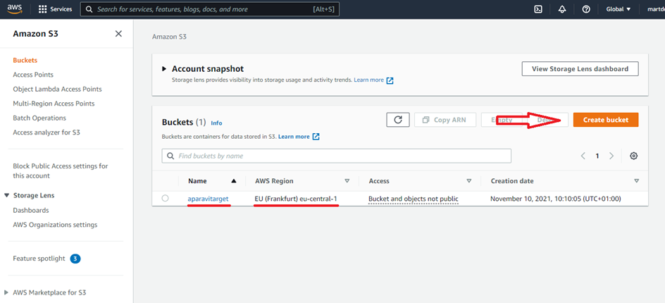

- Enter the bucket name and AWS region in the corresponding fields on the Aparavi platform.

3. Click the “Validate” button located at the bottom of the “Add Target” pop-up box.

**If Validation is Successful:** The system will display a green success message along the bottom of the Add Target pop-up box.

**If Validation is Not Successful:** The system will display a red error message along the bottom of the Add Target pop-up box. Please check the fields for errors and make necessary corrections.

4. Once the system has completed validation with the AWS S3 target service, the Submit button will be highlighted in orange to indicate that the button is now active. Click the Submit button in the bottom right corner of the Add Target pop-up box.

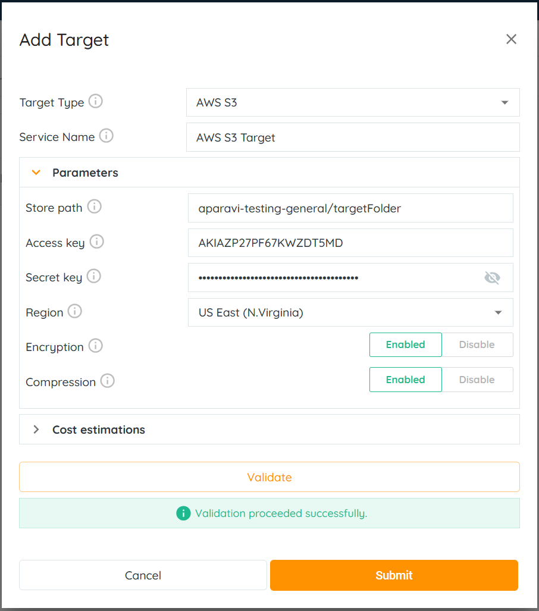

> If the “Submit” button is inactive, and unable to be clicked on, this is due to failure of the credentials and should be checked for errors and attempted again using the same steps.

5. Click on the Save All Changes button.

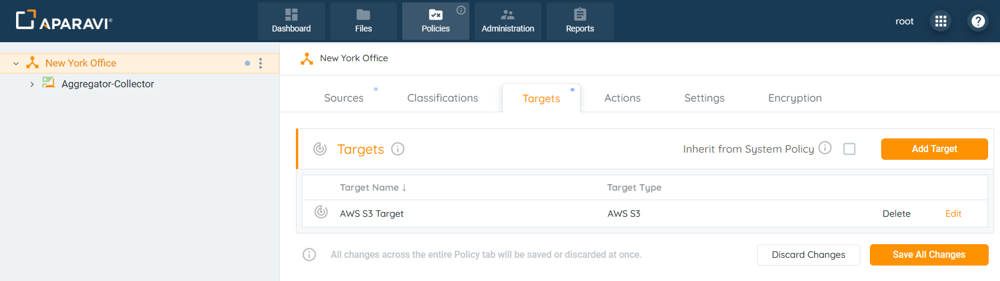

6. When clicked, the Save Changes pop-up box will appear. Click OK.

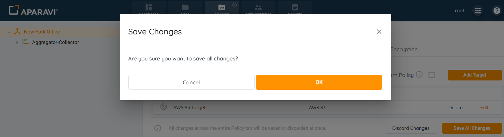
Once all changes have been successfully saved, the AWS S3 target service will appear as an entry under the Targets sub-tab. Also, an alert message will display in the bottom left-hand corner to indicate that the target service has been successfully configured.
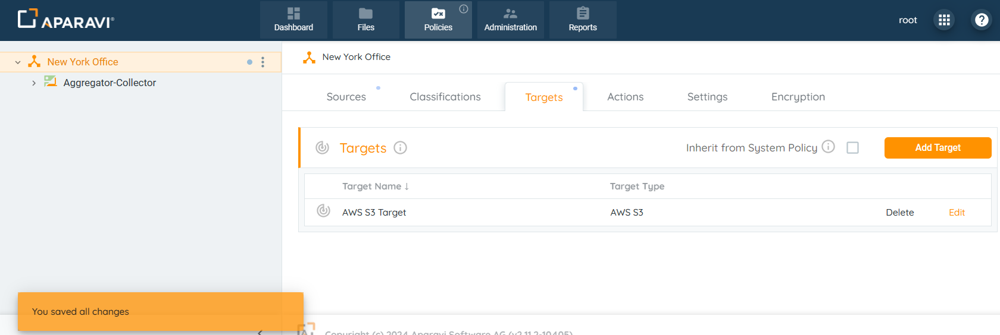
