<head>
  <title>Azure Blobs - Aparavi Data Suite Documentation</title>
</head>

Aparavi allows business users to automate data actions by linking sources and targets, no code or command line necessary.

Creating targets allows the system to direct data into pre-configured data services. This enables businesses to build custom workflows for data hygiene, compliance, and retention use cases.

Once the target service has been set up, export actions can also be configured to run in the background and copy the files from the source to the target service.

> FAT32 file systems, removable and mounted drives cannot be configured as a target service at this time.

## **Configuring an Azure Blob Target Service**

The platform allows for all nodes to inherit identical settings for the Targets subtab. If the various nodes should have their own set of specifications instead, disabling this feature is also available.

1. Click on the Policies tab, located in the top navigation menu.

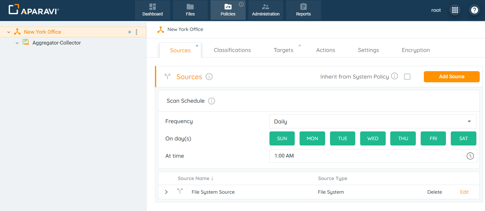

2. Click on the Targets subtab.
3. Click on the Add Target button, located in the upper right-hand corner of the screen. Once this button is clicked, the Add Target pop-up box will appear.

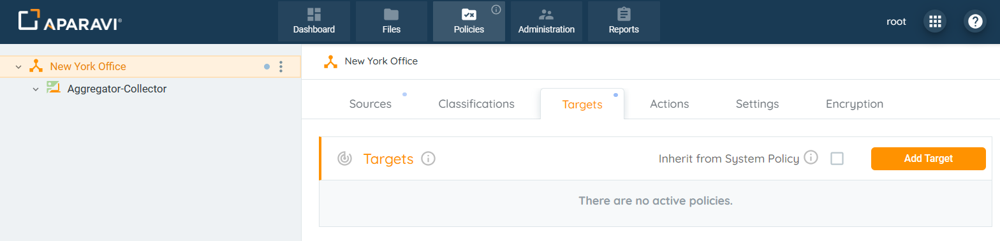

4. Inside the Add Target pop-up box, click the Target Type field and select the Azure Blob option.

## **Target Service Options for use with Azure Blob**

This section describes all required fields to complete to implement the Target Service for the Azure Blob.

1. Select “Azure Blob” as the Target Type.
2. Inside the Add Target pop-up box, enter the fields to configure the Azure Blob target:
    - **Target Type:** This field defines the kind of target to connect to.**Service Name:** Enter any name for the Azure Blob target.
        
        ### **Configure Parameters:**
        
        - **Store path:** This path defines the exact specific folder in the filesystem. Format for Azure Blob: **containername/foldername**. For example: aparavi-target/folder.
        - **Account name:** This defines the unique namespace in Azure for your data. This is available inside the Azure Portal.
        - **Key:** This defines the Azure account key needed to access the blob storage. This is available inside the Azure Portal.
        - **Endpoint suffix:** Specifies the endpoint suffix to use for establishing the connection. The default value is _blob.core.windows.net_.
        - **Encryption:** Encryption enables you to encrypt your metadata and data so others cannot easily read your data without the proper access key. The data is encrypted before it ever is transmitted across the network and stored on the aggregator or sent to the cloud for retention purposes.
        - **Compression:** Compression can greatly reduce the amount of data sent and stored. Certain file types are more compressible than others. The algorithm used is LZ4, which is highly efficient and very fast. An average of 30% to 50% data size reduction is typical depending on your data set. This has the benefit of reducing the total amount of data that needs to be stored, but also decreases the time required to send that data across the network.
            
            ### **Configure Cost estimations:**
            
        - **Access delay:** Elapsed time before access to a file starts. (For example: S3 could be 0 second delay, while Glacier could be hours.
        - **Access rate:** Time required to recall a file in MB per second.
        - **Store cost:** The cost per MB to store a file per month.
        - **Access cost:** The egress cost per MB to recall a file.

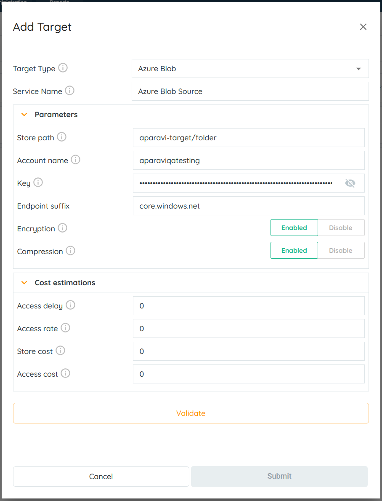

> You will find the information for the “Account Name”, “Account Key” and the “Container Name” in your Azure Management Console. Follow the steps to find the information.

- Login into your Azure Subscription as a root user or a user with administrative permissions.
- Open “Azure Market Place”.
- Choose “Storage Account”.

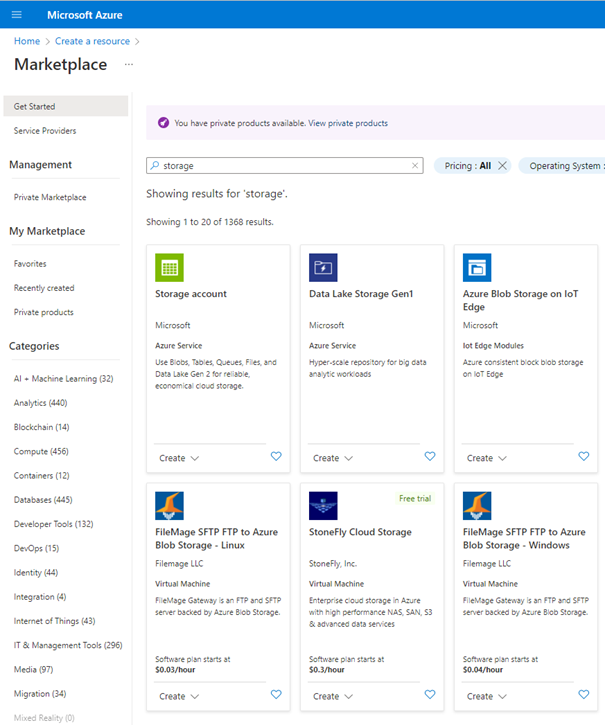

- Click Create button.

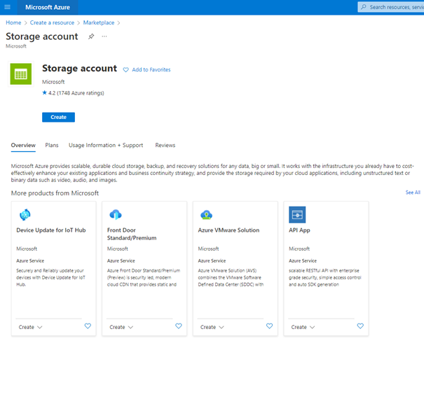

- Define a storage account name. In this example, we have named the storage account "mystorage00141".

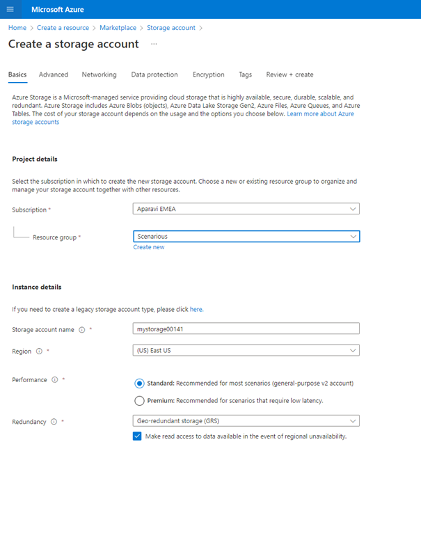

- Create a new “Container”. In this example, we named the container “my container”.

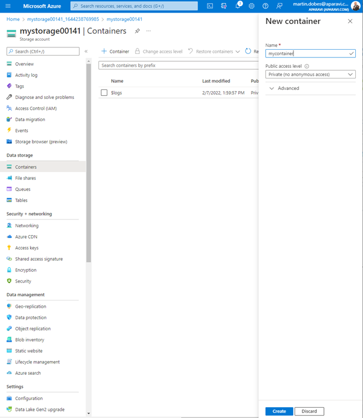

- Select "Access Keys > Show Keys" to make the keys visible. Then copy either “key1” or “key2” to the clipboard. You will need it later in the Aparavi Platform dialog box (as the Key).

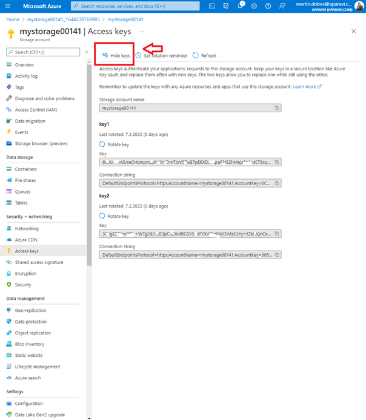

- Fill in all required fields with the appropriate data. The “Account Name” is the name of your Azure Storage Account. The “Account Key” is the Azure Storage Access Key. The “Container” is the name of the container you created a few steps ago.

3. Click the “Validate” Button located at the bottom of the “Add Target” pop-up box.

**If Validation is Successful:** The system will display a green success message along the bottom of the Add Target pop-up box.

**If Validation is Not Successful:** The system will display a red error message along the bottom of the Add Target pop-up box. Please check the fields for errors and make necessary corrections.

4. Once the system has completed validation with the Azure Blob target service, the Submit button will be highlighted in orange to indicate that the button is now active. Click the Submit button in the bottom right corner of the Add Target pop-up box.

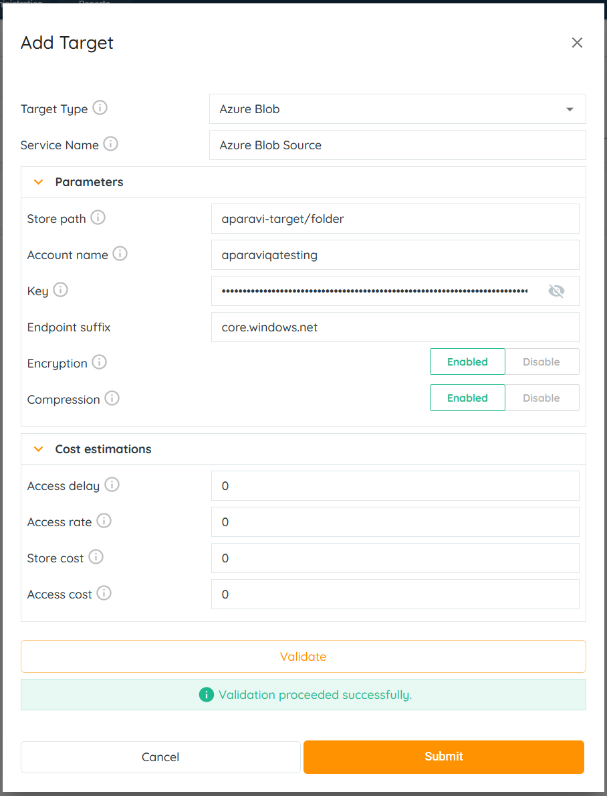

> If the “Submit” button is inactive, and unable to be clicked on, this is due to failure of the credentials and should be checked for errors and attempted again using the same steps.

5. Click on the Save All Changes button, located on the bottom right-hand side of the screen.

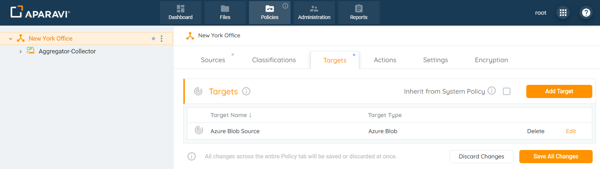

6. When clicked, the Save Changes pop-up box will appear. Click the “OK” button located in the bottom right-hand side of the pop-up box.

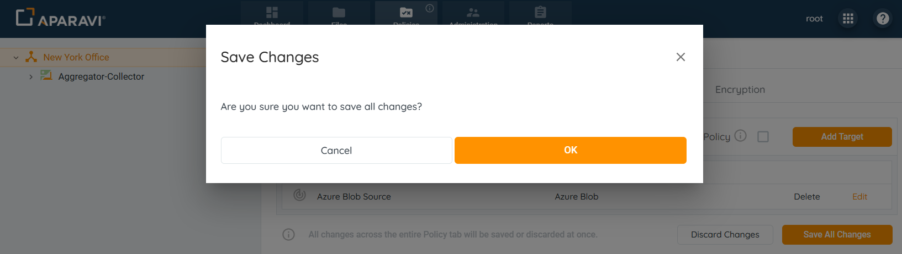
Once all changes have been successfully saved, the Azure Blob target service will appear as an entry under the Targets sub-tab. Also, an alert message will display in the bottom left-hand corner to indicate that the target service has been successfully configured.

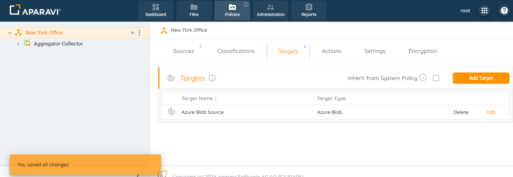
