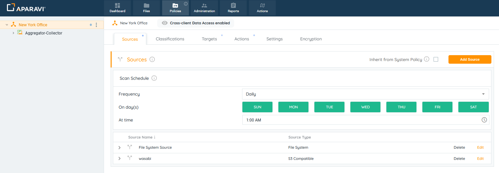
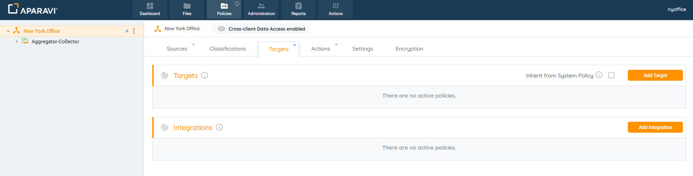
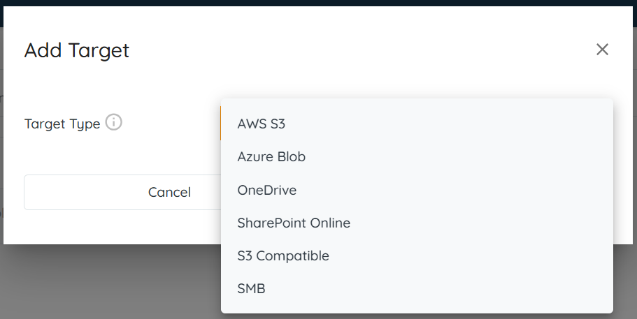
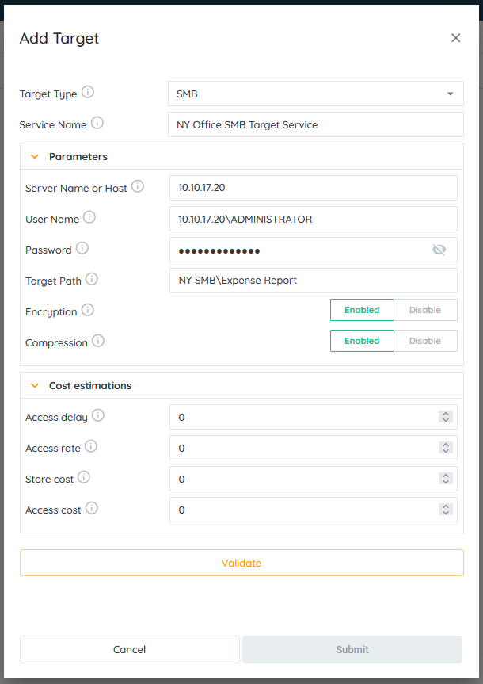
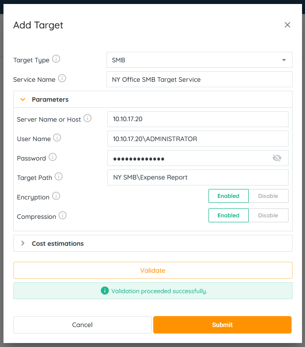
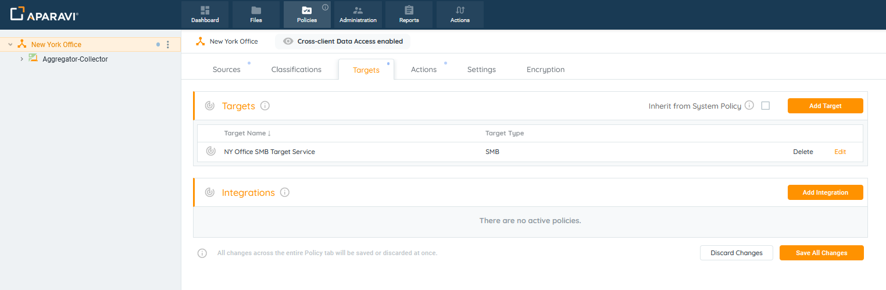
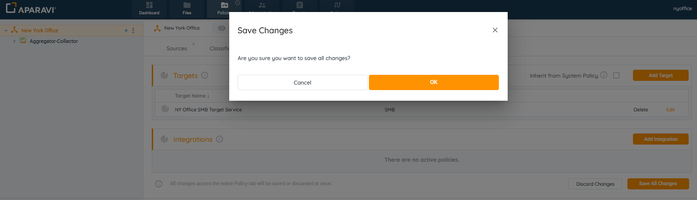
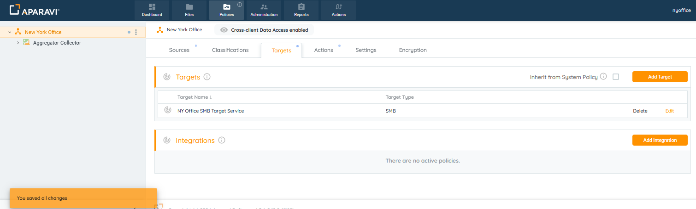

<head>
  <title>Samba (SMB) - Aparavi Data Suite Documentation</title>
</head>

Aparavi allows users to automate data actions by linking SMB sources and targets without the need for code or the command line.

Creating targets allows the system to direct data into pre-configured data services. This enables businesses to build custom workflows for data hygiene, compliance, and retention use cases.

> FAT32 file systems and removable or mounted drives cannot be configured as a target service at this time.

### Configuring an SMB Target Service

The platform allows for all nodes to inherit identical settings for the Targets subtab. If the various nodes should have their own set of specifications instead, disabling this feature is also available.

1. Click on the Policies tab, located in the top navigation menu.

2. Click on the Targets subtab.

3. Click on the Add Target button, located in the upper right-hand corner of the screen.
4. Inside of the Add Target pop-up box, select the SMB option listed from the drop-down menu that appears under the Target Type field.

5. Inside the Add Target pop-up box, enter the fields to configure the SMB target:

- - **Target Type:** This field defines the kind of target to connect to.
    - **Service Name:** Enter any name for the SMB target.
    - **Configure Parameters:**
        - **Server Name or Host:** Defines the Server Name. Format for Windows and Linux: hostname (file.core.net) OR IP Address (192.168.1.1)
        - **User Name:** Defines the username to connect to the file share. Enter the username in the order as defined below for Windows and Linux. Format must contain a domain name or computer name regardless Windows or Linux, like: domainname\\username OR computername\\username OR .\\username.
        - **Password:** Defines the password to connect the file share.
        - **Target Path:** Defines the SMB Target Path. Format ShareName\\Path.
        - **Encryption:** Encryption enables you to encrypt your metadata and data so others cannot easily read your data without the proper access key. The data is encrypted before it ever is transmitted across the network and stored on the aggregator or sent to the cloud for retention purposes.
        - **Compression:** Compression can greatly reduce the amount of data sent and stored. Certain file types are more compressible than others. The algorithm used is LZ4, which is highly efficient and very fast. An average of 30% to 50% data size reduction is typical depending on your data set. This has the benefit of reducing the total amount of data that needs to be stored, but also decreases the time required to send that data across the network.
    - **Configure Cost estimations:**
        - **Access delay:** Elapsed time before access to a file starts. For example: S3 could be 0 second delay, while Glacier could be hours.
        - **Access rate:** Time required to recall a file in MB per second.
        - **Store cost:** The cost per MB to store a file per month.
        - **Access cost:** The egress cost per MB to recall a file.

6. After completing all sections within the Add Target pop-up box, select the Validate button located at the bottom of the “Add Target” pop-up box.

**If Validation is Successful:** The system will display a green success message along the bottom of the Add Target pop-up box.

**If Validation is Not Successful:** The system will display a red error message along the bottom of the Add Target pop-up box. Please check the fields for errors and make necessary corrections.

7. Once the system has completed validation with the SMB target service, the Submit button will be highlighted in orange to indicate that the button is now active. Click the Submit button in the bottom right corner of the Add Target pop-up box.

> If the “Submit” button is inactive, and unable to be clicked on, this is due to failure of the credentials and should be checked for errors and attempted again using the same steps.

8. Click on the Save All Changes button.

9. When clicked, the Save Changes pop-up box will appear. Click the “OK” button located in the bottom right-hand side of the pop-up box.
    
    

Once all changes have been successfully saved, the SMB target service will appear as an entry under the Targets sub-tab. Also, an alert message will display in the bottom left-hand corner to indicate that the target service has been successfully configured.

Now that the target service has been configured, Automated or Manual Exports can bne configured.
