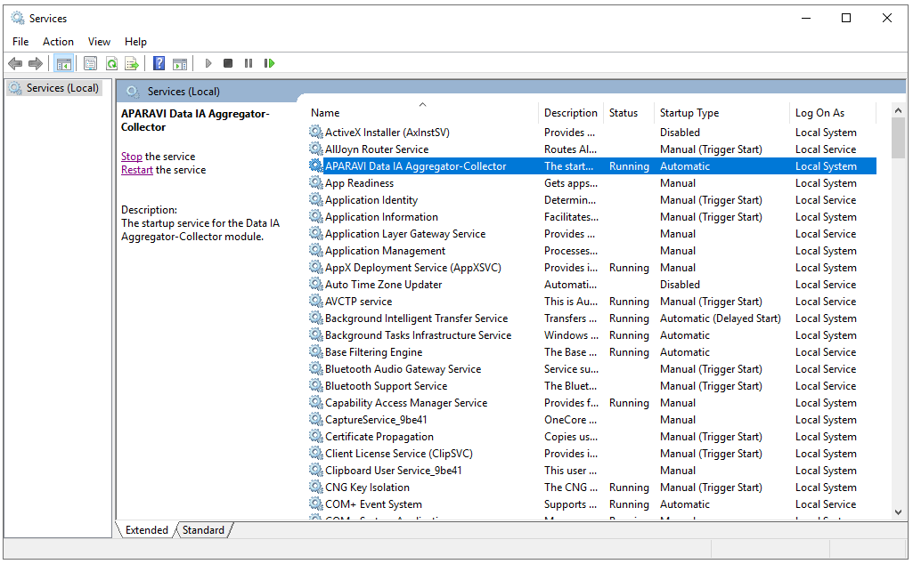
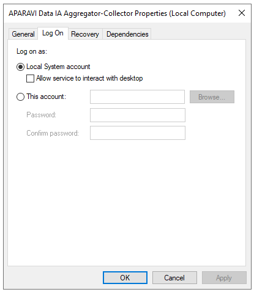
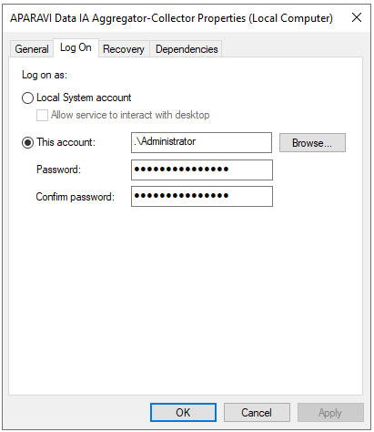

<head>
  <title>Cannot access SMB shares with provided credentials - Aparavi Data Suite Documentation</title>
</head>

## Error

Unable to access “sharename”.

## **Issue description**

Aparavi user installation is leveraging windows SMB share, provided credentials have been validated as correct. User can access the share directly from the Windows server where the Aparavi Collector or Aggregator-Collector is installed.

You can validate during Aparavi scan status, the scan will display an error accessing the specific share(s).

## Resolution

1. Open Windows services and locate the Aparavi service.

2. Right-click on the service and select Properties. Click on the Log On tab.

3. In the “\[T\]his account:” field, enter the account name and password. _NOTE_: this account should be validated to have access to the SMB share specified within the Aparavi platform.

4. Now click Apply for the changes to take effect. You will receive a pop-up stating that the service will need to be restarted for the changes to take effect. Restart the service, once it is back to a running state again, you can manually run the scan.
