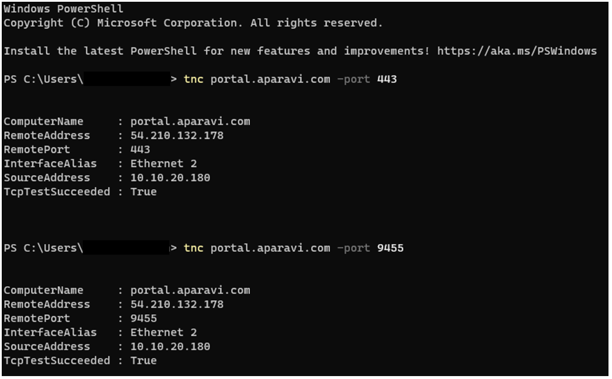

<head>
  <title>Check ports in the server directory - Aparavi Data Suite Documentation</title>
</head>

The Aparavi software needs an outbound connection and specific open ports to communicate with the platform. Once installed, it will require an internet connection for updates and platform communication.

The ports required to be opened outbound:

- 443 - HTTPS Port
- 9455 - Aparavi data port.

> Within some infrastructure cases the method of the outbound connections may vary and additional connections need to be opened for the node to talk to the platform and the update server. The specific requirements to open outbound ports can very depending on the type of firewall used.

A method that can be used to confirm if ports are blocked for the node to communicate to the platform. Open Powershell in Administration mode, enter the command tnc followed by the website and port assignment. For example “tnc [portal.aparavi.com](http://portal.aparavi.com/) -port 443”.

