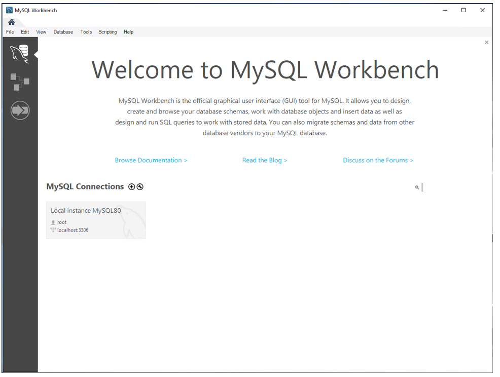
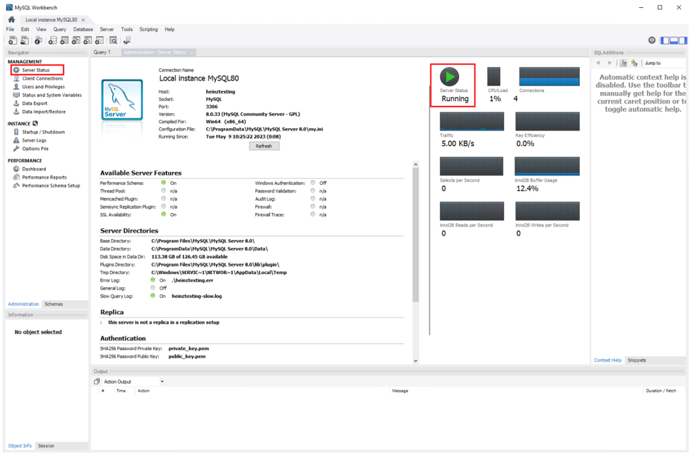
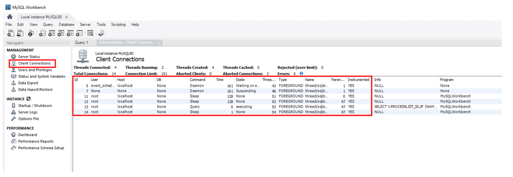
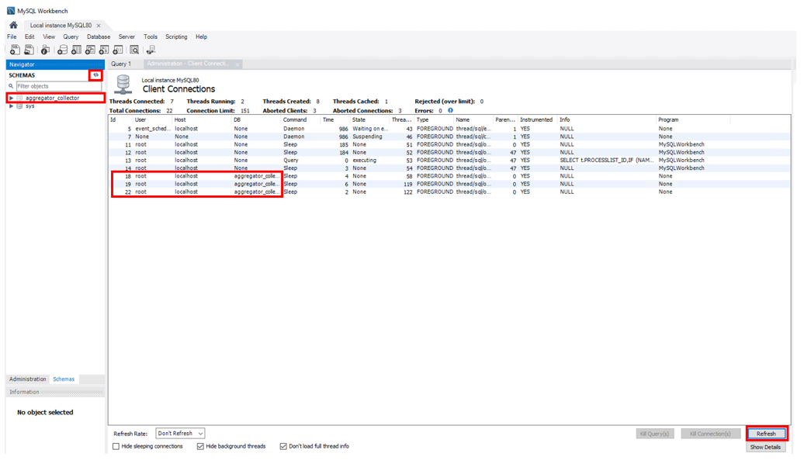

<head>
  <title>Check the database connection (advanced options MySQL) - Aparavi Data Suite Documentation</title>
</head>

If the Aparavi software is installed and the node shows Offline status, there are some troubleshooting methods you can use to confirm the connections to the MySQL server.

To confirm connections within MySQL you need to have preinstalled the MySQL workbench. For more information on how to install MySQL see the [MySQL server (Windows)](/data-suite/technical-documentation/prerequisites/mysql-server-windows) or [MySQL server (Linux)](/data-suite/technical-documentation/prerequisites/mysql-server-linux).

### Server Status

1. Open and log in to the MySQL instance within the MySQL Workbench.

2. Select Server Status, then select the instance you want to log on to, and enter the username and password to gain access.
3. Within this window, you will see the status of the MySQL service. From this window, you will be able to see overall health of the server.

### Client Connections

To identify the node connection to the MySQL Instance click on the Client Connections under management. From this window, you will be able to see all connections to the MySQL instance. By clicking on the Refresh button you will be able to refresh all links to confirm.

### Aparavi node database scheme

Another method for troubleshooting to see if the Aparavi software has connected successfully is to confirm if any schemas have been created within the MySQL server, to do this click on the Schemas button to display the schema selection.

> The "sys" is created by MySQL by default as well as the connections displayed in the above example.

1. Once you have installed the Aparavi Software you can confirm that the connection to the MySQL server has been created. In order to confirm this click on the Refresh button on the bottom left to refresh the connections as well as the Refresh button on the right to refresh the schemas.
2. When all connections are established a new Aparavi schema will be created as well as connections to the MySQL server.

3. When the Aparavi node has been installed and connected to the MySQL and outbound ports have been opened to the Aparavi platform the node will then appear online. As seen in the above example.

> When a server has had a security update and needed to be restarted and the node shows offline, restart the MySQL server followed by the Aparavi node.
