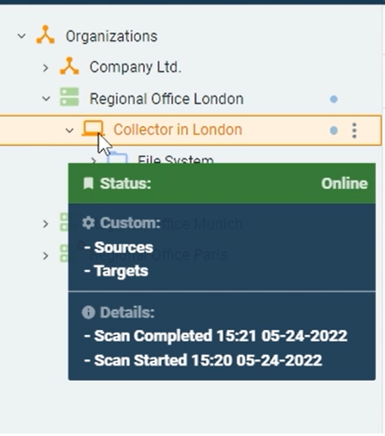
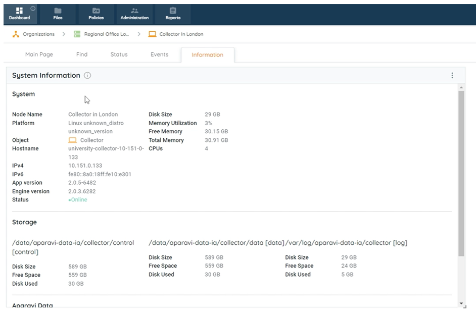
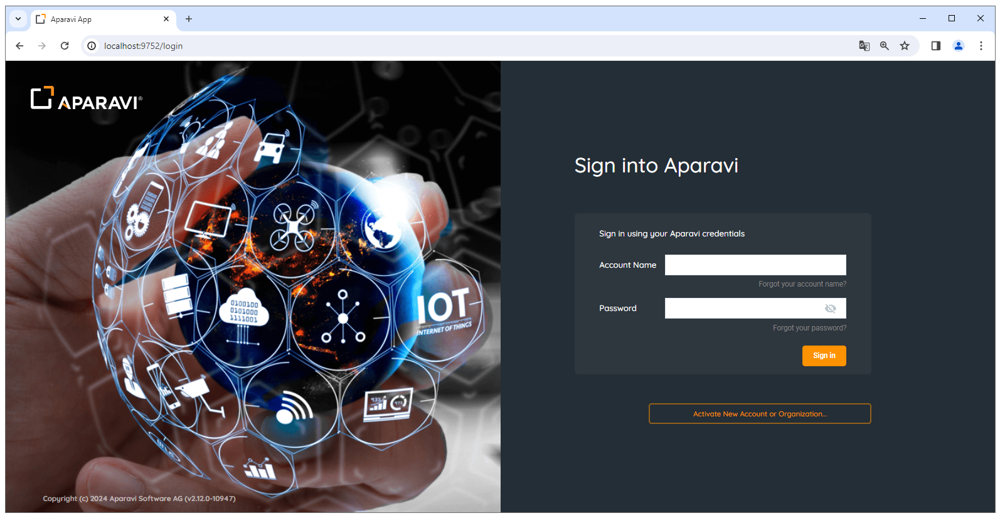
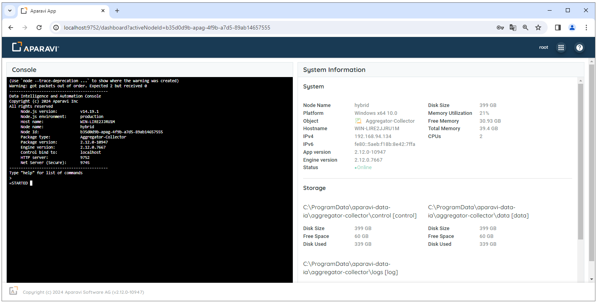

<head>
  <title>Node Connectivity Check - Aparavi Data Suite Documentation</title>
</head>

### **How to see if the nodes are online or offline?**

- Login on your client level in the APARAVI platform.
- Navigate to the file tree and hover over the node. A popup menu will appear showing you the status of the node.

What you can expect to see

- **Status**  – Is the node online or offline
- **Custom**  – What settings are added on the node ( Sources, Targets, etc )
- **Details**  – Details of scan start time and date as well as completion time and date

 

You can also access detailed system information by going to the "Dashboard" menu and choosing the "Information" tab. Here, you'll discover essential details like your IP address, disk size, memory utilization, free memory, total memory, CPU cores, and online status.

> When the node is offline, the last online status and updates are available on Information Tab.

When troubleshooting the Aparavi software, you can test whether the Aparavi service is online or offline. To verify the connection and Aparavi software status, log into the webpage to confirm the active status of the service.

> To confirm the Aparavi service is active this needs to be done within the same machine or the same network the node is installed on.

There are three types of nodes: Aggregator, Collector, Aggregator-Collector. Each type has its own port. The default ports are listed as follows:

- **Aggregator**: 9552
- **Collector**: 9652
- **Aggregator-Collector**: 9752
- **Worker**: 9852

### Aggregator-Collector status check

1. Open a web browser and type in the following URL to access the Aparavi local web link:

- http://127.0.0.1:9752/login
- [http://localhost:9752/login](http://localhost:9752/login)

2. To access the node you will need to provide the username and password to gain access

- Username: _root_
- Password: _root_

3. Scroll down and accept the Master Saas Agreement.
4. When the Aparavi node is active and running you will see the status as online.

> If the node is not running you will receive a “This site can't be reached” notice within your web browser.

