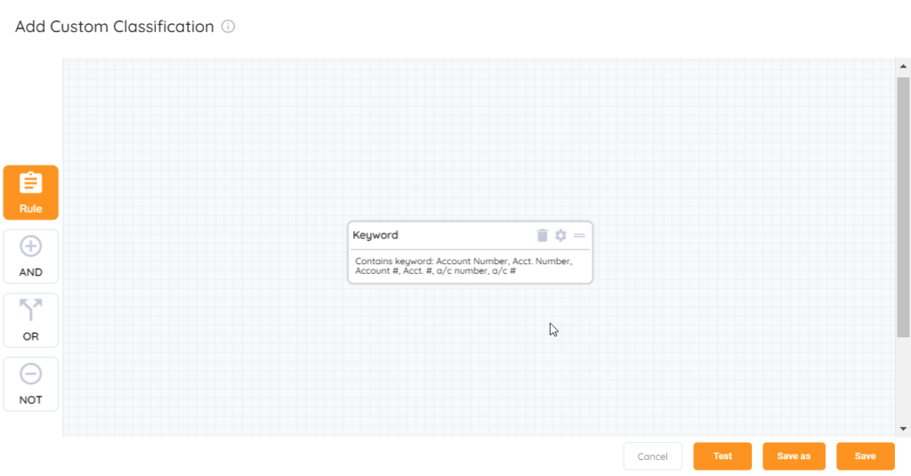

<head>
  <title>Custom Rules - Aparavi Data Suite Documentation</title>
</head>

Predefined classifications can be complex, but you may want something more specific to your needs than what an existing rule would provide. We will use the account number example, but this could also be a customer ID, patient number, student number, etc. where a unique value may be assigned to a record. If we start looking at account number, how many ways could “account number” be represented?

- Account Number
- Acct. Number
- Account #
- Acct. #
- a/c number
- a/c #

Those are just some of the possibilities, and an organization may also have its own unique way to indicate an account number. When it comes to custom data needs and naming conventions , a keyword rule can be used for custom classification creation. Not only does this rule allow for a single key word but also multiple words for cases like account number that can be written many ways. Here is what it will look like in custom classification creation:

<figure>

<figcaption>

Keyword rule in custom classification creator

</figcaption>

</figure>

As you can see it allows for a list of keywords allowing for the multiple ways to indicate account number. This simplifies creating the rule because there doesn’t have to be a separate rule created for each one.
