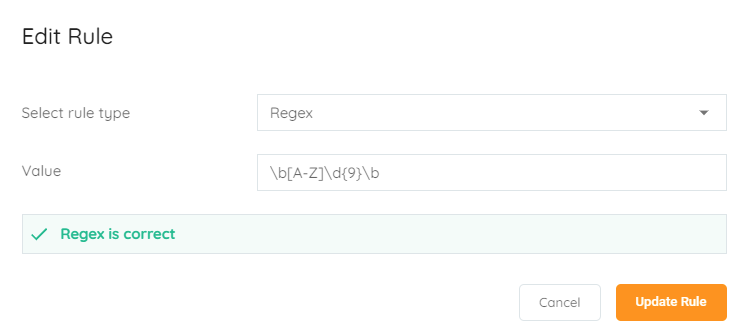
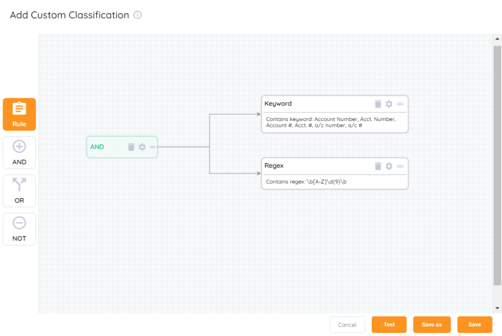
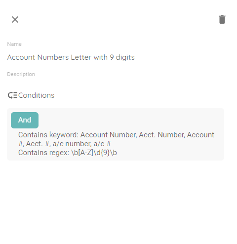

<head>
  <title>Regex - Aparavi Data Suite Documentation</title>
</head>

Considering the account numbers example, not only can it be written in many different ways but the account number format itself is completely up to the organization. Number formatting can vary for numbers such as:

- SSN
- Bank Account
- Credit Cards
- Driver’s License
- Passport Numbers

Looking at 10 different organizations there is a good chance you will have 10 different formats for account numbers. In most cases these account numbers will be comprised of just digits 0-9, could be a single digit, however more than likely will be a multiple of even more than 10 digits. To make them even more unique, an organization might even add letters to the mix. With account numbers possibly consisting of a mix of numbers and letters, no single rule would be able to handle all account number types.

The custom classifications form provides one rule to specify a unique string of numbers or numbers and letters. The answer is Regex. Here are a couple Regex examples:

- \\b\\d{9,16}\\b – simple string of numbers 9-16 digits in length
- \\b\[A-Z\]\\d{9}\\b – looks for a value that contains a letter, then 9 digits

Here is an example of how it looks to create one such rule:

 

<figure>

<figcaption>

Regex rule

</figcaption>

</figure>

What’s great is we can now combine the custom rule needed for keyword along with the rule for Regex to completely cover finding data that contains that information based on the unique account number. The complete custom classification rule would consist of an AND statement looking for both, looking like this:

<figure>

<figcaption>

Keyword and regex to create classifcation

</figcaption>

</figure>

This is how it looks in the View selection from the Classification list:

<figure>

<figcaption>

View of rule

</figcaption>

</figure>
