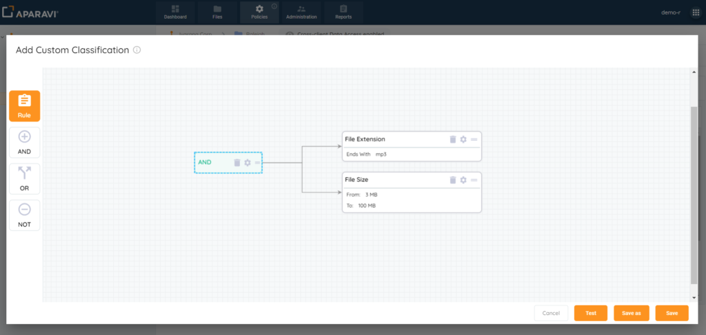
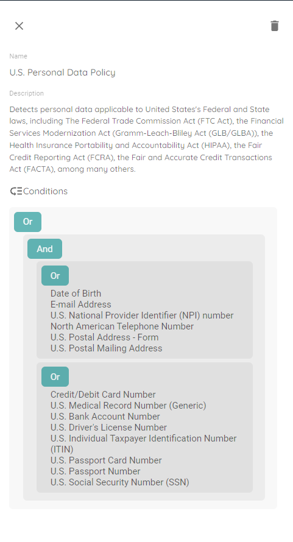
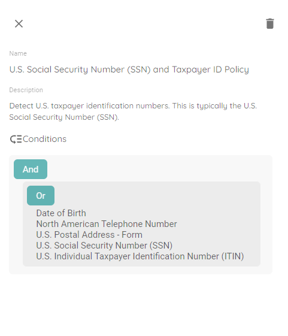
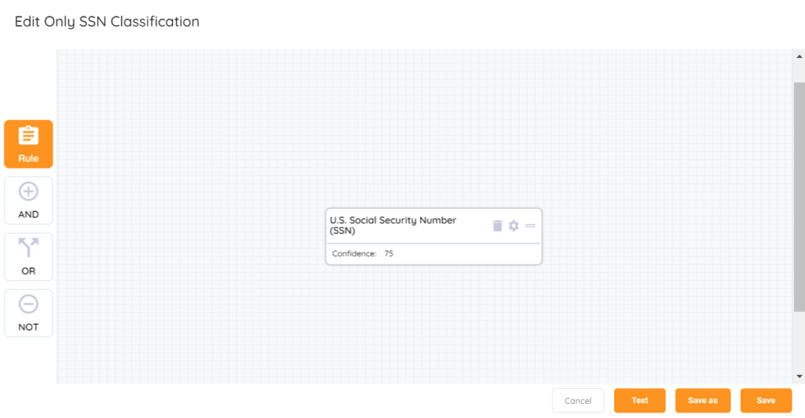
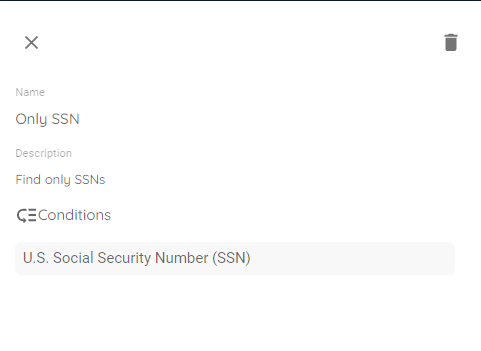
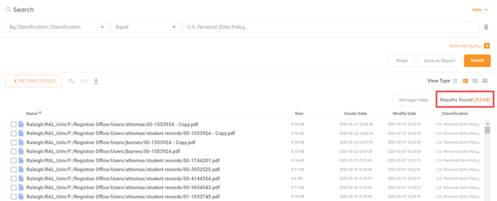
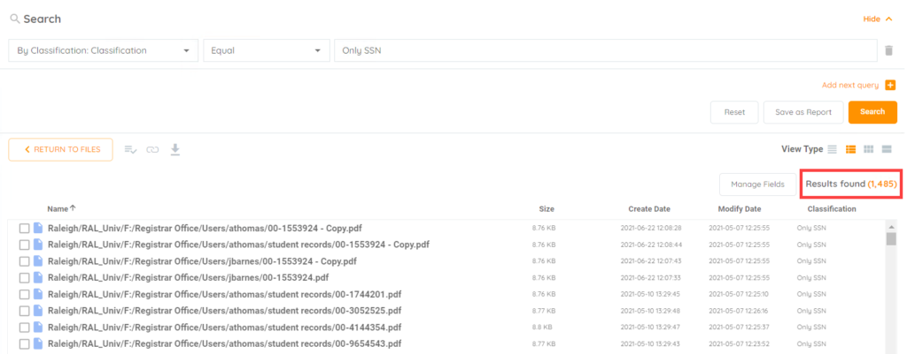

<head>
  <title>When to use - Aparavi Data Suite Documentation</title>
</head>

The purpose of this document is to outline just a few reasons why Aparavi users may wish to create their own classifications and how to accomplish that.

<figure>

<figcaption>

Custom Classification Creator

</figcaption>

</figure>

When you start selecting classifications that fit your organization’s requirements for classifying your unstructured data, the results may vary. This is because the classifications are built using logical operators. Consider the U.S. Personal Data Policy for example:

<figure>

<figcaption>

Logical operators for U.S. Sensitive Data

</figcaption>

</figure>

As you can see, the classification logic has two “OR” components. The first OR statement requires any one of the following:

- Date of Birth
- E-mail Address
- U.S. National Provider Identifier (NPI) number
- North American Telephone Number
- U.S. Postal Address – Form
- U.S. Postal Mailing Address

And any one of the following from the second OR:

- Credit/Debit Card Number
- U.S. Medical Record Number (Generic)
- U.S. Bank Account Number
- U.S. Driver’s License Number
- U.S. Individual Taxpayer Identification Number (ITIN)
- U.S. Passport Card Number
- U.S. Passport Number
- U.S. Social Security Number (SSN)

The AND is what ties the OR statements together to complete the classification of U.S. Personal Data. With logical operators set up that way, many combinations could trigger the classification hit. Let’s use the Social Security Numbers search for example. The U.S. Personal Data classification will find it, but the classification policy for U.S. Social Security Number (SSN) and Taxpayer ID Policy would be a better option due to there being only one OR statement:

<figure>

<figcaption>

Logic for U.S. SSN and Taxpayer ID

</figcaption>

</figure>

Notice that it is simpler than the U.S. Personal Data Policy, but there are still a few rules that could trigger the classification of that file other than an actual SSN. This is where you may want to find data using only the SSN rule. You can open the Add Custom Classification form to easily create this, as shown below:

<figure>

<figcaption>

SSN only rule in creator

</figcaption>

</figure>

And the new classification will show in the View selection from the Classification list:

<figure>

<figcaption>

View of classification logic

</figcaption>

</figure>

It is a much simpler rule specifying exactly what to look for. Without the other rules that are part of the two defined classifications we can achieve a more narrowed result to look for just SSNs to produce a classification hit. Look below at a comparison of the two search results:

<figure>

<figcaption>

Result of U.S. Personal Data search

</figcaption>

</figure>

<figure>

<figcaption>

Result of Only SSN search

</figcaption>

</figure>

From the screen shots the number of found results are significantly different when using the custom vs predefined classification. This helps narrow the results to what is actually desired, limiting more results due to additional criteria.
