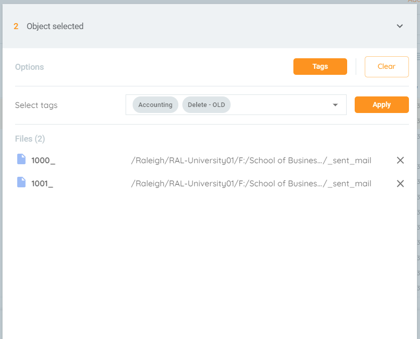
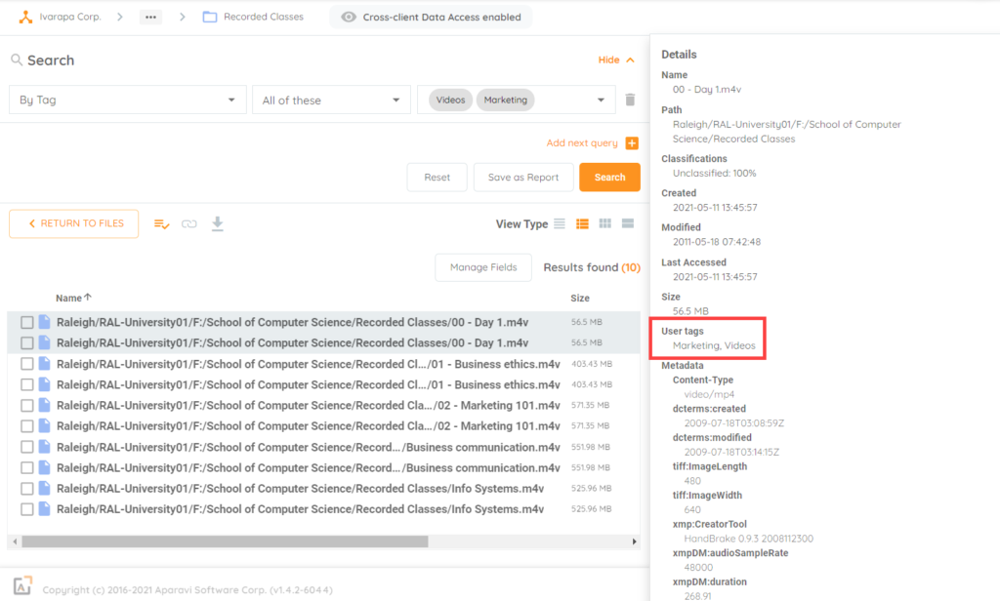

<head>
  <title>Department and Data Types - Aparavi Data Suite Documentation</title>
</head>

## **Department**

If you look at your organization and how you have organized file shares, more than likely they are by department but what about shares of individual users? Shared storage spaces for individual users within departments and separate shared drives for departmental use are common in organizations. This setup allows for efficient organization and access control, accommodating users who work across multiple departments while maintaining data integrity and confidentiality.

Tags based on departments can help with a few different tagging scenarios, but they these can overlap with other aspects for tagging within the Aparavi Platform.

- User data- Tagging a user’s data with their assigned department makes sure the data can be moved or cleaned up based on actions against Data ROT. For example, say a user leaves the organization, then what happens to their files. Well certain files can be distinguished as files that would benefit the activity of their respected department, but there also may be files like photos, audio, videos, etc. that are trivial and have no use. Tagging the appropriate beneficial files will allow for a better decision on what can be moved to the department share and allowing deletion of the junk files.
- Using Multiple Tags- With the ability to have multiple tags on a file it can easily distinguish those files used by multiple departments and overlap. In scenarios of data ROT and wanting to cleanup older files, you have the insight to now ask the appropriate teams if that would be suitable.

<figure>

<figcaption>

Selecting multiple Tags

</figcaption>

</figure>

These are a couple examples on leveraging departmental tags. Users being able to distinguish their files for their respected department and the leveraging of multiple tags for multi-team documents.

 

**Data Type**

If you think about the files located on your shares, what are they? There are too many types to probably keep track of it all. There are data types that are going to be more important to your organization than others, but if we look at the last example, specific types of data can also be broken down by department. On the Aparavi Platform dashboard you can find the Files by Type widget to help get started, then maybe a custom classification to help find the data and what they are related to.

Here are some examples of data types that could make use of tags, and of course data ROT and dark data is always a consideration.

- Video Files – With these being large files of course they can be some of the first targets of data ROT, but it really comes down to who is using them. As an example, if you were to take two departments Accounting and Marketing, by theory Marketing should have a lot more video files than accounting. However, if Accounting does have a lot of videos, it may raise some questions for more digging and potential finding of trivial data that does not benefit the accounting department. This is a great example of a video tag in combination with a departmental tag to help make aware of the type of data a department uses.
- Image Files – Very similar to videos images can take up larger amount of space, such as marketing with the number of high-quality photos that are being used for all sorts of materials. However, what about user shares and the number of photos there? Granted some of that might be useful to the organization, but what if a user is backing up their personal photos to company storage. Being able to use combination of tags can help tag ROT data to clean user share consumption.
- Backup Files – Depending on your backup software or applications that have native backups there may be files that can be associated with them. A lot of times these are quite large due to the fact they are backing up full servers or large datasets, and these sometimes ten to be forgotten. Get them tagged as backup files and talk with the appropriate teams to see if they could be deleted or archived due to age.

<figure>

<figcaption>

File Search based on multiple tags and showing metadata of User Tags

</figcaption>

</figure>

Videos, images, and backups are two great examples of the types of files that can be consuming storage that is trivial to the organization. Whether it is personal user files or trivial/obsolete data for a department, or long forgotten backups, tagging helps keep organized in knowing the data and who is using it. Giving you the facts to help clean up and gain back costly storage space.
