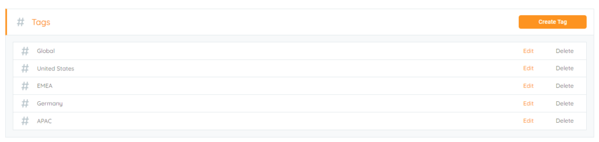

<head>
  <title>Geographical Location - Aparavi Data Suite Documentation</title>
</head>

Many Organizations have multiple locations, whether they are within a few 100 miles, or across the world, there is probably a need for an easy way to report on that data. Let us take some geographic examples to base tags on:

- Global: This tag can be used on data that is used for data that could be accessed by anyone globally.
- Country: For users or offices that reside in the same country accessing the same file, especially if language is specific to their location and country specific compliance regulations are in place, think GDPR in the EU and how that can affect where data lives.
- State/Region: This is for data that can be used in a smaller geographic region. This could be data that only makes sense for the smaller region. Very similar with the country tags and GDPR, many states in the US have started to have their own Privacy acts coming into play.
- Office: Use a tag for a specific set of users that are part of a particular office or department.

<figure>

<figcaption>

Location Tags

</figcaption>

</figure>

Using location-based tags helps an organization understand where its users and data are located. This will also help silo and secure that data for those users, especially in circumstances wherein other users should not have access. Additionally, location-based tagging allows organizational leaders to make decisions on their data strategy according to specific geographies/locations.
