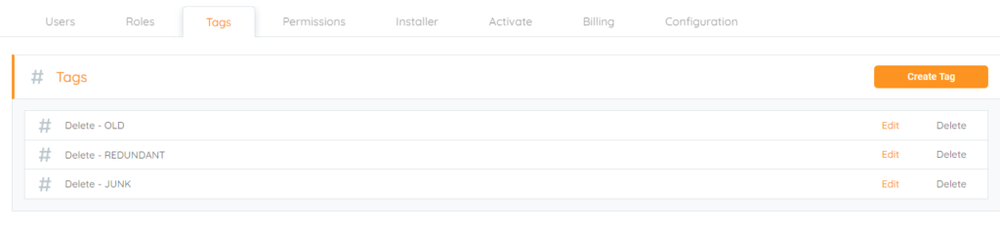

<head>
  <title>Tagging use cases - M&A - Aparavi Data Suite Documentation</title>
</head>

## **Merger and Acquisitions (M&A)**

A powerful use of the Aparavi Platform is to function as a tool leveraging an M&A to help sort through data of the acquired organization before it is potentially brought in one central location. This could be a corporate organization that has acquired a company or even a university moving to a centralized IT department. If there is an ability to save on storage consumption before bringing the new data or find risky files, why not do it? Get rid of ROT and dark data by using Tags. Examples of Tags that could be created could be:

- Delete – Old: For anything that has not been accessed for x amount of time. Have a conversation of a timeframe in which it would be good to delete the data by all parties involved with the process.
- Delete – Redundant: Leveraging the File search or Reports find duplicate data. No need to copy over multiple copies, so have users clean up their directories to help with purging the duplicate files.
- Delete – Junk: How much data is junk sitting in the shares. Do their users store photos, music, and videos that do not pertain to the organization’s purpose? If it is not going to provide a benefit, tag it to be deleted as junk.

<figure>

<figcaption>

Created tags

</figcaption>

</figure>

Organizations may have better names for their tags and what might make sense for them, so keep that in mind that the examples above could be named differently. The good thing is these few examples could be leveraged in other use cases as well, not just mergers and acquisitions, such as your data in general for ROT and dark data to help reclaim space.
