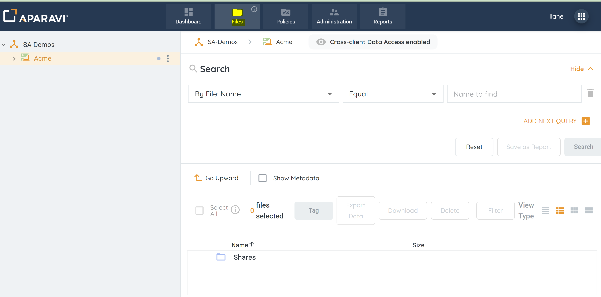
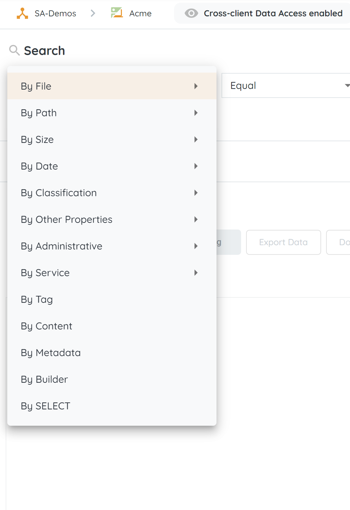
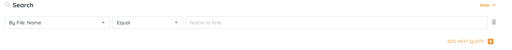
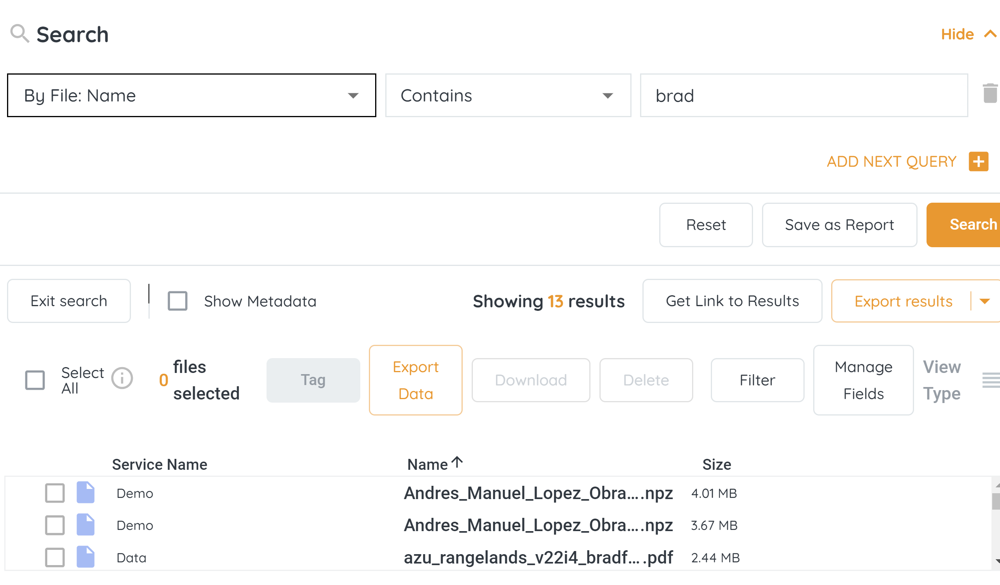

<head>
  <title>File Search - Aparavi Data Suite Documentation</title>
</head>

## After a successful scan, you will be able to search for specific content and characteristics of your data.

The files tab provides a search feature that allows users to look into the files that have been scanned. Each of these search filters provides the user a method to narrow down the search criteria as well as being able to combine the search criteria with multiple search parameters to allow the user to dig deep into the scanned data.

 

**How do I search for the scanned data?**

1. Login on your client level in the APARAVI platform. Locate and click on the “ **Files** “ tab.

 

2. When you have completed a scan and want to look into the data you are able to search the data and use a number or search criteria.

- **By file name** - Search data by name, version, or duplication
- **By Path** \- Search data by local path or parent path
- **By size** - Search data by size or size on disk
- **By date** - Search data by create, modify, access dates as well as Document creation and modify time.
- **By classifications** \- Search data by classification and with confidence %
- **By other properties** - Search data by owner, permission, compression ratio, storage cost, retrieval time, retrieval cost, the document created by, and document modified by.
- **By administrative** \- Search data by audit message and audit message time.
- **By service** - Search data by service type and service name.
- **By tag** \- Search data by tags
- **By content** - Search data by the content.
- **By metadata** - Search data by metadata.

3. Each search field has a secondary search field that allows you to add more criteria to the search field. Examples of these are: Equal, Not equal, Starts with, Ends with, Contains, and not contains.
4. You can combine the search results by adding an additional search criteria. To do so locate the “**Add next query**”. when done you will see new search criteria select the desired search option from the drop-down menu.

5. When done and you are ready to see the search results locate and click “ **Search** “.
6. When the parameters are selected and a search has been executed the search results will be displayed.

 

 

**To access video-based information on the topic, please visit our APARAVI ACADEMY by clicking the icon.**

