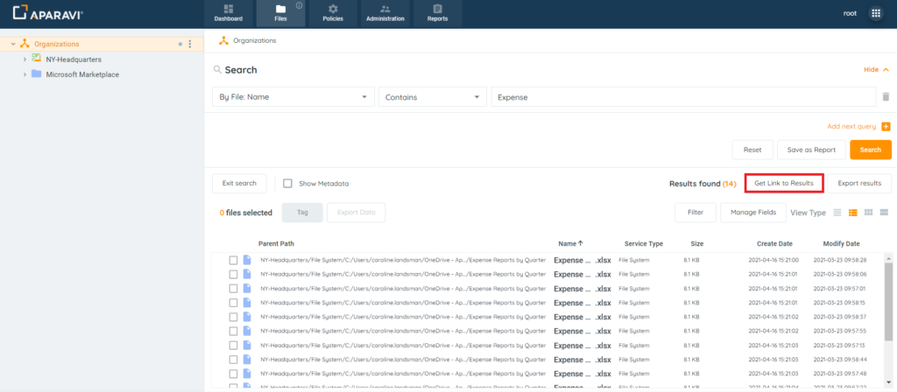
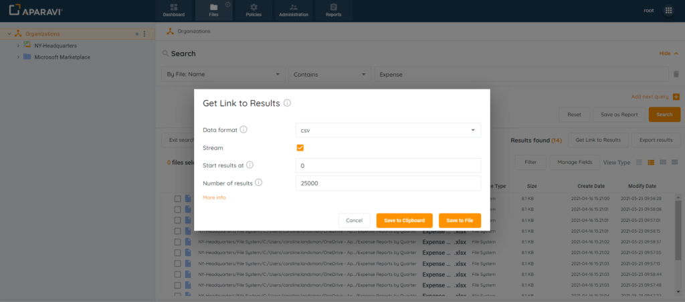

<head>
  <title>Get Link to Results for Files Search - Aparavi Data Suite Documentation</title>
</head>

Get Link to Results creates a link for search outcomes in either CSV or JSON format. Once set up in Excel or a JSON, the link gives the same results as the file search. It updates automatically with new matching files, ensuring an always current view of search results on your local machine.

1. Click on the File tab in the top navigation menu and complete a file search.
2. Perform a search, click on the Get Link to Results button that appears in the toolbar above the file results. Once clicked, the Get Link to Results pop-up box will display.

<figure>

<figcaption>

Get Link to Results Button

</figcaption>

</figure>

3. Inside the Get Link to Results pop-up box, configure the settings for the generated link.

Configuration Options:

- **Export type** – select the output format for your query results. The options are csv and json formats.
- **Stream** – the maximum number of query results returned is 25,000. If your results are greater than this limit, you can use the **Stream** option to paginate your results per URL (25,000 max for each link generated). By default the **Stream** option is enabled.
- **Start results at** – Enter the position to start the query results.
- **Number of results** – Enter the number of results to include, starting from the **Start results at** value.

<figure>

<figcaption>

Get Link to Results Pop-up Box

</figcaption>

</figure>

4. Once all settings have been configured, the system offers two options to gain access to the link:

- **Save to Clipboard** – selecting this button will save the generated URL to your local computer’s clipboard. This link can then be directly pasted into Excel.
- **Save to File** – selecting this button will save the generated URL to a file on your local computer (location determined by your browser setting for downloads). Once the file has been downloaded, it can be opened to copy and paste the URL into Excel.

5. To open the link in Microsoft Excel, follow these instructions

[https://aparavi-software.helpscoutdocs.com/article/468-get-link-to-results-microsoft-excel-setup](https://aparavi-software.helpscoutdocs.com/article/468-get-link-to-results-microsoft-excel-setup)

 

**To access video-based information on the topic, please visit our APARAVI ACADEMY by clicking the icon.**

