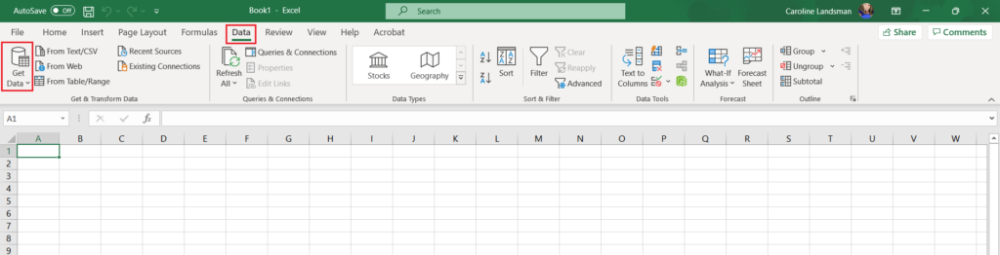
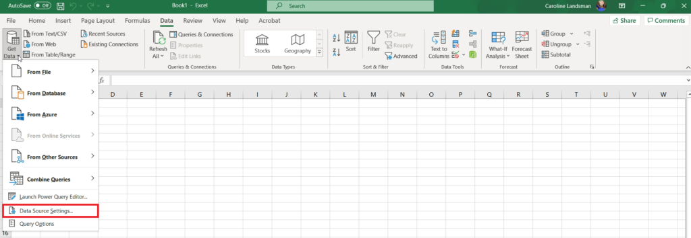
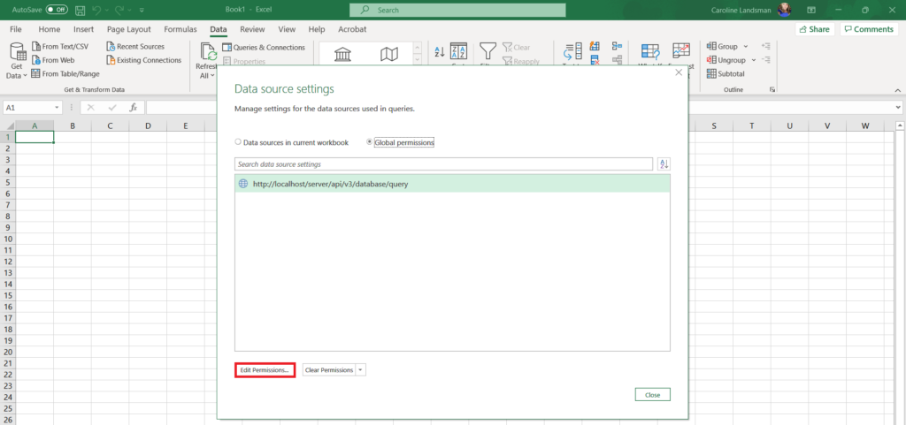
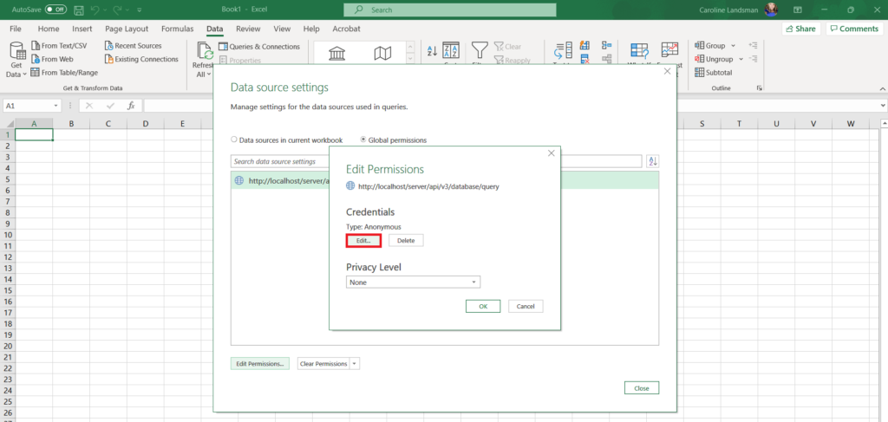
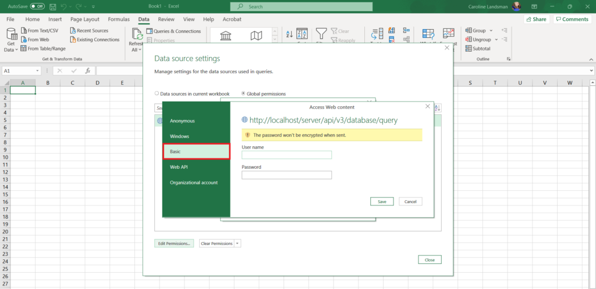
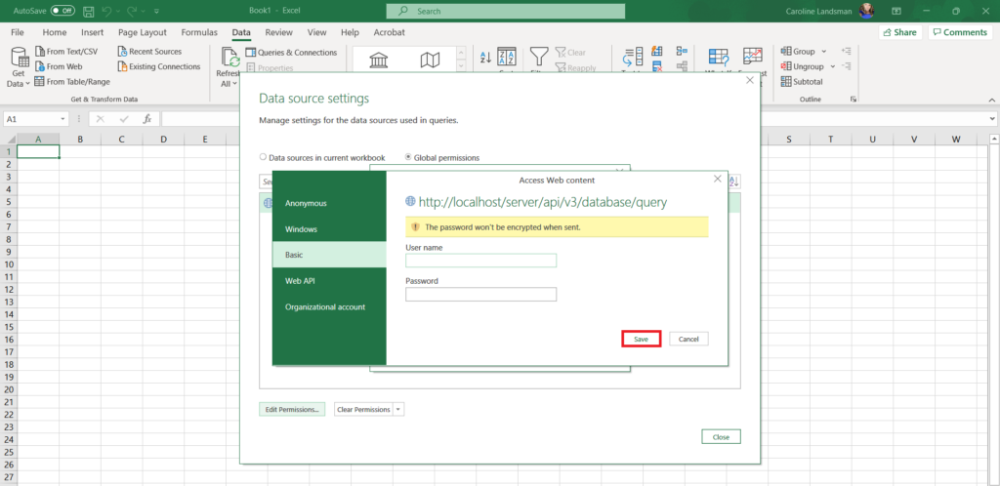
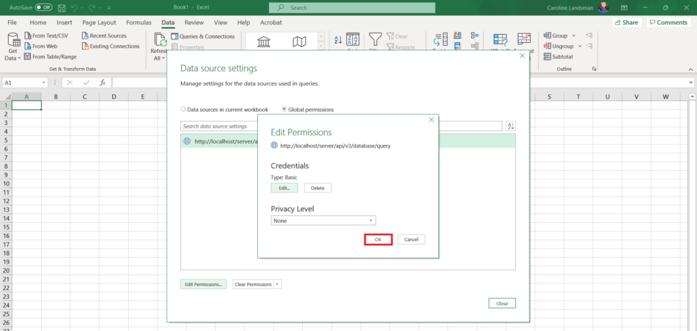
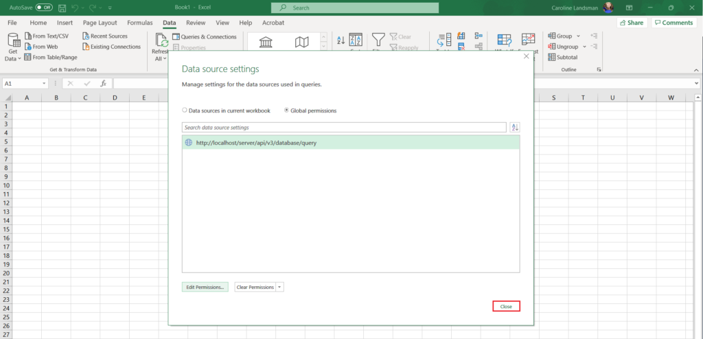

<head>
  <title>How To Configure Microsoft Excel with Aparavi Credentials - Aparavi Data Suite Documentation</title>
</head>

After the first time the Get Link to Results feature is used, Microsoft Excel can be configured to accept the Aparavi username and password, so that many of the steps completed the first time will not have to be completed again.

1\. Open Microsoft Excel on the local host machine and click on the Data navigation tab. Once there, click on the Get Data button, located in the upper left-hand side of the Excel spreadsheet toolbar.

<figure>

<figcaption>

Data Tab & Get Data Button in Microsoft Excel

</figcaption>

</figure>

2\. From the menu that appeared, click on the Data Source settings option. Once clicked, the Data Source settings pop-up box will appear.

<figure>

<figcaption>

Data Source Settings Option in Get Data Menu

</figcaption>

</figure>

3\. Inside of the Data Source settings pop-up box that appeared, click on the Aparavi entry listed and then click on the Edit Permissions button.

<figure>

<figcaption>

Edit Permissions Button in Data Source Settings Pop-up Box

</figcaption>

</figure>

4\. Inside the Edit Permissions pop-up box, click on the Edit button. Once clicked the Access Web content pop-up box will appear.

<figure>

<figcaption>

Edit Permissions Pop-up Box

</figcaption>

</figure>

5\. Inside of the Access Web content pop-up box, click on the Basic option, located on the left-hand navigation tree.

<figure>

<figcaption>

Basic Option in Navigation Tree

</figcaption>

</figure>

6\. Once clicked, the pop-up box will contain two fields, enter the correct Aparavi username and password and then click the Save button.

<figure>

<figcaption>

Input Aparavi Username & Password

</figcaption>

</figure>

7\. Once saved, the Edit Permissions pop-up box will appear again. Click on the Ok button to close it.

<figure>

<figcaption>

Ok Button Inside Edit Permissions Pop-up Box

</figcaption>

</figure>

8\. Once closed, the Data source settings pop-up box will display again. Click on the close button to complete the process.

Please Note: From this point forward, opening the developer tools and obtaining the Aparavi token will no longer need to be completed when using the Get Link to Results feature.

<figure>

<figcaption>

Close Button Inside Data Source Settings Pop-up Box

</figcaption>

</figure>
