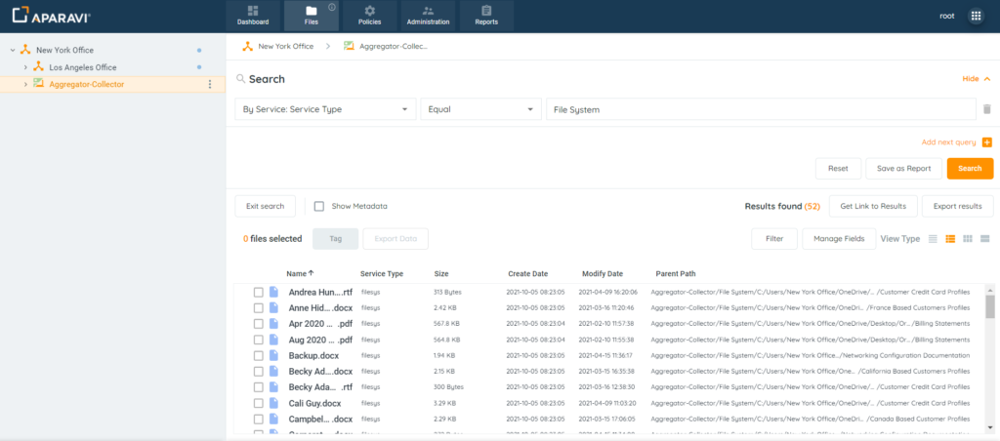
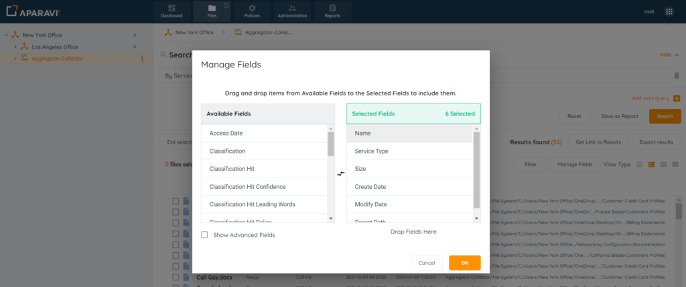
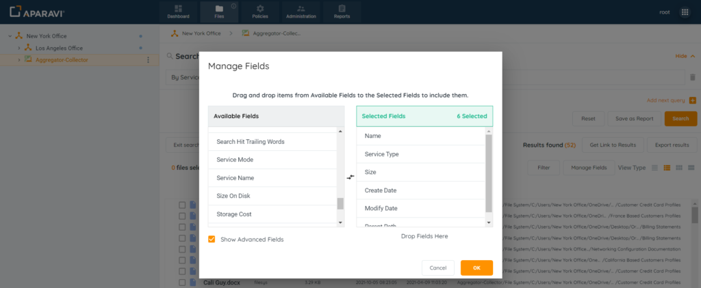
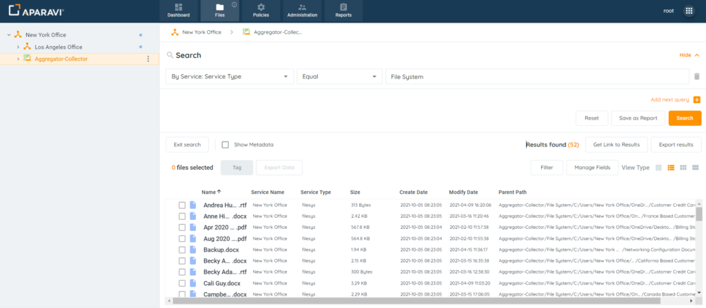

<head>
  <title>How To Customize File Search Fields Displayed - Aparavi Data Suite Documentation</title>
</head>

## Purpose

In order to make the search results more meaningful, the system allows for many fields to be added to the search. This feature is only available when viewing the results via the Details view type and only after a search has been completed. The Manage Fields button will not be visible if viewing on List view, Icons view or Content View.

1. Complete a File Search.

2\. Click on the Details View Type under the View Type options in the upper right-hand corner. Once this view type is selected, the Manage Fields button will appear just above the search results window.

<figure>

<figcaption>

Details View

</figcaption>

</figure>

3. Click on the Manage Fields button and the Manage Fields pop-up box will appear with a list of data fields to add or remove from the results window.

<figure>

<figcaption>

Manage Fields Button

</figcaption>

</figure>

**Additional Fields available with version 2.0**

These fields are additionally available with the 2.0 product version.

_**Document Created By**_

_**Document Creation Time**_

_**Document Modified By**_

_**Document Modify Time**_

These “document” fields are only populated when indexing is enabled for the included path. They will not get populated after running quick scan, which is the case when indexing is disabled for the included path. This is because this “metadata” is actually contained within the file and only extracted when the file contents are parsed.

To add a field, click on the field name from the list of Available Fields section, located on the left-hand side. Once selected, hold down the button on the mouse and drag the selected field from the Available Fields section, into the Selected Fields section.

 

To remove a field, click on the field name from the list of Selected Fields section, located on the right-hand side. Once selected, hold down the button on the mouse and drag the selected field from the Selected Fields section, into the Available Fields section.

 

In addition to the fields that appear within the two sections, there is a checkbox located in the bottom left-hand side of the pop-up box, beside the label “Show Advanced Fields,” that when clicked on, will offer many more field options to be added. To add or remove these fields, follow the same steps as above.

<figure>

<figcaption>

Show Advanced Fields Pop-up Box

</figcaption>

</figure>

4\. Once completed with the field selections, click on the Ok button at the bottom right-hand side of the pop-up box to save changes.

 

5\. The Manage Fields pop-up box will close, and the new data fields will appear in the results window and display the additional information for all results from the search performed.

<figure>

<figcaption>

New Fields Added to Search

</figcaption>

</figure>
