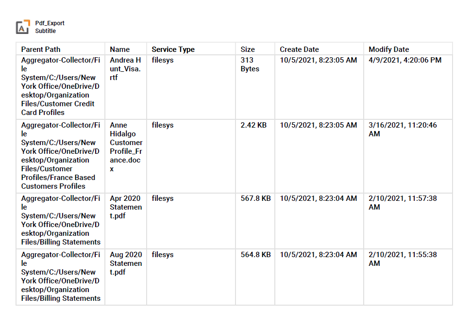
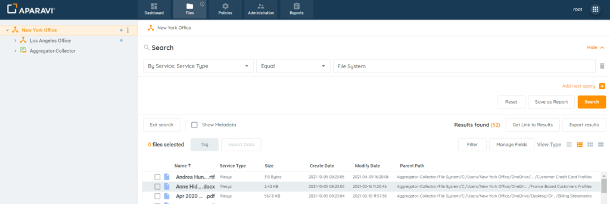
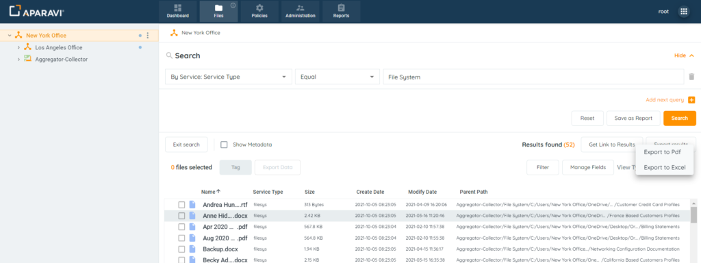
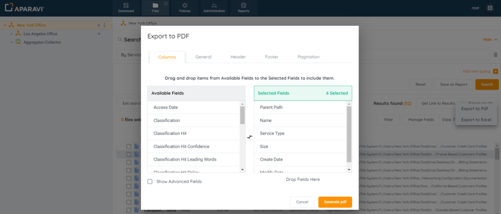
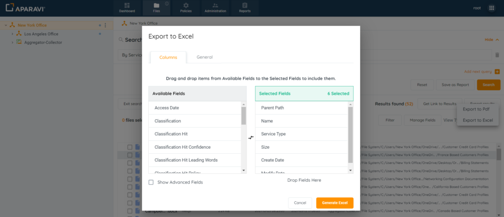
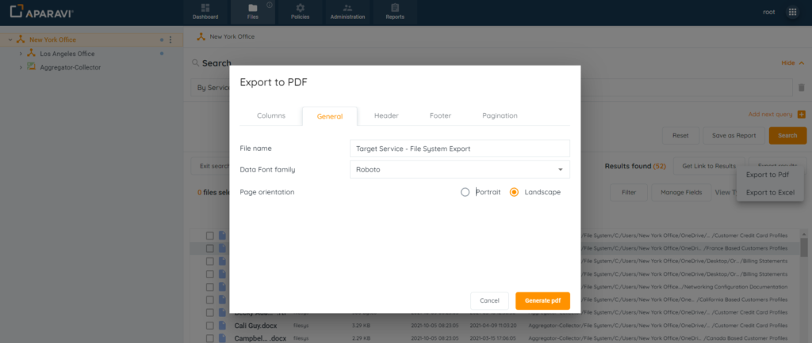
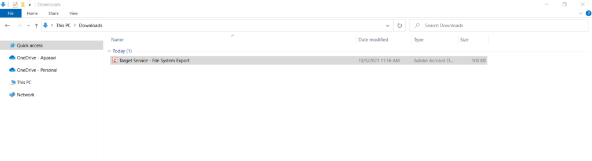
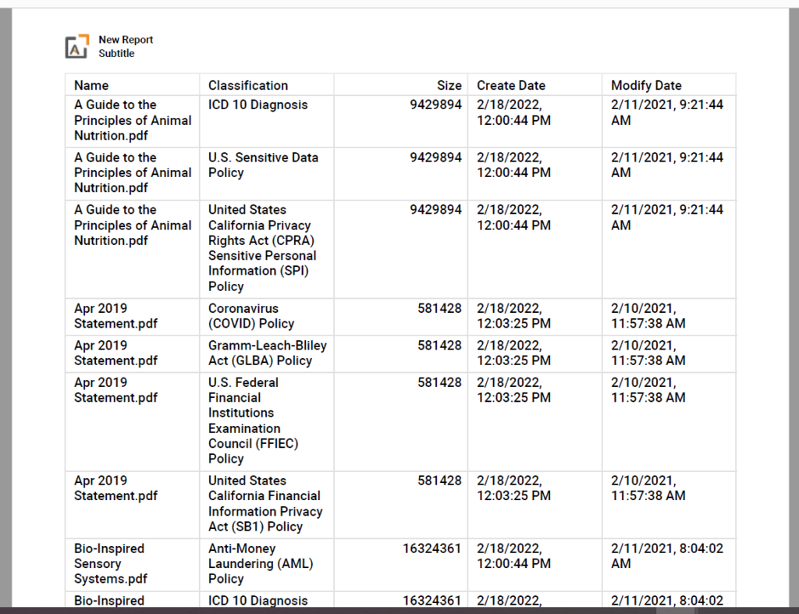
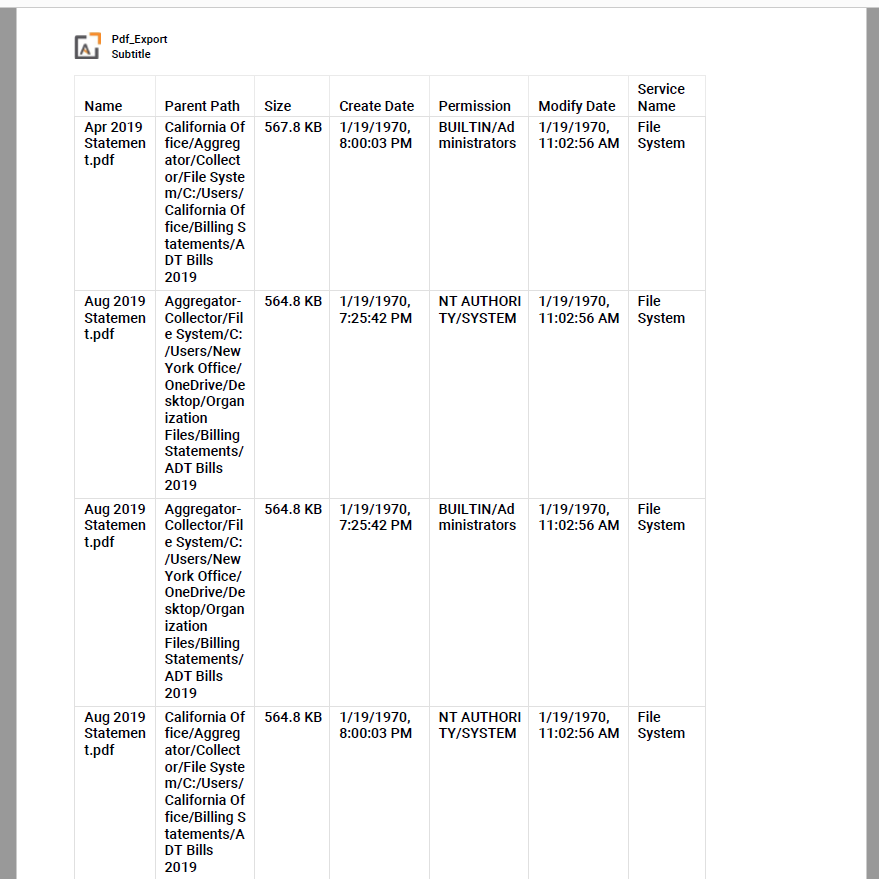

<head>
  <title>How To Export File Search Results to PDF or Microsoft Excel - Aparavi Data Suite Documentation</title>
</head>

## Purpose

Once the file search has been completed, the results can be exported to a PDF file or a Microsoft Excel File.

Please Note: Performing this action will not export the actual files. Instead the system will export a list of all the files along with the fields that were specified during the search.

<figure>

<figcaption>

Example Exported PDF File

</figcaption>

</figure>

1\. Directly above the search results, click on the Export Results button, located on the right-hand side of the screen.

<figure>

<figcaption>

Export Results Button

</figcaption>

</figure>

2\. Click on either options that displays when the export button is clicked: (1) Export to PDF or (2) Export to Excel.

<figure>

<figcaption>

Export Results

</figcaption>

</figure>

3\. Regardless of which option was selected, a pop-up box will appear that offers the ability to customize the export, such as renaming the exported file’s name or selecting additional fields to be included in the exported file.

- If Export to PDF is selected, the pop-up box will include the following customization options

<figure>

<figcaption>

Export to PDF Options

</figcaption>

</figure>

- If Export to Excel is selected, the pop-up box will include the following customization options

<figure>

<figcaption>

Export to Excel Options

</figcaption>

</figure>

4\. After customizing the export options, inside the export pop-up box, click on the Generate PDF or Generate Excel button, located at the bottom right-hand side of the pop-up box. Once this button is clicked, the pop-up box will disappear, and the exported file will begin to download.

<figure>

<figcaption>

Generate Button to Begin Export

</figcaption>

</figure>

5\. Search the local host computer’s downloads folder, and double click on the exported file to open it.

<figure>

<figcaption>

File Exported

</figcaption>

</figure>

_**Please Note:**__When adding certain fields to an exported file search, some of the files will appear more than once on the export, due to the variances in the entries._

**For Example:**

1. **Classifications Field**: when added to the exported file, the file will duplicate for each classification triggered.

<figure>

<figcaption>

Multiple Classifications

</figcaption>

</figure>

2. **Permissions Field**: when added to the exported file, the entries will appear for each existing permission.

<figure>

<figcaption>

Multiple Permissions

</figcaption>

</figure>
