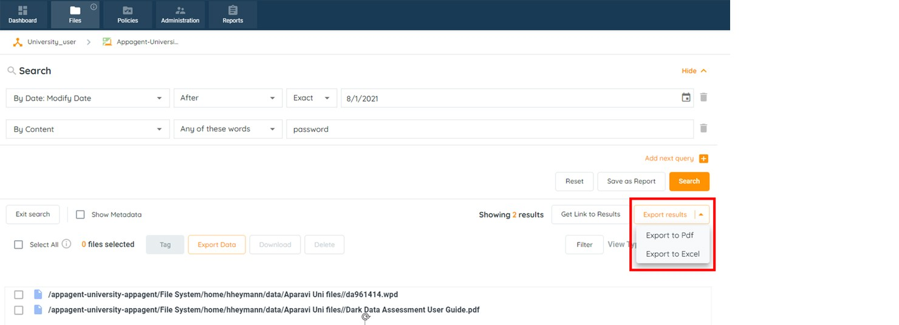
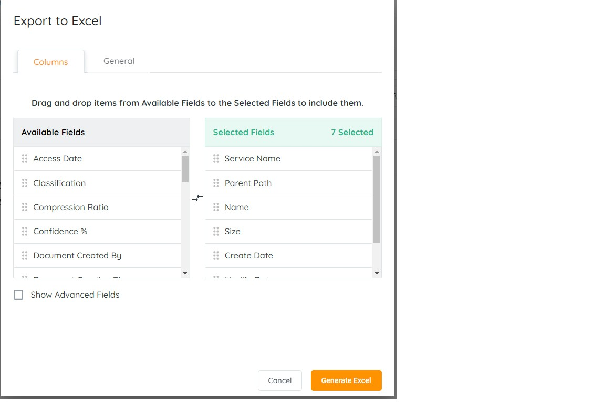
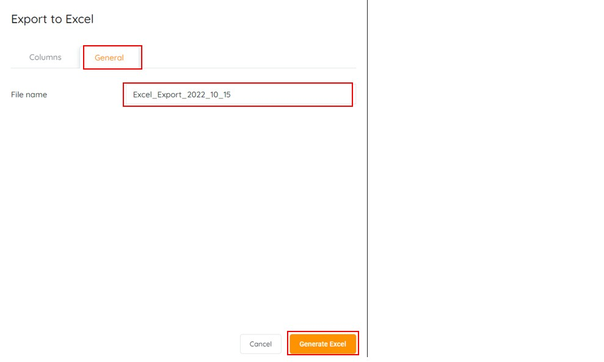
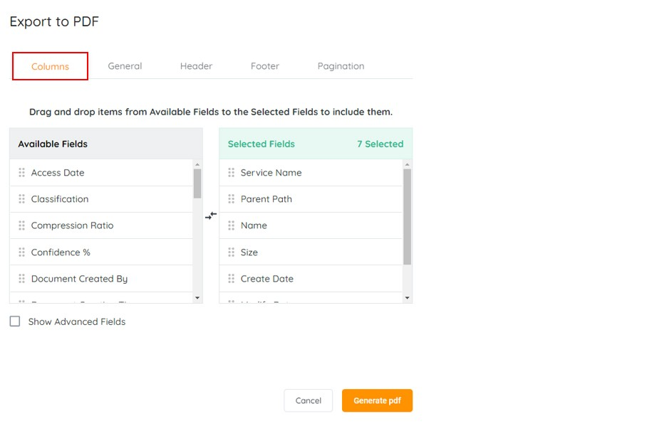
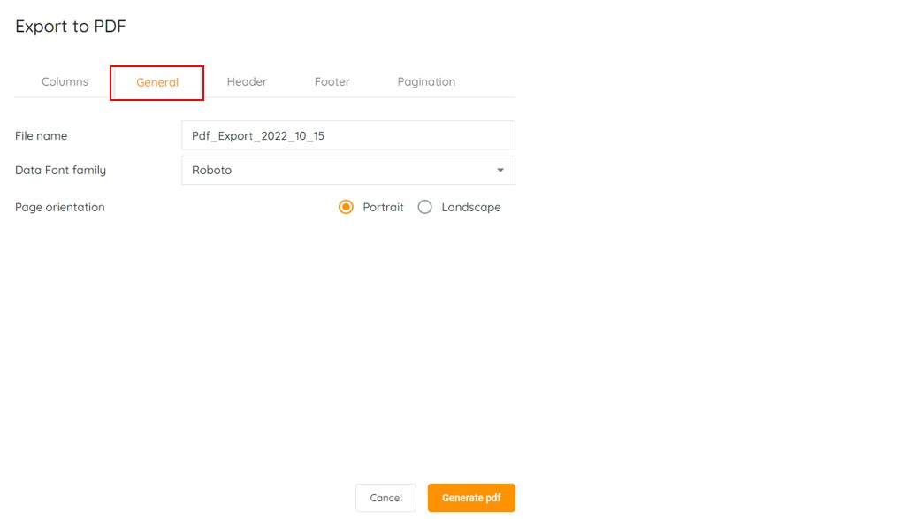
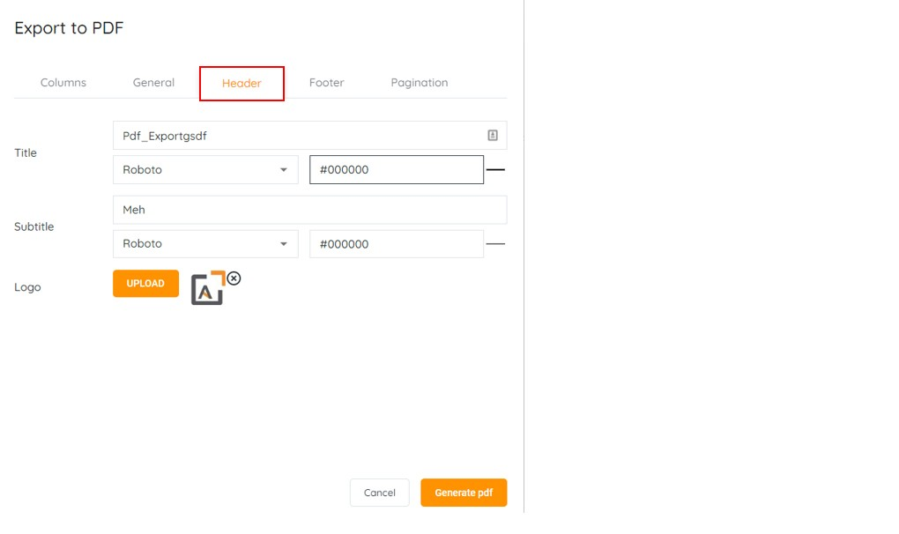
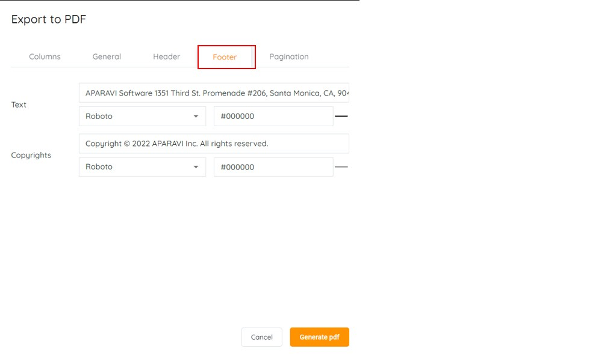
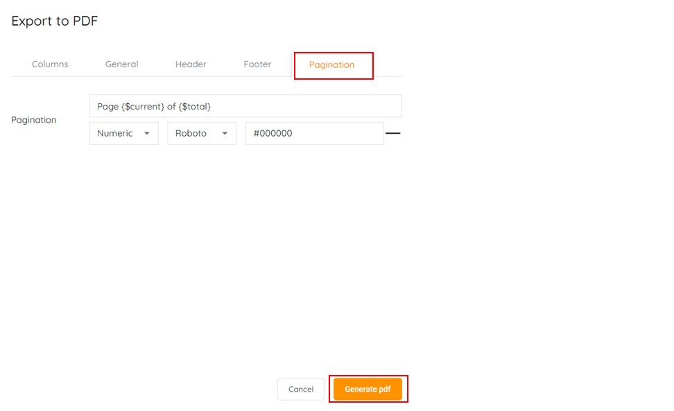

<head>
  <title>How To Export File Search Results - Aparavi Data Suite Documentation</title>
</head>

## APARAVI has the ability to not only display the search results but export the results to a PDF or Excel format for later analysis.

**How do I export the search results?**

Login on your client level in the APARAVI platform. Locate and click on the “**Files**“ tab. Complete a search query with the desired results to export. Locate and click on “**Export results**”, Select the option “**Export to Pdf**“ or “**Export to Excel**“

 

**Excel Export**

When selecting the option to export to Excel a new window will appear with two tabs

- **Columns** \- Selection of fields to display additional file information.
- **General** \- Tab providing options to change document details.

 

Select additional fields by dragging and dropping them from “**Available**” to “**selected”** or remove fields by dragging and dropping them from “**selected**” to “**available**”.

Note by checking the “**Show Advanced Fields**” will display more options to select from.

 

Within the “**General**” tab, you have the option to edit the document details

**File name**\- Edit box allowing you to change the name of the document

To export, the results click on “**Generate Excel**“an excel document will be downloaded by your browser.

 

**PDF Export**

When selecting the option to export to PDF a new window will appear with five tabs

- **Columns** \- Selection of fields to display additional file information.
- **General** \- Tab providing options to change document details.
- **Header** \- Tab providing options for customization for the header.
- **Footer** \- Tab providing options for customization for the footer.
- **Pagination** \- Tab providing options for pagination.

 

Select additional fields by dragging and dropping them from “**Available**” to “**selected”** or remove fields by dragging and dropping them from “**selected**” to “**available**”.

Note by checking the “**Show Advanced Fields**” will display more options to select from.

 

Within the “**General**” tab, you have the option to edit the document details

- **File name** - Edit box allowing you to change the name of the document
- **Data font family** - Select the options between Roboto or Arial font
- **Page Orientation** \- Select the page layout between portrait or landscape

 

Within the “**Header**” tab, you have the option to

- **Title** \- Title header text and font selection
- **Subtitle** \- Subtitle text and font selection
- **Logo** \- Company logo that will display

 

Within the “**Footer**” tab, you have the option to

- **Text** \- Footer text and font selection
- **Copyrights** \- Copyrights text and font selection
- **Logo** \- Company logo that will display

 

Within the “**Pagination**” tab, you have the option to

- **Pagination** \- Pagination properties
- **Numeric** \- Dropdown selection for the numbering layout
- **Font** \- Dropdown selection for the font selection

To export, the results click on “**Generate pdf**“ a pdf document will be downloaded by your browser.

 

**To access video-based information on the topic, please visit our APARAVI ACADEMY by clicking the icon.**

