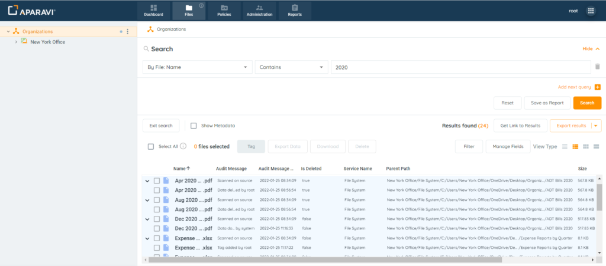
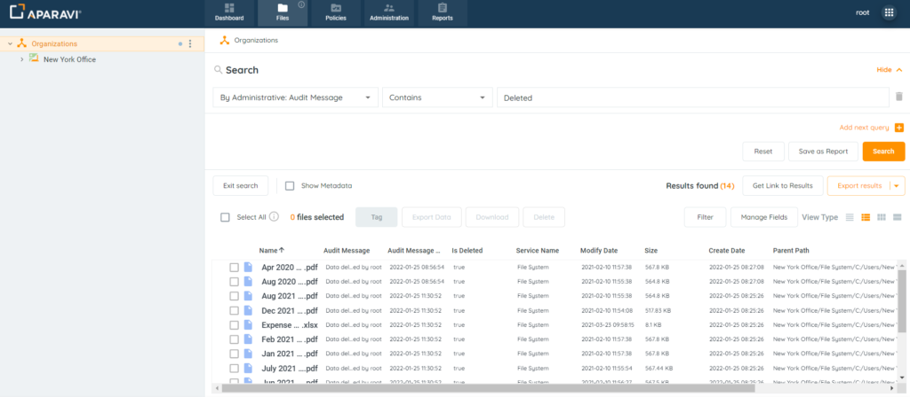
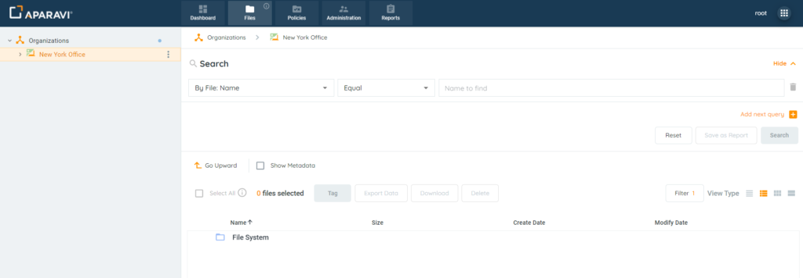
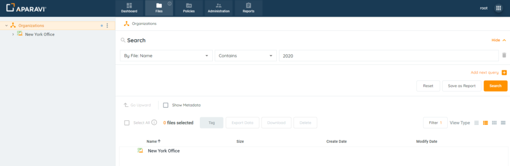
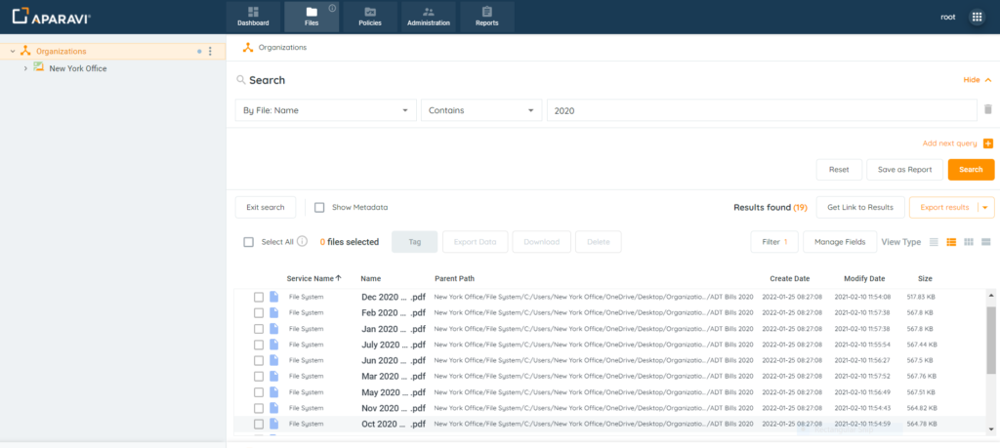
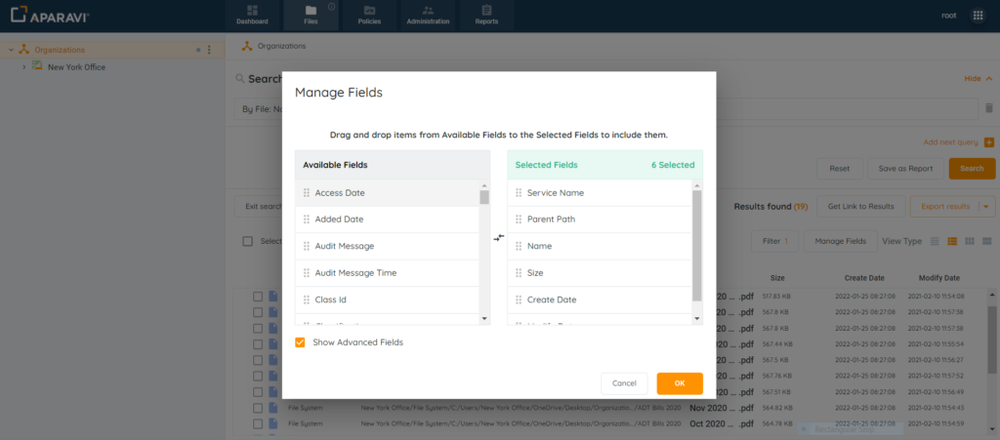
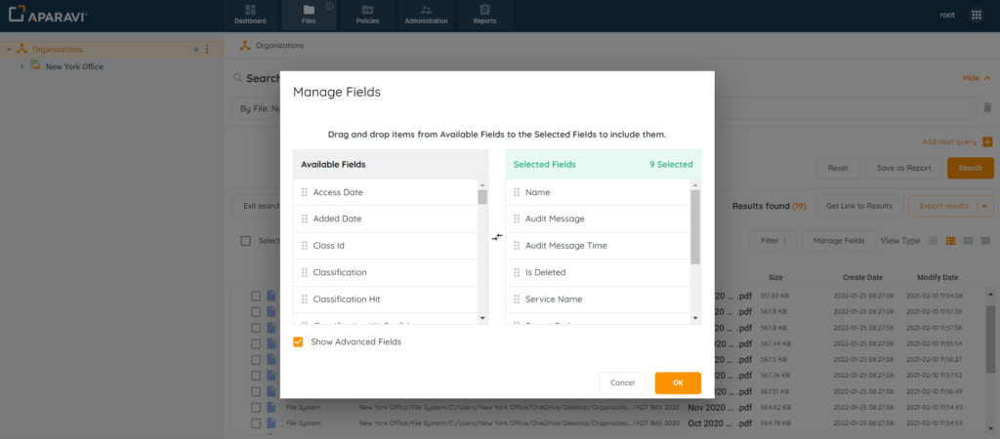
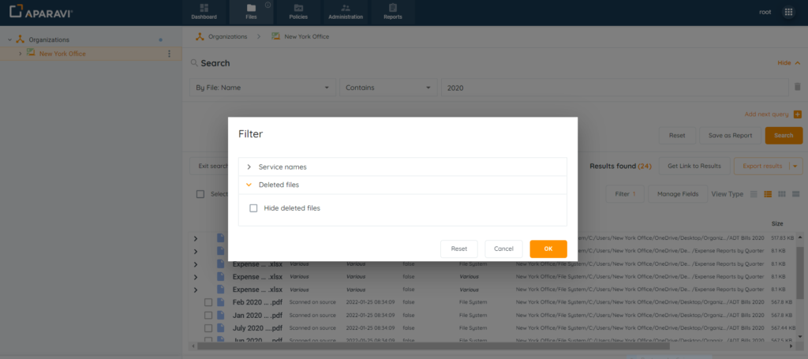

<head>
  <title>How To Search Audit Log Files - Aparavi Data Suite Documentation</title>
</head>

## Overview

The platform provides administrative users the ability to view an audit log of actions taken in the system. This preserves the chain of custody and allows system administrators to monitor what is taking place and when. This audit log includes both actions performed by users, as well as the automated actions configured.

Please Note: Both File Searches and Query Reports will generate the audit log.

## Overview

- Audit Log Features
- Audit Log Search

## Audit Log Features

The system will record the following actions in the Audit log:

- Manually Deleting Files
- Downloading Files
- Tagging Files
- Manually Exporting Files
- System Automated Actions

<figure>

<figcaption>

Audit Log

</figcaption>

</figure>

There are many queries that will create an audit log that captures the actions taken in the system. Searches are driven by the selection of the first filter. Either of the examples below would produce the audit log with relevant information.

- **Audit Log Driven Selections**
    - Examples
        - \[By Administrative: Audit Message\]
        - \[By: Administrative: Audit Message Time\]

or

- **Basic File Search & Adding Fields**
    - Examples
        - \[By Name: Name\]
        - \[By Size: Size on Disk\]

Regardless of the search generated, fields can be added or removed to create a meaningful report. The audit log can then be saved and generated in the future, without having to conduct the steps repeatedly.

<figure>

<figcaption>

Deleted Files Audit Log

</figcaption>

</figure>

## Audit Log Search

1\. Click on the Files tab, located in the top navigation menu.

<figure>

<figcaption>

Files Tab

</figcaption>

</figure>

2\. Complete a file search.

<figure>

<figcaption>

Example File Search

</figcaption>

</figure>

3\. Once the file results are displaying, ensure that Details View is selected as the View Type.

<figure>

<figcaption>

Details View

</figcaption>

</figure>

4\. Click on the Manage Fields button and the system will display a list of data fields to add or remove from the results.

<figure>

<figcaption>

Field Selection

</figcaption>

</figure>

5\. Add the following fields to the Selected fields section:

- **Audit Message:** the action taken and who performed it
- **Audit Message Time:** timestamp for the action taken
- **IsDeleted Field:** displays if the file has been deleted from the system

Click the checkbox next to the label “Show Advanced Fields.” When enabled, the Available fields section will offer additional options, including the three fields above.

To add a field, drag it from the Available Fields section into the Selected Fields section. Once completed, click the Ok button to save the changes.

<figure>

<figcaption>

Add Selected Fields

</figcaption>

</figure>

6\. By default, all searches will omit deleted files unless the option has been deselected. If deleted files should appear in the audit log, click on the Filter button located above the file results. Expand the Deleted files section and click on the checkbox next to “Hide Deleted Files” to deselect it. Once completed, click the Ok button to save the changes.

<figure>

<figcaption>

Filter Options

</figcaption>

</figure>

At this point the Audit log has been created and is ready for the administrator to review the results.

Please Note: The name ‘system’ will appear for automated actions only. All other actions will record the name of the user who performed it.

<figure>

<figcaption>

Audit Log Search

</figcaption>

</figure>
