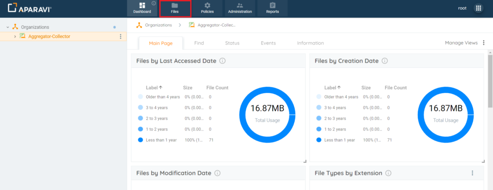
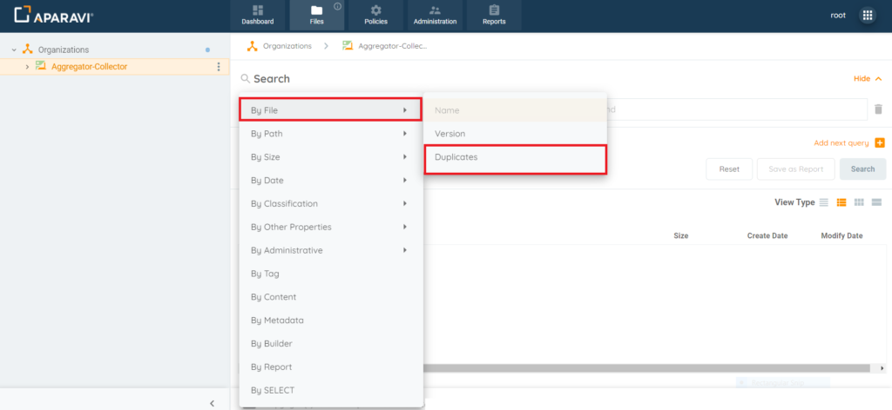
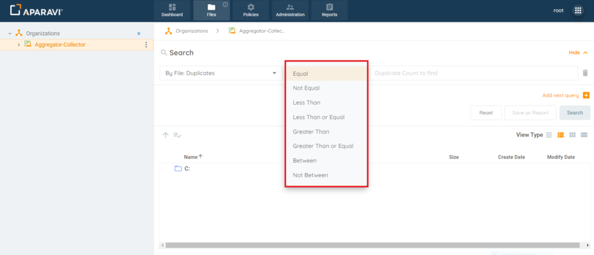
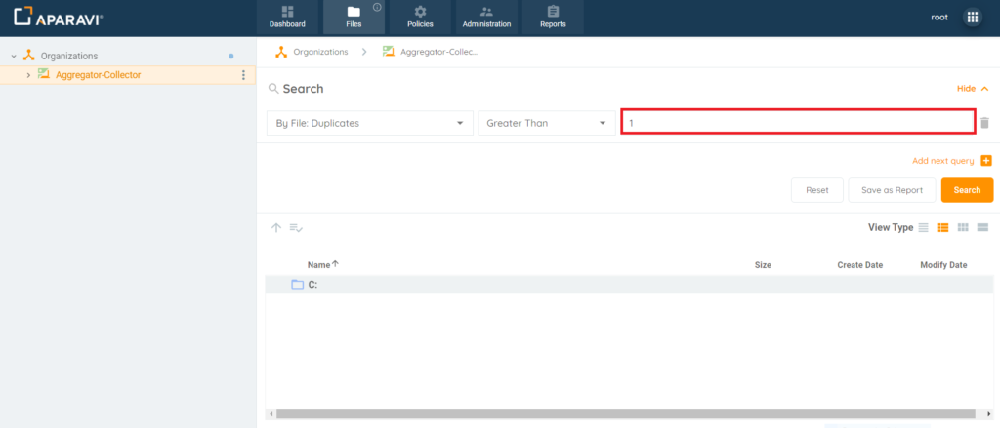
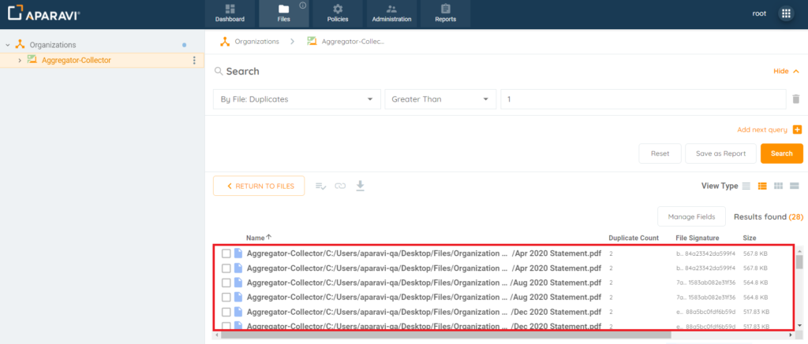

<head>
  <title>How To Search for Duplicate Files - Aparavi Data Suite Documentation</title>
</head>

Searching for duplicate files allows for organizations to view the redundant data that is being stored within the system. Managing redundant data is a requirement in managing ROT (Redundant/Obsolete/Trivial) and offers many benefits such as consolidating storage, reducing risk, and imposing defensible disposition of data.

## **File Search By Duplicates**

1\. Choose which node/folder to perform the search on, by clicking on it in the navigation tree, located on the left-hand side. Once selected, it will appear with a yellowish background color to indicate that it is selected.

Please Note: It is important to select the correct node/folder. The system will only search for files contained within that specific node/folder selected.

2\. Click on the Files tab in the top navigation menu.

<figure>

<figcaption>

Files Tab

</figcaption>

</figure>

3\. Click on the first search filter drop-down field and then click on first option listed \[By File\] to expand the filter. From the sub-menu that appears, click on the Duplicates field. Once the search filter is selected, the menu will disappear, and the selection will appear inside the field.

Please Note: All filters that contain a side arrow icon, directly to the right of the filter’s name, indicates there are more options to choose from within that filter subject.

<figure>

<figcaption>

File Search – By File – Duplications – Drop-down field

</figcaption>

</figure>

4\. Click on the second search filter drop-down field and then click on one of the operators listed. Once the operator is selected, the menu will disappear, and the selection will appear inside the field.

Please Note: This field is dynamic and offers different operators depending on the first search filter’s selection.

<figure>

<figcaption>

Files Tab – Second Drop-down Menu Operator

</figcaption>

</figure>

5\. Click on the third field and enter the search criteria. This field will vary, depending on the selection of the second drop-down menu (list of operators). Once the information is entered or selected, it will appear inside of the field.

- Example 1: If searching for any duplicates files in the system, this can be performed by selecting \[Greater Than\] in the second drop-down menu. If this operator is selected, the third field becomes a textbox that a numerical value can be entered. For this type of search, “1” would be entered into the third field.

<figure>

<figcaption>

Files Search Tab – Search Field

</figcaption>

</figure>

- Example 2: If searching for duplicate files between the range of 4 – 6 duplicates each, this can be performed by selecting \[Between\] in the second drop-down menu. If this operator is selected, an additional fourth field displays. The third and fourth fields will then accept numerical values that can be entered into each field. For this type of search, “4” would be entered into the third field and “6” would be entered into the fourth field.

6\. Once all search criteria have been properly entered into all the search filter fields, click Search.

7\. The results of the search will display in the window, directly below the search filter fields, displaying all duplicate files that have been scanned by the system.

Please Note: By default, when using the \[By File Duplicates\] filter, the system will display the two columns “Duplicate Count” & “File Signature.”

**Duplicate Count Field**: The values located in this field represents that specific duplicated file’s count. For Example: Duplicate Count = 2 – Then this file is the second duplicate of the original file scanned.

**File Signature Field**: This field contains a hash value generated from the contents of the file which is used to identify, or verify, the contents of the duplicated file and will display that specific duplicated file’s file signature.

<figure>

<figcaption>

File Results

</figcaption>

</figure>
