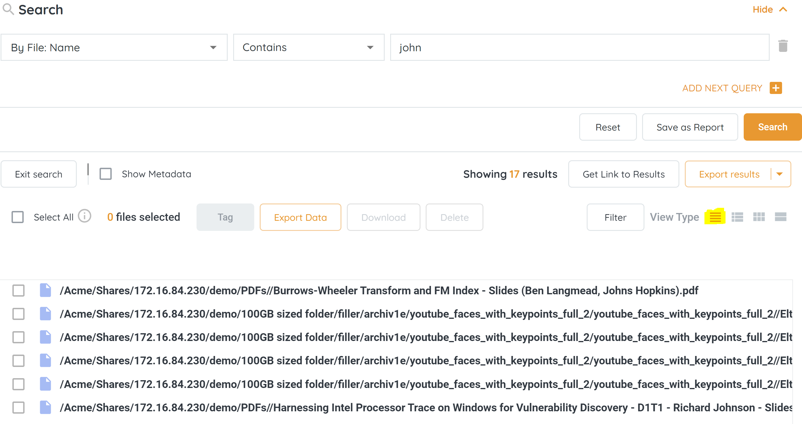
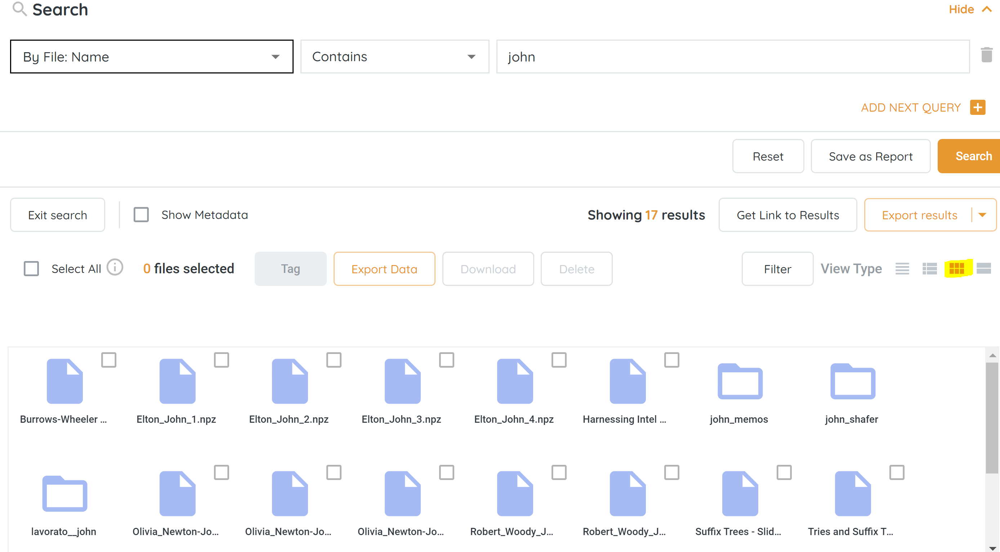

<head>
  <title>Manage View Types - Aparavi Data Suite Documentation</title>
</head>

1. Click on the File tab in the top navigation menu and complete a file search.
2. Once the file results are displayed, locate the View Types to toggle between the four options:
    - **List view** \- Display results in a list.
    - **Details view** \- Display results in a detailed view. This is selected by default.
    - **Icons view** \- Display results in an icon view.
    - **Content view** \- Display results of content searched

<figure>

<figcaption>

View Types

</figcaption>

</figure>

3. Example of List view.

<figure>

<figcaption>

List View

</figcaption>

</figure>

4. Example of Icons view.

<figure>

<figcaption>

Icons View

</figcaption>

</figure>

 

**To access video-based information on the topic, please visit our APARAVI ACADEMY by clicking the icon.**

