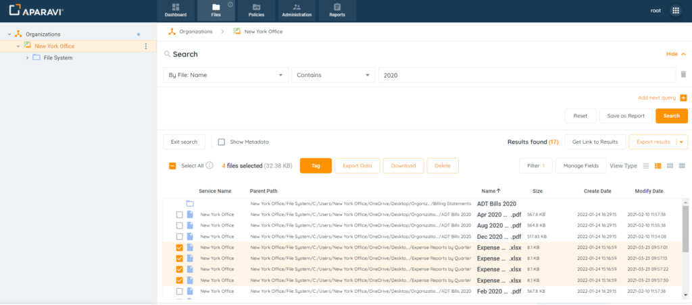
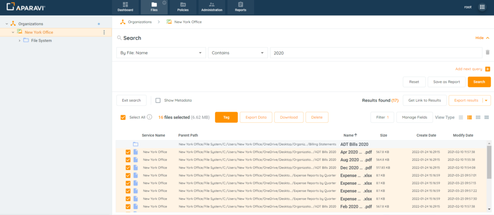
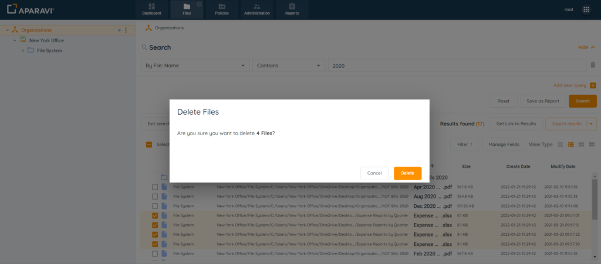
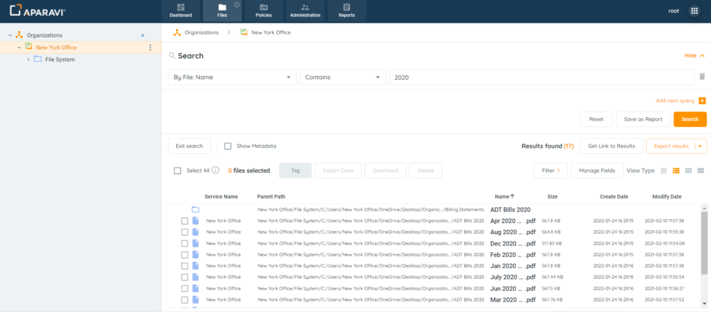

<head>
  <title>Manual deletion of files - Aparavi Data Suite Documentation</title>
</head>

Once the system scans files, you can delete them one by one or in batches. Deleted files are hidden from searches and reports by default, but they can still be seen using the query filter. The system creates reports on deleted files, providing an audit trail for administrators to track when files were removed. This helps show the chain of custody and what happened to a file and when.

_**Please Note:**_ _Files will be removed from the local host or target service when deleted from the platform. This selection cannot be reversed, as this action will bypass the trashcan and instantly remove the file from the source it was scanned from._

 

1. Click on the Files Tab, located in the top navigation menu.
2. Using the three search filters, create a file search that will produce the file(s) to be deleted.
3. Once the file results are displaying, click the checkbox located to the left of the file that needs to be deleted.

**_Please Note:_** _One or multiple files can be chosen to be removed._

<figure>

<figcaption>

File Selection

</figcaption>

</figure>

**Bulk File Deletion**: Located above the file results, the system offers a Select All checkbox. This feature will select up to 25k files at once, but folders cannot be removed from the system once scanned.

<figure>

<figcaption>

Select All Checkbox

</figcaption>

</figure>

4. After all files have been selected, click Delete.
5. After the Delete button is selected, a warning message will appear containing the number of files to be deleted. Click OK to confirm the file’s deletion.

<figure>

<figcaption>

Warning Message

</figcaption>

</figure>

6. The files will no longer be searchable in basic queries. If needed to be still queried, use the IsDeleted search criteria in the Query Builder.

<figure>

<figcaption>

Files Deleted

</figcaption>

</figure>

A report could also be generated on the deleted files. You can read more about this here

[https://aparavi-software.helpscoutdocs.com/article/469-create-a-report-of-deleted-files](https://aparavi-software.helpscoutdocs.com/article/469-create-a-report-of-deleted-files)

 

**To access video-based information on the topic, please visit our APARAVI ACADEMY by clicking the icon.**

