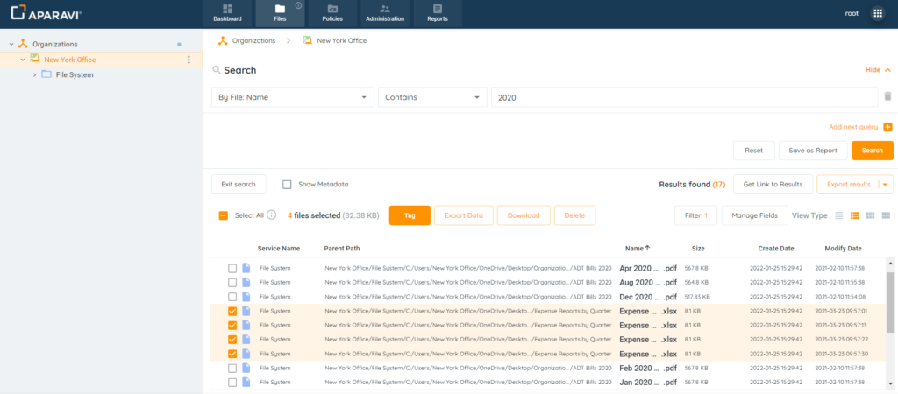
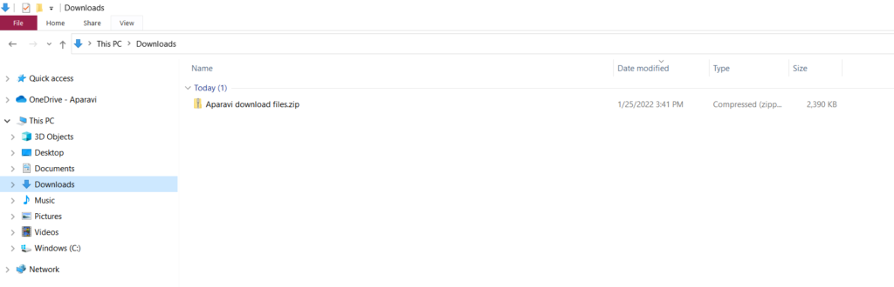

<head>
  <title>Manually Download Files - Aparavi Data Suite Documentation</title>
</head>

Once files are scanned, you can download them individually or in bulk. The download limit is _100MB_ per request; for larger files, manual export is recommended. Using 7zip to extract ensures inclusion of files with the same name.

1. Click on the Files Tab, located in the top navigation menu.
2. Perform any file search using the three query parameters and click the Search button.
3. Select the checkboxes located to the left of the file’s name for download.

<figure>

<figcaption>

File Selection

</figcaption>

</figure>

4. Click on the Download button, located at the top of the file results.

<figure>

<figcaption>

Download Button

</figcaption>

</figure>

5. The selected files will then automatically be downloaded as a zipped folder to the local host machine. This folder can typically be found in the downloads folder unless specified otherwise.

From this point the files can be extracted from the zipped folder and viewed in their native format.

<figure>

<figcaption>

Download Zipped Folder

</figcaption>

</figure>

**To access video-based information on the topic, please visit our APARAVI ACADEMY by clicking the icon.**

