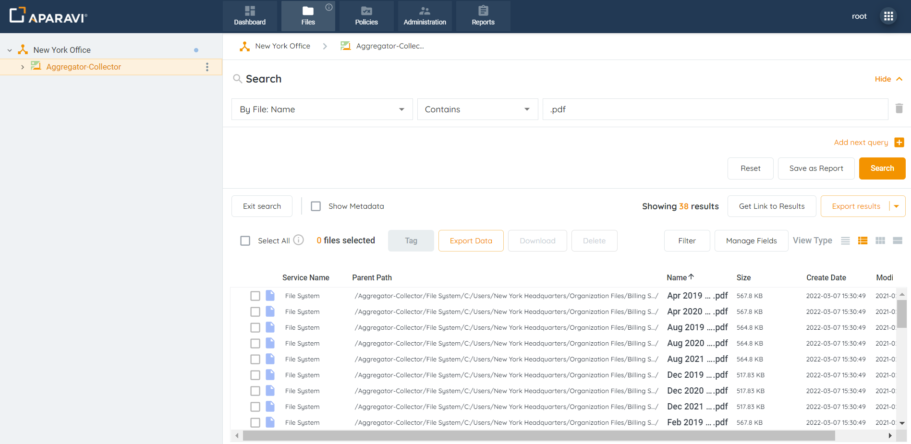
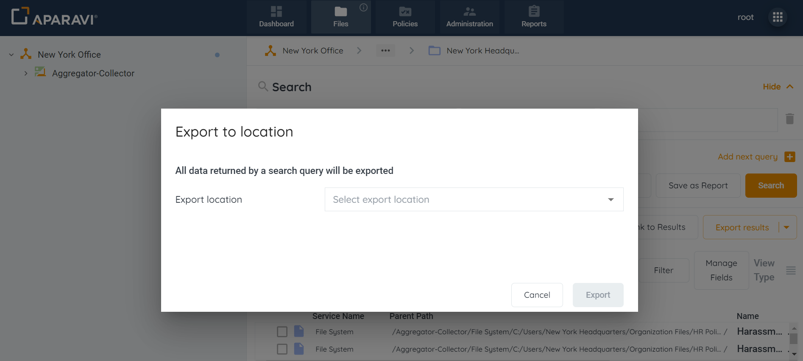
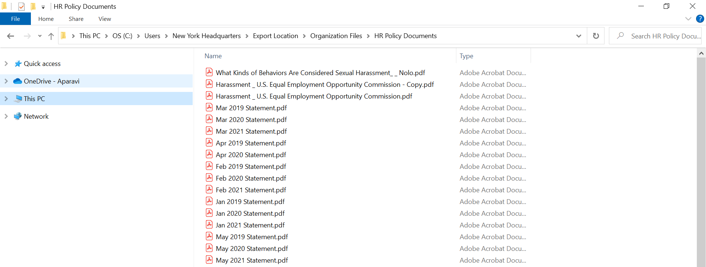

<head>
  <title>Manually Export Files by Query - Aparavi Data Suite Documentation</title>
</head>

The system restricts exporting more than 25,000 files from the platform to the local host machine while using Export by Select. However, the ability to export an **unlimited number** of files can be completed through Manual Export by Query. Manual data exports can be used to migrate files between storage systems or to extract data and review the files stored in their native format.

1. Click on the Files Tab, located in the top navigation menu.
2. Perform any file search using the three query parameters and click the Search button.
3. **Without** **selecting any of the files**, click on the Export Data button located in the toolbar.

<figure>

<figcaption>

Data Export Button

</figcaption>

</figure>

4. Once clicked, the Export to Location pop-up box will display and offer an Export Location drop-down menu.

<figure>

<figcaption>

Export to Location

</figcaption>

</figure>

5. Select where the files should be exported to by creating a new location or selecting a previously configured location. Read about configuring a new location here

[https://aparavi-software.helpscoutdocs.com/article/407-manual-action-how-to-configure-a-onedrive-target-service?preview=659fc3563afe0a1c1e4d1d7b](https://aparavi-software.helpscoutdocs.com/article/407-manual-action-how-to-configure-a-onedrive-target-service?preview=659fc3563afe0a1c1e4d1d7b)

5. To view the exported files, check the location specified during the export process. The folder will display all selected files in their native format.

<figure>

<figcaption>

Exported Files

</figcaption>

</figure>
