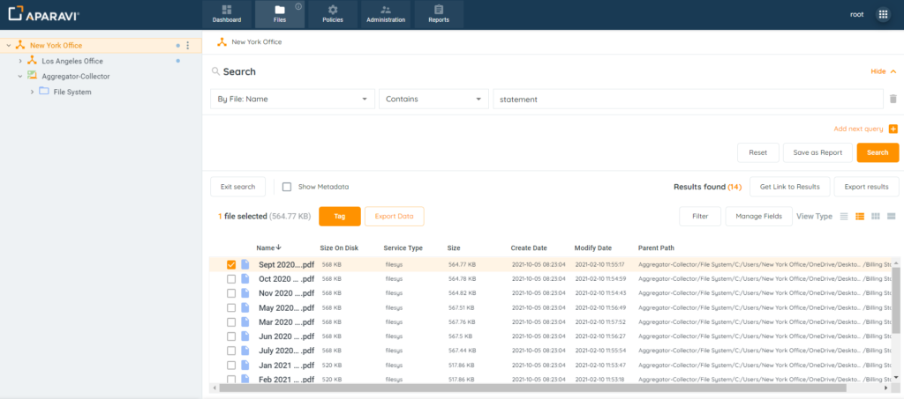
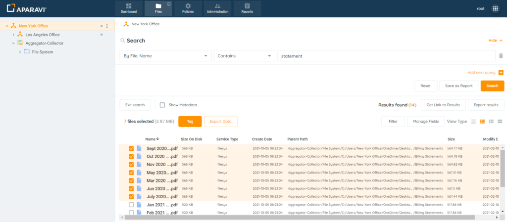
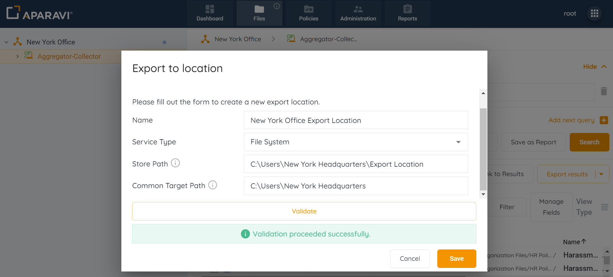
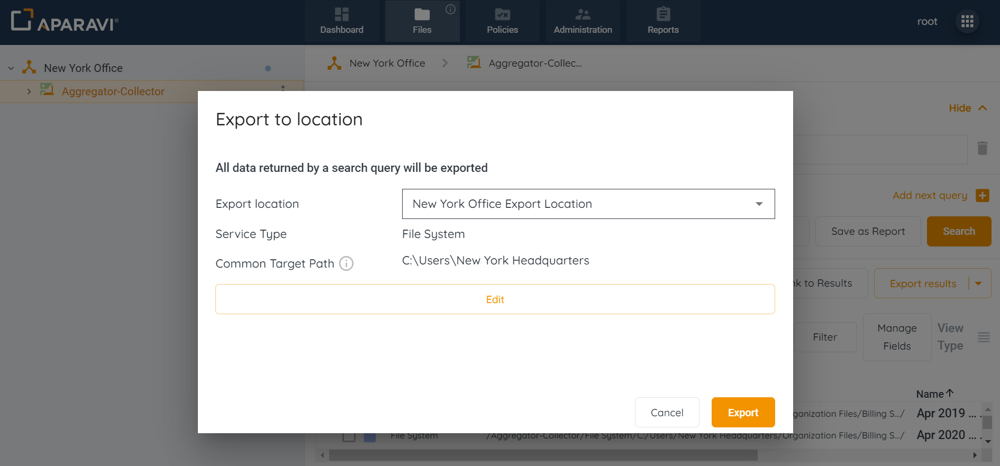
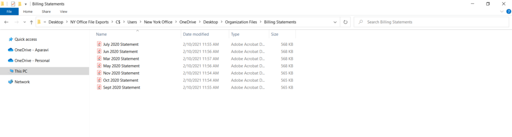

<head>
  <title>Manually Export Files by Select - Aparavi Data Suite Documentation</title>
</head>

The system allows exporting 25,000 files from the platform to the local host machine. Manual data exports can be used to migrate files between storage systems.

1\. Click on the Files Tab, located in the top navigation menu.

2. Perform any file search using the three query parameters and click the Search button.

3\. Select the checkbox located to the left of the file’s name. This will select the file for export.

<figure>

<figcaption>

File Selected For Export

</figcaption>

</figure>

4. Repeat this process until all files are selected for export.

<figure>

<figcaption>

Selecting Multiple Files For Export

</figcaption>

</figure>

5. To begin the export process, click on the highlighted Export Data button, located above the file results.
6. Once clicked, the Export to Location pop-up box will display and offer the Export Location drop-down menu.
7. Select where the files should be exported to by creating a new location or selecting a previously configured location.

**If Configuring a New Location**:

- Choose \[Create New\] from the drop-down menu.
- Once all information has been entered into the Export to Location pop-up box, click on the Validate button.
- Click on the Save button, located at the bottom right-hand side of the pop-up box.
- All information will be saved and the Export button will become active.
- Once completed, the files will begin to export to the new location.

<figure>

<figcaption>

New Export Location

</figcaption>

</figure>

**Selecting a Previously Configured Location**:

- Click on the configured location from the drop-down menu.
- Click on the Export button, located at the bottom right-hand side of the pop-up box.
- Once completed, the files will begin to export to the selected location.

<figure>

<figcaption>

Previously Configured Location

</figcaption>

</figure>

7\. To view the exported files, check the location specified during the export process. The folder will display all selected files in their native format.

<figure>

<figcaption>

Exported Files

</figcaption>

</figure>
